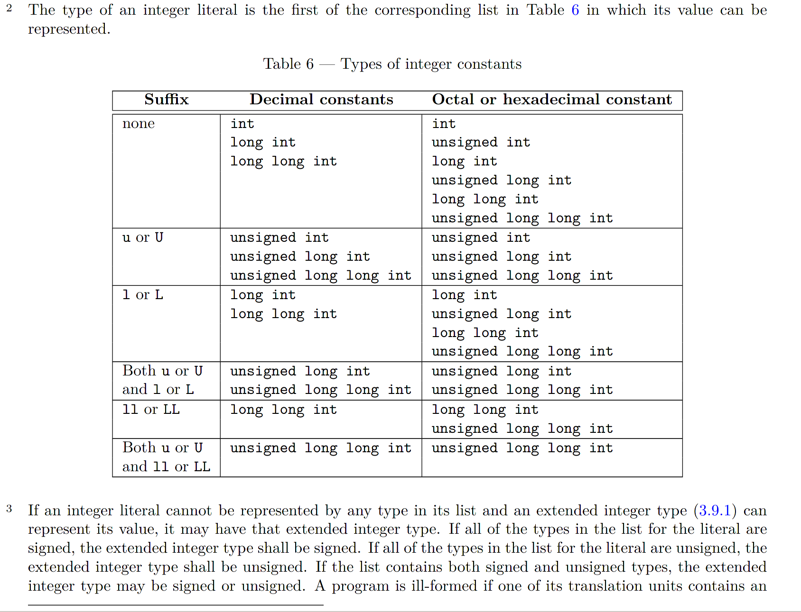

[TOC]

# 概述

无符号数和有符号数是通用的计算机概念，具体到编程语言上则各有各的不同，程序员是解决实际问题的，所以必须熟悉编程语言中的整数。C/C++ 有自己特殊的算术运算规则，如整型提升和寻常算术转换，并且存在大量未定义行为，一步小心就会掉进坑里（即使是 Apple 这样的巨头），并且很难发现，解决这些 bug 的最好方法就是熟悉整数性质以避免 bug。

我不是语言律师（非贬义），对 C/C++ 算术特性的了解主要来自教材和互联网，但基本上都查阅 C/C++ 标准验证过，虽然不能保证，但 C 和 C++ 在整数性质和算术运算上应该是完全相同的，如果有错误请指正。

# C/C++ 整数的阴暗角落

C/C++ 期望自己可以在所有机器上运行，因此不能在语言层面上把整数的编码、性质、运算规定死，这让 C/C++ 中存在许多未规定的阴暗角落和未定义行为。许多东西依赖于编译器、操作系统和处理器，这里通称为运行平台。

- 标志没有规定整数的编码，具体的编码格式依赖于运行平台。

- `char`有无符号依赖于运行平台，编译器有选项可以控制，如 GCC 的 -fsign-char。
- 移位大小必须小于整数宽度，否则是未定义行为。
- 无符号数左移 K 位结果为原来的 2^K 次方，右移 K 位结果为原来的数除 2^K 次方。仅允许对值非负的有符号数左移右移，运算结果同上，**对负数移位是未定义的**。
- 标准仅规定了标准内置整数类型（如`int`等）的最小宽度和大小关系（如`long`不能小于`int`），但未规定具体大小，如果要用固定大小的整数，请使用拓展整数类型（如`uint32_t`）等。
- 无符号数的溢出是合法的，**有符号数溢出是未定义行为**

# 整型字面量

常常有人说 C/C++ 中的整数字面量类型是`int`，但这种说法是错误的。C/C++ 整形字面量究竟是什么类型取决于字面量的格式和大小。StackOverflow 上有人问[为什么在 C++ 中`(-2147483648> 0)`返回`true`](https://stackoverflow.com/questions/14695118/2147483648-0-returns-true-in-c)，代码片段如下：

```c++
if (-2147483648 > 0)21474836482147483648
    std::cout << "true";
else
    std::cout << "false";
```

现在让我们来探索为什么负数会大于 0。一眼看过去，`-2147483648`似乎是一个字面量（32 位有符号数的最小值），是一个合法的`int`型变量。但根据 C99 标准，字面量完全由十进制（`1234`）、八进制（`01234`）、十六进制（`0x1234`）标识符组成，因此可以认为**只有非负整数才是字面量**，负数是字面量的逆元。在上面的例子中，`2147483648`是字面量，`-2147483648`是字面量`2147483648`的逆元。

字面量的类型取决于字面量的格式和大小，C++11（N3337 2.14.2）规则如下：

对于十进制字面量，编译器自动在`int`、`long`、`long long`中查找可以容纳该字面量的最小类型，如果内置整型无法表示该值，在拓展整型中查找能表示该值的最小类型;对于八进制、十六进制字面量，有符号整型无法表示时会选择无符号类型。如果没有足够大的内置/拓展整型，程序是错误的，GCC/Clang 都会发出警告。

在 C89/C++98 没有`long long`和拓展整型，因此在查找完`long`后查找`unsigned long`。

现在再看上面的代码段就很清晰了，在 64 位机上，不论是 C89/C++98 还是 C99/C++11，都能找到容纳该值的`long`类型（8 字节），因此打印`false`。在 32 位机上，`long`占据 4 个字节无法容纳字面量，在 C89/C++98 下，`2147483648`的类型为`unsigned long`，逆元`-2147483648`是一个正数（2^32 - 2147483648），打印`true`;在 C99/C++11 下，`2147483648`的类型为`long long`，逆元`-2147483648`是一个负数（-2147483648），打印`false`。

经过以上分析，尽管提问者没有说明 C++ 标准和机器字长也可以判断出提问者实在 32 位机上使用 C++98 做的实验。

和字面量相关的另一个问题是《深入理解计算机系统（第 3 版）》2.2.6 中介绍的`INT_MIN`的表示方法。代码如下：

```c
/* Minimum and maximum values a ‘signed int’ can hold. */
#define INT_MAX
 2147483647
#define INT_MIN
 (-INT_MAX - 1)
```

《深入理解计算机系统》没有给出解释，很显然这是为了避免 C/C++ 推导字面量类型时将宏`INT_MIN`定义为`long long`（C99/C++11）或`unsigned long`（C89/C++98）。

# 整型提升与寻常算术转换

再看一个 stackoverflow 上的提问[Implicit type promotion rules](https://stackoverflow.com/questions/46073295/implicit-type-promotion-rules)，通过这个例子来了解 C/C++ 算术运算中的*整型提升*（*integer promotion*）和*寻常算术转换*（*usual arithmetic conversion*）。他编写了以下两段代码，发现在第一段代码中，`(1 - 2) > 0`，而在第二段代码中`(1 - 2) < 0`。这种奇怪的现象就是整型提升和寻常算术转换导致的。

```c
unsigned int a = 1;
signed int b = -2;
if(a + b > 0)
  puts("-1 is larger than 0");
// ==============================================
unsigned short a = 1;
signed short b = -2;
if(a + b > 0)
  puts("-1 is larger than 0"); // will not print
```

整型提升和寻常算术转换涉及到整型的秩（优先级），规则如下：

- 所有有符号整型的优先级都不同，即使宽度相同。

  假如`int`和`short`宽度相同，但`int`的秩大于`short`。

- 有符号整型的秩大于宽度比它小的有符号整型的秩

  `long long`宽度为 64 比特，`int`宽度为`32`比特，`long long`的秩更大

- `long long`的秩大于`long`，`long`的秩大于`int`，`int`的秩大于`signed char`

- 无符号整型的秩等于对应的有符号整型

  `unsigned int`的秩等于对应的`int`

- `char`的秩等于`unsiged char`和`signed char`

- 标准整型的秩大于等于对应宽度的拓展整型

- `_Bool`的秩小于**所有**标准整型

- 枚举类型的秩等于对应整型

虽然上面有好多规则，但简单的说就是内置整型是一等公民，拓展整型是二等公民，`_Bool`是弟弟，枚举等于整型。

整型提升的定义如下：

> C11 6.3.1.1
>
> If an `int` can represent all values of the original type (as restricted by the width, for a bit-field), the value is converted to an `int`; otherwise, it is converted to an `unsigned int`. These are called the *integer promotions*. 

在算术运算中，秩小于等于`int`和`unsigned int`的整型（小整型），如`char`、`_Bool`等转换为`int`或`unsigned int`，如果`int`可以表示该类型的全部值，则转换为`unsigned int`，否则转换为`unsigned int`。由于在 x86 等平台上，int 一定可以表示这些小整型的值，因此不论是有符号还是无符号，小整型都会隐式地转换为 int，不存在例外（otherwise 所说的情况）。

在某些平台上，`int`可能和`short`一样宽。这种情况下，`int`无法表示`unsigned short`的全部值，所以`unsigned short`要提升为`unsigned int`。这也就是标准中说的*”否则，它将转换为`unsigned int`*。

```c++
// C++17
// 有符号数溢出是未定义行为，但在许多编译器上能看到正常的结果，
// 这里只是观察现象，请不要认为有符号数溢出是合法的
#include <cfloat>
#include <climits>
#include <cstdio>
#include <type_traits>
int main()
{
  signed char cresult, a, b;
  int iresult;
  a = 100;
  b = 90;
  // a，b 提升为整型，a + b = 190 在 int 表示范围内，没有溢出。
  // int 类型的 a + b 赋给表示范围更小的 char 类型 cresult（窄化），
  // 发生溢出，值为 190 - 256 = -66。
  cresult = a + b; /* C++17: cresult {a + b}; 编译器报错，不能将 int 窄化为 signed char */
  // a，b 提升为整型，a + b = 190 在 int 表示范围内，没有溢出。
  // int 类型的 a + b 赋给表示范围相同的 int 类型 iresult，没
  // 发生溢出，值为 190。
  iresult = a + b;
  printf("cresult: %d\n", cresult);
  printf("cresult: %d\n", iresult);

// ======== output ========
// cresult: -66
// cresult: 190

```


寻常算术类型 转换规则如下：

> 6.3.1.8 Usual arithmetic conversions
>
> Many operators that expect operands of arithmetic type cause conversions and yield result  types in a similar way. The purpose is to determine a common real type for the operands  and result. For the specified operands, each operand is converted, without change of type  domain, to a type whose corresponding real type is the common real type. Unless  explicitly stated otherwise, the common real type is also the corresponding real type of  the result, whose type domain is the type domain of the operands if they are the same,  and complex otherwise. This pattern is called *the usual arithmetic conversions*:
>
> - First, if the corresponding real type of either operand is `long double`, the other operand is converted, without change of type domain, to a type whose corresponding real type is `long double`.
> - Otherwise, if the corresponding real type of either operand is `double`, the other operand is converted, without change of type domain, to a type whose corresponding real type is `double`.
> - Otherwise, if the corresponding real type of either operand is `float`, the other operand is converted, without change of type domain, to a type whose corresponding real type is float.
> - Otherwise, the integer promotions are performed on both operands. Then the  following rules are applied to the promoted operands:
>   - If both operands have the same type, then no further conversion is needed.
>   - Otherwise, if both operands have signed integer types or both have unsigned  integer types, the operand with the type of lesser integer conversion rank is  converted to the type of the operand with greater rank.
>   - Otherwise, if the operand that has unsigned integer type has rank greater or  equal to the rank of the type of the other operand, then the operand with  signed integer type is converted to the type of the operand with unsigned  integer type.
>   - Otherwise, if the type of the operand with signed integer type can represent  all of the values of the type of the operand with unsigned integer type, then  the operand with unsigned integer type is converted to the type of the  operand with signed integer type.
>   - Otherwise, both operands are converted to the unsigned integer type  corresponding to the type of the operand with signed integer type.

在算术运算中，不仅整数要转换类型，浮点数也要转换类型。浮点数没有有符号/无符号的区别，直接转换为能够容纳操作数的最小浮点类型即可，如单精度浮点数和双精度浮点数运算，单精度浮点数转换为双精度浮点数。

整数之间由于存在无符号/有符号的差异，转换稍微复杂一点：

1. 进行整型提升
2. 如果类型相同，不转换
3. 如果符号相同，将秩低的类型转换为秩高的类型
4. 如果无符号类型的秩高于或等于其他操作数，将其他操作数转换为该无符号数的类型
5. 如果有符号数的类型可以**表示**其他操作数类型的全部值，将其他操作数转换为该有符号数的类型
6. 如果以上步骤都失败，一律转换为无符号数，再进行上诉步骤

算术类型转换是为了找到合理的公共类型，所以当整数符号相同时将较小的整型转换为较大的整型，将精度较小的浮点数转换为精度较大的浮点数。但 C 语言很古怪，当整型符号不同时会尝试将整型转换为无符号类型（无符号类型的秩不低于有符号类型时），这会导致负数被错误的当成非常大的正数。C 语言的算术类型转换很可能是一个失败的设计，它很可能导致非常多难以发现的 bug，比如无符号和有符号数比较：

```c
#include <stdio.h>
int main()
{
    unsigned int a = 100;
    int b = -100;
    printf("100 > -100: %d\n", a > b); // b 被转换为 unsiged int，-100 变成一个很大的正数
    return 0;
}
// ===== output =====
100 > -100: 0

```

整型提升讲的是的**小整型**转换为秩更高的`unsiged int`或`int`，当参加算术运算时发生，是寻常算术转换的第一步，因此可以认为是寻常算术转换的特例。结合之前的介绍的整形字面量，我们应该已经理解了 C/C++ 算术运算的完整过程：

1. 推导出字面量的值
2. 进行寻常算术转换
3. 计算

第一步中，如果字面量是十进制字面量，字面量会被推导为有符号数;如果是八进制、十六进制字面量，可能会被推导为无符号数。第二步中，可能会同时出现无符号数和有符号数，寻常算术转换可能会将有符号数转换为无符号数，一定要小心再小心。

不仅发生寻常算术类型转换可能导致 bug，误以为发生了寻常算术类型转换也可能导致 bug，就连 Apple 这样的巨头都在自己的安全编码规范中翻了车，详见[Buggy Security Guidance from Apple](https://randomascii.wordpress.com/2014/04/17/buggy-security-guidance-from-apple/)：

```c
// int n, m;
if (n > 0 && m > 0 && SIZE_MAX/n >= m) {
size_t bytes = n * m;
… // allocate “bytes” space
}
```

Apple 的原意是先判断乘法是否溢出，再将乘积赋给一个足够宽的变量避免溢出，但这个实现有两个错误：

- `int`型变量的最大值是`INT_MAX`而不是`SIZE_MAX`
- `n`和`m`都是`int`型变量，乘积溢出后会被截取到`int`的表示范围内，然后再赋给`bytes`

所以，在涉及类型宽度不同的算术类型时要格外小心，可能会出现结果被截取后再赋给变量的情况。

有了这些知识，回头看这一节中的 stackoverflow 问题。第一个代码块中，两变量的类型是`int`和`unsigned int`，发生寻常算术类型转换，`int`转换为`unsigned int`，负数变正数` UINT_MAX - 1`，相加后得到`UINT_MAX`，因此`(1 - 2) > 0`;第二个代码块中，两变量的类型是`char`和`unsigned char`，发生整型提升，转换为`int`，相加的到负数，因此`(1 - 2)  > 0`。

# 算术溢出检测

$\omega$ 位整数的和需要 $\omega + 1$ 位才能表示，$w$ 位整数的积需要 $2\omega$ 位才能表示，计算后 C/C++ 仅截取低 $\omega$ 位，可能会发生溢出。C/C++ 不会自动检测溢出，一旦发生溢出，程序就会在错误的状态中运行。

由于编译器会进行*死代码消除*（*dead code elimination*）和*未定义行为消除*（*undefined behavior elimination*），依赖 UB 的代码很可能会被编译器消除掉，即使没被消除掉，发生未定义行为就无法保证程序处于正确状态，参考[It’s Time to Get Serious About Exploiting Undefined Behavior](https://blog.regehr.org/archives/761)。以一种错误的缓冲区溢出检测方法来说明编译器优化对代码的影响。

```c
// 这个例子来自 https://www.kb.cert.org/vuls/id/162289
char buf[1024];
int len;
len = 1<<30;
// do something
if(buf+len < buf) // check 
  // do something
```

如果`len`是一个负数，那么`buf + len < buf`一定为真。这个逻辑是对的，但 C 语言中数组越界是未定义行为，编译器可以忽略依赖未定义行为的代码，直接消除掉`if`语句，因此上面的检测实际上没有任何用处。因此必须在**有符号数溢出**之前进行检测。

对于无符号加法 $c = a + b$，溢出后 $c < a\space and \space c < b$;对于有符号加法 $c = a + b$，当且仅当 $a,b$ 同号，但 $c$ 与 $a, b$ 符号相反时溢出，即 $a, b > 0 \rightarrow c < 0 \space 或 \space a, b < 0 \rightarrow c > 0$。注意，加法是一个阿贝尔群，不论是否溢出，$c - a$ 都等于 $b$，所以不能以和减加数的办法检测溢出。

```c
#include <limits.h>

int signed_int_add_overflow(signed int a, signed int b)
{
    // 检测代码不能导致有符号数溢出
    return ((b > 0) && (a > (INT_MAX - b))) || ((b < 0) && (a < (INT_MIN - b)));
}

int unsigned_int_add_overflow(unsigned int a, unsigned int b)
{
    // 无符号数溢出合法，检测代码可以依赖溢出的值
    unsigned int sum = a + b;
    return (sum < a) && (sum < b);
}

```

乘法发生溢出时，将 $2\omega$ 的积截取到 $w$ 位，得到的积一定不等于正常的数学运算的积。

```c
#include <limits.h>
#include <stdio.h>

int unsigned_int_multiply_overflow(unsigned int a, unsigned int b)
{
    if (a == 0 && b == 0) {
        return 0;
    }
    unsigned int product = a * b; // 无符号溢出是合法的
    return (a != 0) ? product / a == b : product / b == a;
}

int signed_int_multiply_overflow(signed int a, signed int b)
{
	// a 和 b 可能为负，也可能为正，需要考虑 4 种情况
    if (a > 0) {     // a is positive
        if (b > 0) { // a and b are positive
            if (a > (INT_MAX / b)) {
                return 1;
            }
        } else { // a positive, b nonpositive
            if (b < (INT_MIN / a)) {
                return 1;
            }
        }            // a positive, b nonpositive
    } else {         // a is nonpositive
        if (b > 0) { // a is nonpositive, b is positive
            if (a < (INT_MIN / b)) {
                return 1;
            }
        } else { // a and b are nonpositive
            if ((a != 0) && (b < (INT_MAX / a))) {
                return 1;
            }
        } // End if a and b are nonpositive
    }     // End if a is nonpositive
    return 0;
}
```


# 位运算技巧

位运算是 C/C++ 的一大利器，存在大量的技巧，我不是这方面的高手，这里只是介绍几个最近学习中碰到的让我打开眼界的技巧，感兴趣的可以参考这份清单（我没有看）[Bit Twiddling Hacks](https://graphics.stanford.edu/~seander/bithacks.html)。

- 给定一个**非空**整数数组，除了某个元素只出现一次以外，其余每个元素均出现两次。找出那个只出现了一次的元素。

```c++
// 利用异或消除相同元素
int SingleNumber(std::vector<int>& nums)
{
  int ret = 0;
  for (ssize_t i = nums.size() - 1; i >= 0; --i) {
    ret ^= nums[i];
  }
  return ret;
}
```

- 消去二进制数最低位的 1

可以观察到，整数减一会消去最低位的 1（0 反转为 1），低位的 0 全部反转为 1，因此`val & (val - 1)`可以消去最低位的 1 且不再后面生成新的 1。

```c
unsigned int val = /* something */;
val &= (val - 1); /* 消去最低位的 1 */
```

利用这个性质，可以快速计算出二进制数中 1 的个数：

```c
int CountOfBinaryOne(unsigned int val) {
    int cnt = 0;
    while (val != 0) {
        val &= (val - 1);
        ++cnt
    }
    return cnt;
}
```

当整数是 2 的整数幂时，二进制表示中仅有一个 1，所以这个方法还可以用来快速判断2 的幂。

```c
int IsPowerOf2(unsigned int val) {
    return (val & (val - 1)) == 0;
}
```

- 找出不大于 N 的 2 的最大幂

从二进制的角度看，求不大于 N 的最大幂就是将 N 位数最高的 1 以下的 1 全部清空。可以不断消除低位的 1，直到整数为 0，整数变成 0 之前的值就是不大于 N 的 2 的最大幂。

这里还有更好的方法，在 O(1) 时间， O(1) 空间实现功能。先将最高位的 1 以下的比特全部置为 1，然后加一（清空全部为 1 的比特，并将进位），右移一位。举例如下：

```
01001101 --> 01111111 --> 0x01111111 + 1 --> 0x10000000 --> 0x01000000
```
代码如下：

```c
unsigned int MinimalPowerOf2(unsigned int val) {
    n |= n >> 1; 
	n |= n >> 2; 
	n |= n >> 4;
	n |= n >> 8; 
	n |= n >> 16;
	return (n + 1) >> 1;
}
```

这个实现无法处理最高位为 1 的情况，这时`val`会被或操作变成`UINT_MAX`，最后`(n + 1) >> 1`得到`0`。正确的版本如下：

```c
unsigned int MinimalPowerOf2(unsigned int n)
{
    if ((int)n < 0) { // 最高位为 1
        return 1 << 31;
    }
    n |= n >> 1;
    n |= n >> 2;
    n |= n >> 4;
    n |= n >> 8;
    n |= n >> 16;
    return (n + 1) >> 1;
}
```


# 总结

- 尽可能不要混用无符号数和有符号数，如果一定要混用，请小心谨慎

- 在涉及不同大小的数据类型时要小心，可能存在溢出和截断。

- 只要存在有符号数就要考虑溢出导致的未定义行为和可能的符号反转

- 尽量不对小于`int`的整数类型执行算术运算，可能溢出和涉及整型提升

- 如果要利用整数溢出，必须使用无符号数

  

# 参考

- [C语言的整型溢出问题](https://coolshell.cn/articles/11466.html#%E7%BC%96%E8%AF%91%E5%99%A8%E4%BC%98%E5%8C%96)
- C99/C++11 标准草案
- [Buggy Security Guidance from Apple](https://randomascii.wordpress.com/2014/04/17/buggy-security-guidance-from-apple/)
- 《深入理解计算机系统》
- [找出不大于 N 的最大的 2 的幂指数](https://blog.csdn.net/dreamispossible/article/details/91162847)

- [Impilicit type promotion rules](https://stackoverflow.com/questions/46073295/implicit-type-promotion-rules)
- [How do I detect unsigned integer multiply overflow?](https://stackoverflow.com/questions/199333/how-do-i-detect-unsigned-integer-multiply-overflow)
- [(-2147483648> 0) returns true in C++?](https://stackoverflow.com/questions/14695118/2147483648-0-returns-true-in-c)

- [位运算有哪些奇技淫巧？](https://www.zhihu.com/question/38206659)