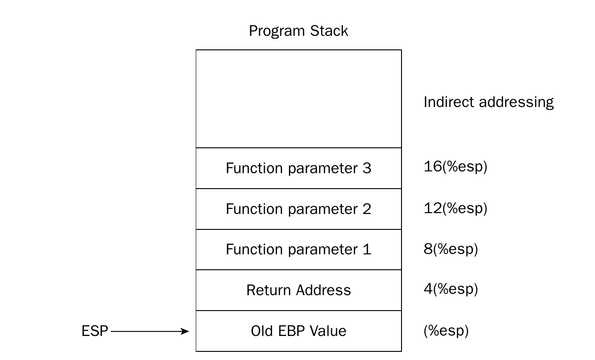

# 概述

C/C++ 作为系统级语言，可以方便地与汇编语言进行交互。C/C++ 与汇编语言的交互主要有两种方式，一种是内联汇编，一种是 C/C++ 和汇编的相互调用。在学习操作系统的过程中遇到了写汇编函数给 C 程序调用的情况，写这篇文章介绍 C/C++ 的相互调用。

C/C++最终要被转换为汇编程序，汇编程序中函数通过`call`和`ret`指令实现，但是·参数的传递和结果的返回具体使用什么方式是由程序员指定的，不同的汇编程序可能使用不同的方式。这样就导致一个问题，不同的汇编程序因为函数的实现方法不同，很难被重复利用。为了解决这个问题，大家提出了*调用规范*来统一汇编级别的函数实现方式。

C/C++ 和汇编程序的交互就是 C/C++ 编译器在将 C/C++ 程序转换为汇编程序时遵守一定的调用规范，这样的话 C/C++ 可以直接调用汇编函数，汇编也可以直接调用 C/C++函数。

# 传递规范

ISO C/C++ 没有规定调用规范，但是在特定的处理器和操作系统平台都有着约定俗成的规范，并且规范还有很多种，这里介绍的是 x86 架构的 Linux 默认的规范。 32 位和 64 位的规范不同，分开介绍。

不论是 32 位还是 64 位程序，函数在汇编语言层面的实现基本都是一样的。过程如下：
1. 传递参数
2. 调用`call`指令跳转到目标函数并压入返回地址（`cs`和`ip`）
3. 保存需要保存的寄存器
4. 函数分配 non-static 局部变量
5. 清理栈帧并调用`ret`指令返回

调用规范决定着以上步骤的具体实现方法。
## 32 位

调用者规范：
1. 通过堆栈传递参数，并且从右到左传递。
  参数传递后，堆栈高地址存放右面的参数

  

