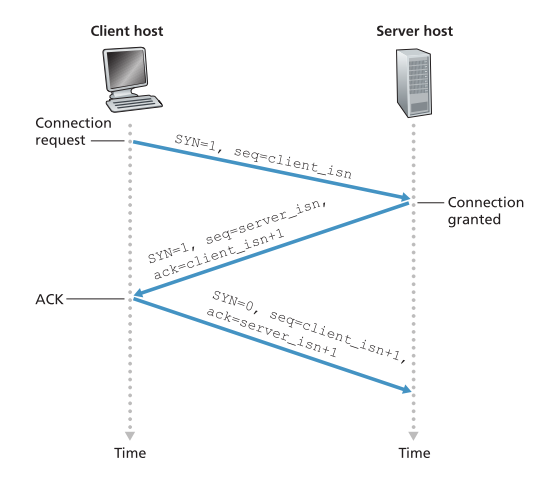

* [TCP 和 UDP 的比较](#tcp-和-udp-的比较)
* [进程到进程的数据传送](#进程到进程的数据传送)
* [传送可靠数据传送](#传送可靠数据传送)
    * [stop and wait](#stop-and-wait)
    * [pipelining](#pipelining)
    * [GBN(window slide protocal)](#gbnwindow-slide-protocal)
    * [Selective Request(SR)](#selective-requestsr)
    * [以上方案均存在接收到之前发送的包的可能](#以上方案均存在接收到之前发送的包的可能)
    * [comulative ack](#comulative-ack)
    * [- 减少重传](#--减少重传)
    * [TCP 中的两种情况](#tcp-中的两种情况)
    * [双全工（？？？）](#双全工)
    * [TCP 数据段的传递（有为解决的问题）](#tcp-数据段的传递有为解决的问题)
    * [*RTT* 的估算](#rtt-的估算)
    * [可靠数据传输（待续）](#可靠数据传输待续)
* [三次握手，四次挥手](#三次握手四次挥手)
    * [TCP 连接管理的安全问题](#tcp-连接管理的安全问题)
* [流量控制](#流量控制)
* [拥塞控制](#拥塞控制)
        * [通用的方法](#通用的方法)
            * [TCP 拥塞控制](#tcp-拥塞控制)
* [公平性](#公平性)
* [SSL](#ssl)

可靠数据传输：
- [ ] 发展脉络：存在的问题->解决方案->引入的问题->解决方案
- [ ] 大的角度：stop-and-wait ==> pipelining

--------------

- [ ] 网络层协助的拥塞控制
- [ ] 如何访问 NAT 中的私网设备
- [ ] ipv4 和 ipv6 如何共存

# TCP 和 UDP 的比较


# 进程到进程的数据传送

# 不可靠数据传送（UDP）

# 可靠数据传送

- 比特错误

- 包丢失

- 包乱序

- 包重复

    


- 序列号
- ACK/NAK
- 校验码
- 定时器
- 重传

## 底层链路可靠


## stop and wait

Reliable Data Transfer over a Channel with Bit Errors: rdt2.0

ARQ (Automatic Repeat reQuest) protocols.

rdt2.0 没有考虑 ACK/NAK 出错的情况，rdt2.1 考虑 ACK/NAK 出现错误的情况（添加序列号）。


rdt2.1、rdt2.2 发送方和接收方之间序列号的不一致，是发送方、接收方没有建立连接握手的过程导致的。rdt2.2 中，假如发送方发送包 0，接收方期待包 1，接收方将返回 ACK0，发送方会认为接受方成功接收包 0，之后发送包 1，相当于完成了序列号的协商。

在 rdt2.2 中，使用重复 ACK 替代 NAK。

rdt 2 没有引入计时器，任意时刻仅有一个包在发送中，不会出现乱序的情况，也不存在重复的情况。序列号是为了判断接收到的是之前错误的包还是正常的新包。

rdt 3 引入了计数器，当计数器时间耗尽，发送者认为包丢失或延迟，重新发送，因此某一时刻可能存在多个正在发送的包;在接收到 ACK 后才会发送下一个序号的包，因此任意时刻最多存在两个序号的包，并且顺序正常;可能存在重复的包，考虑这种情况：

1. 发送者发送包 0,发送超时，多次重新发送
2. 接受者接收到了其中一个包 0 并发送 ACK，尝试接收包 1
3. 发送者发送包 1，
4. 因超时而发送的包 0 先于包 1 到达接收者

这时，接收者已经接收到了包 0,开始接收包 1,但又接收到了包 0，必须正确处理包重复的情况。如果接收者接收到了包 1，然后开始接收包 0,之前发送的包 0 到达接收者，这时接收者就接收到了错误的包 0。为了避免这种情况，需要精心设置定时器，确保旧序列号的包在重新回到该序列号之前销毁。


## pipelining

## 	GBN(window slide protocal)

流水线发送很可能会存在乱序的情况，GBN 的处理办法很简单：

- 接收者：按照正常的顺序接收（接收到一个包就递增序列号），并发送 ACK
- 发送者：没接收到 ACK 就重新发送

这样就解决了乱序和重复的问题。


window-silde proto可靠数据传输cal 中认为发送方接收到了序列号为 N 的 ACK，那么序列号小于等于 N 的包的 ACK 也接收到了。这一点是由接收方保证的：接受方按顺序接收包，并发送 ACK。假如发送者要求接收包 100,却接收到了包 101,直接丢弃，不发送 ACK，因此确保了**接收者发送 ACK/发送者接收 ACK 时，序列号更小的包都已被接收**。


Window-silde protocal 仍然存在性能问题。考虑这种情况：

1. 发送者发送序列号为 0 - 100 的包
2. 接收者接收到 1 - 100 的包，包 0 丢失
3. 接收者完全按照顺序接收包，因此包 1 - 100 都被丢弃
4. 发送者发现超时，重新发送包 0
5. 接收者接收包 0

接收者接收到了包 1 - 100，却因为没有接收到包 0 而丢弃了所有接收到的包，这是严重的性能损失，有巨大的优化空间。我个人认为，一种可行的优化是：

- 接收方：将全部接收到的包存储在缓冲区中，并根据序号进行排列，确保顺序正确

- 发送方：不再依赖**接收者发送 ACK/发送者接收 ACK 时，序列号更小的包都已被接收**的断言，记录所有已收到的 ACK 的包，超时后重新发送未收到 ACK 的包。

    
  
    ## Selective Request(SR)


## 以上方案均存在接收到之前发送的包的可能

- SR 解决方案：将 window size 设置为小于等于 buffer 的一半

- 尽可能使用不重复的序列号

- 
-


# TCP 数据段 

TCP 传递数据段（*segment*），其中包含网络数据，为了提高数据传输效率，TCP 会根据底层链路一次能够传输的最大字节数 *MTU*（*Minimun Transfer Unit*）来确定 *MMS*（*Minimum segment size*）。MMS 叫做最大数据段长度，但实际上是指 TCP/IP 数据段中数据的最大大小，不包括 TCP 头。因此，MMS 等于：$$MMS = MTU - TCP/IP\space Header$$。通常，TCP/IP 头占用 40 字节，MTU 大约 1500 字节，因此 MSS 一般为 1460 字节。

```

    0                   1                   2                   3
    0 1 2 3 4 5 6 7 8 9 0 1 2 3 4 5 6 7 8 9 0 1 2 3 4 5 6 7 8 9 0 1
   +-+-+-+-+-+-+-+-+-+-+-+-+-+-+-+-+-+-+-+-+-+-+-+-+-+-+-+-+-+-+-+-+
   |          Source Port          |       Destination Port        |
   +-+-+-+-+-+-+-+-+-+-+-+-+-+-+-+-+-+-+-+-+-+-+-+-+-+-+-+-+-+-+-+-+
   |                        Sequence Number                        |
   +-+-+-+-+-+-+-+-+-+-+-+-+-+-+-+-+-+-+-+-+-+-+-+-+-+-+-+-+-+-+-+-+
   |                    Acknowledgment Number                      |
   +-+-+-+-+-+-+-+-+-+-+-+-+-+-+-+-+-+-+-+-+-+-+-+-+-+-+-+-+-+-+-+-+
   |  Data |           |U|A|P|R|S|F|                               |
   | Offset| Reserved  |R|C|S|S|Y|I|            Window             |
   |       |           |G|K|H|T|N|N|                               |
   +-+-+-+-+-+-+-+-+-+-+-+-+-+-+-+-+-+-+-+-+-+-+-+-+-+-+-+-+-+-+-+-+
   |           Checksum            |         Urgent Pointer        |
   +-+-+-+-+-+-+-+-+-+-+-+-+-+-+-+-+-+-+-+-+-+-+-+-+-+-+-+-+-+-+-+-+
   |                    Options                    |    Padding    |
   +-+-+-+-+-+-+-+-+-+-+-+-+-+-+-+-+-+-+-+-+-+-+-+-+-+-+-+-+-+-+-+-+
   |                             data                              |
   +-+-+-+-+-+-+-+-+-+-+-+-+-+-+-+-+-+-+-+-+-+-+-+-+-+-+-+-+-+-+-+-+

                            TCP Header Format

          Note that one tick mark represents one bit position.

```


| 字段 | 含义 |
| :--: | :--: |
|      |      |
|      |      |
|      |      |
|      |      |
|      |      |
|      |      |


# TCP 连接的建立

## TCP 字节流

TCP 将网络数据看作是字节流，但传输的是数据段。TCP 根据 MMS 将字节流切割成多段，将其存入到数据段中传递。数据段头中通过序列号（*sequence number*）和确认号（*acknowledgement number*）来确定该段包含的字节序列。序列号指示该数据段包含的字节流起始字节编号，确认号是期待读取到的字节的编号。

## 双全工


## 三次握手




**值得注意的是，A 发送给 B 的 ACK 是 B 发送给 A 的数据。**？？？

主机 A 接受到 B 发送的回写字符后，向主机 B 发送 ACK，由于没有发送实际的数据，TCP 头中的 Seq 段没有意义，随意选取了一个编号。


## 两次握手的问题

## 初始序列号的选择

考虑 rdt3.0 的问题

## 粘包问题


# TCP 连接的销毁

# *RTT* 的估算

RTT 的大小可以反应网络状况，TCP 使用 RTT 进行拥塞控制，但在网络传输中，网络状态不一定是稳定的，数据段的 RTT 会随时间变化，获取单个数据段的 RTT 没有意义，需要找出估算 RTT 的方法。

估算 RTT 的方法很简单，使用指数平均法（*exponential averaging*）即可（短作业优先调度算法也使用这种办法估算进程执行时间，详见《操作系统--精髓与设计原理》。

将单个数据段的 RTT 记作 $$SampleRTT$$，数据段平均（估算） RTT 记作 $$EstimatedRTT$$。计算公式为：

$$ EstimatedRTT = \alpha \cdot SampleRTT + (1-\alpha)EstimatedRTT $$

这种办法给不同时间点的发送的数据段不同的权重。展开 $EstimatedRTT$ 的公式可以看到，越近的数据段权重越高，越远的数据段权重越低，因此 $EstimatedRTT$ 在比较贴近当前网络状况的同时又比较稳定。使用这种方法，只需要记录第一个数据段的 $SampleRTT$，之后的平均 RTT 动态修正。通常，$\alpha$`取 0.15。

除了计算平均 RTT，还要描述当前网络的稳定情况。网络的稳定情况可以通过当前数据段 $SampleRTT$ 和 $EstimatedRTT$ 之间的差值（绝对值）描述，插值越大说明网络越不稳定，为了得到比较真实的网络稳定情况，同样使用指数平均法计算：

$$DevRTT = \beta \cdot |SampleRTT - EstimatedRTT| + (1-\beta)DevRTT$$

有了 $EstimatedRTT$ 和 $DevRTT$，就可以估算出合适的超时时间，通常将超时时间设置为 $EstimatedRTT + 4 \cdot DevRTT$。

# 定时器补偿


# TCP 的连续确认和选择重传

TCP 可靠数据传输是 GBN + SR

# 流量控制

# 零窗口探测

# 糊涂窗口综合症


# 网络拥塞

丢包时网络拥塞的结果，而不是其原因。

随着传输速率的增大，延迟越来越高，吞吐量也越来越高，当传输速率过大时，丢包率变大，延迟无限正大，吞吐量降低。

危害：

- 较大的延迟
- 大量的吞吐量浪费到重传上
- 链路中丢包导致之前的路由器做无用功
- 极端情况导致某些连接速率为 0
- 

拥塞控制与流量控制的差异

- 拥塞窗口由发送方维持，流量窗口由接收方发送
- 拥塞控制重点在于


# 经典 TCP 拥塞控制

拥塞控制的两种方式：

- 

- 

TCP 拥塞：

- 丢包
- 接收到 ACK
- 网络状况探测

区分不同的丢包原因反应的网络状况


## 拥塞窗口

## 慢启动

## 拥塞避免

## 快速恢复

## TCP Tahoe

## TCP Reno

AIMD(**A**dditive **I**ncrease，**M**ultiplicative **D**ecrease)

吞吐量

# TCP Cubic

公平性

# TCP Vegas

基于延迟的拥塞控制


# 网络层协助的阻塞控制

# 

# TCP 的公平性

# TCP 的安全问题

SYN flood attack 	

有效的阻止方法：SYN cookies

nmap 端口扫描

# SSL/TLS

# QUIC