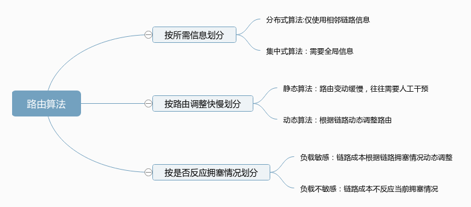
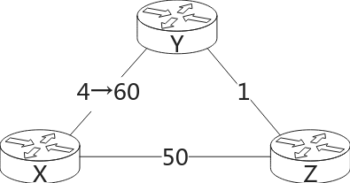

# 网络层概述

网络层不只有 IP

网络层和传输层是隔离的。

# 路由器结构

## 输入端口

## 交换

## 输出端口

## 排队

## 包调度

## 缓冲区

## 网络中立问题

# IPv4 包结构

# IPv4 地址

网络地址

直接广播地址

主机地址

特殊 IP 地址：回送地址，有限广播，本地广播地址，组播，默认路由（0.0.0.0），环回地址（127.0.0.0/8），链路本地地址（

共有/私有：

10.0.0.0/8

172.16.0.0/12

192.168.0.0/16

保留：

传统 IPv4 地址分类：

A B C D

# 子网划分

网络地址的表示：前缀

# DHCP

# NAT

网络穿透

# IPv6

# IPv6 过渡技术

## 隧道

## 翻译

## 双栈

# 广义转发与软件定义网络

# 路由算法

## LS(Link State) Algorithm

dijstra 算法

 iBGP connections do 
not always correspond to physical links.

链路震荡

自同步

## DV(Distance Vector) Algorithm

算法
$$
d_x(y)=min_v{c(x,y)+d_v(y)}
$$
routing loop

## LS vs DV Routing Algorithm 
not always correspond to physical links.

# 自治系统内通信

## OSPF

## RIP

# 自治系统间通信: BGP

实际上，最大的影响因素的政治、经济、商业因素	

