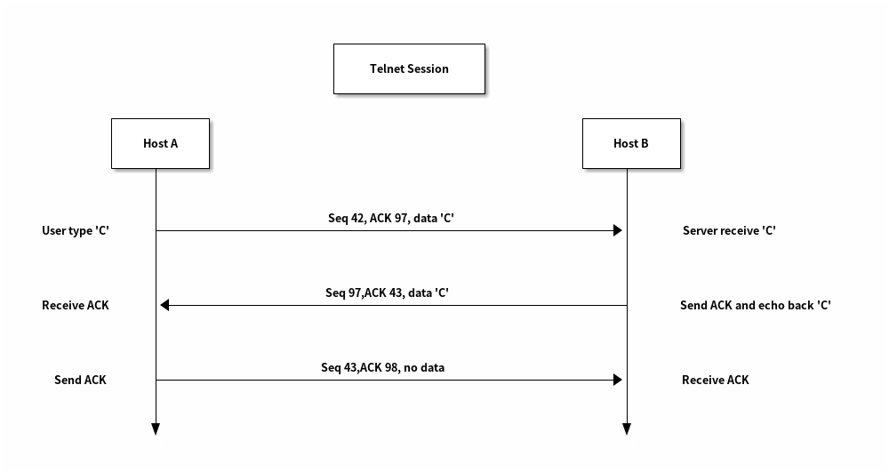
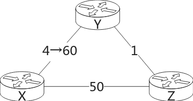

# ,网络概述

## 网络介质

局域网DSL 双绞线

HFC  同轴电缆 + 光纤

FTTH 光纤

Ethernet（双绞线） WiFi

3G/4G LTE

Twisted-Pair Copper Wire

Coaxial Cable

Fiber Optics

双绞线传递电信号，为了降低干扰，所以双绞

路由器的不同端口可能是不一样的线

## 网络的核心

### 包转发

(N + P - 1)*L/R

### 电路交换

两种多路服用方法：

- frequency-division multiplexing (FDM)
- time-division multiplexing (TDM)

## 网络的网络

## 延迟和丢包

traffic intensity

# 应用层

## HTTP

无状态

TCP 持久/不持久

### 消息格式

### cookie

### 缓存服务器

### HTTP/2

motivitation:

- HOL(Head Of Line) Block
- TCP congestion control

features:

- HOL Block ---- frame and interleave
- prorioty and depethe server can analyze the HTML page, identify
  the objects that are needed, and send them to the client before receiving explicit
  requests for these objects. ndency
- server push

## SMTP

C/S model

SMTP handshake

client -> server -> server -> client

push protocal

today HTTP ICMP

## DNS

Berkeley Internet Name Domain (BIND) software UDP port 53

- hosting aliasing: canonical hostname mnemonic hostname
- mail server aliasing
- load sistribution

### DNS 的架构

分布式、层级数据库

分布式：

• A single point of failure.

• Traffic volume.

• Distant centralized database.

• Maintenance.

层次：

root DNS, top-level domain DNS, authoritive DNS, local DNS。

### DNS 查询的过程

recursive/iterative queries
DNS caching -- local DNS
local DNS会告知是否来自 cache(nslookup: non-authoritive anwser)
default DNS

### DNS 缓存

### DNS 消息

```
DNS消息中可以有多个 RR，比如authoritive dns 的名字和地址（两条 RR）
```

### DNS 更新

通常静态配置

```
UPDATE 动态更新
			nslookup
```

### 配置 DNS

```
127.0.0.53 和 loopback network interface???    https://unix.stackexchange.com/questions/612416/why-does-etc-resolv-conf-point-at-127-0-0-53
```

## P2P

### P2P 的性能

### BitTorrent

- [ ] P2P下载时间？
  如何选择接受的包：rarest first
  判断在网络中，自己所没有并且在整个网络中最稀少的包，并下载该包。这样确保网络中分布的包均匀。
  如何选择和谁上传/下载：tit for tat

1. 从对自己上传速度最快的 4 个节点中下载，并优先向他们上传，这 4 个节点称为 unchoked,每 10s 判断一次。（解决了从谁下载的问题）
2. 在以上 4 个节点外任意选择一个节点，向它上传，这个节点称为 optimistically unchoked。如果对于这个节点来说它是最快的 4 个节点，则反过来向它发送，没 30s 判断一次。（必须要有节点向自己上传自己才能下载，解决了下载的起源问题）

## Video Stream

## CDN(Content Distritution Network)

---

# 传输层

可靠数据传输：

- [ ] 发展脉络：存在的问题->解决方案->引入的问题->解决方案
- [ ] 大的角度：stop-and-wait ==> pipelining
- [x] 网络层协助的拥塞控制

传输层提供了运行在不同主机上的进程间的逻辑连接。从网络物理结构的角度看，两进程的主机可能各在天一方，彼此通过数不清的路由器、交换机建立连接；但从进程自身的角度看，两进程的主机直接相连。传输层的数据包称为*报文段*（*segment*）。传输层提供进程间的逻辑连接，网络层提供主机间的逻辑连接，网络层数据包传输到

## 服务模型(待续）)

## 多路复用和解多路复用（待续）

## 不可靠数据传送（UDP）（待续）

## 可靠数据传输

逐次降低底层链路可靠性，完成一个简单的可靠数据传输算法。

### 底层链路可靠：rdt1.0

假设底层链路可靠，不会出现任何错误情况，那么发送方只需要发送报文段，接收方接受即可，状态图如下：


### 比特错误：rdt 2

进一步降低链路可靠性，假设底层链路可能出现比特错误。rdt1.0 中，发送方报文段出现错误，接收方直接接受错误报文段。为了避免接收方接收到错误报文段，接收方应当在接收到正确报文段后向发送方发送一个正确信息（即 ACK），发送方接收到 ACK 后发送下一个报文段；接收方接收到错误报文段后向发送方发送一条错误信息（即 NCK），发送方接收到后重传报文段。状态机如下：


rdt2.0 中，发送方发送报文段后停止发送，等待接收方返回的 ACK 或 NAK，所以这一类协议也叫做 *stop and wait protocal*。rdt2.0 考虑到了底层链路发生比特错误的可能，但没考虑到 ACK/NAK 发生比特错误的情况。加入 ACK/NAK 发生比特错误，发送方将永远等待下去！

发送方接收到错误的 ACK/NAK 后，不可以直接重传。虽然 ACK 是错误的，但发送出去的包未必是错误的，接收方接收到正确报文段后等待下一个报文段，如果直接重传，接收方会接收到重复的报文段。通过添加序列号解决重复报文段的问题，每个报文段都有序列号，接收方接收到序列号不等于当前期待序列号的报文段后，简单地丢弃并继续等待，这就是 rdt2.1 版本。

发送方状态机如下：


接收方状态机如下：


引入序列号后，NAK 就不必要了。假如接收方接收到错误包，向发送方返回最后一次接收到的报文段序列 ACK；发送方接收序列号不等于已发送报文段序列号的 ACK后，重传报文段。


rdt2.1、rdt2.2 中可能存在发送方和接收方之间序列号不一致的情况，接收方需要报文段 0，而发送方发送报文段 1。发送方、接收方序列号不一致是建立连接时没有握手导致的。rdt2.2 中，假如发送方发送包 0，接收方期待包 1，接收方将返回 ACK0，发送方会认为接受方成功接收包 0，之后发送包 1，相当于完成了序列号的协商。

rdt 2 没有引入计时器，任意时刻仅有一个包在发送中，不会出现乱序的情况，也不存在重复的情况。序列号是为了判断接收到的是之前错误的包还是正常的新。


### 存在丢包和比特错误：rdt3

再次降低底层链路可靠性，考虑存在丢包的情况，rdt2 协议的 ACK、报文段都可能丢失。ACK 丢失后发送方永远等待，报文段丢失后接收方永远等待。引入定时器解决丢包问题，发送方等待一段时间，定时器超时，重传报文段，接收方同理。rdt3 发送方状态机如下：

发送方定时重传报文段，所以这种协议也称为 *ARQ (Automatic Repeat reQuest) protocols*。定时器超时不一定意味着丢包，也可能是 ACK 丢失或 ACK 超时，所以使用定时器策略的协议必须考虑重复包的问题。定时器超时的三种情况如下：


rdt 3 引入了计数器，当计数器超时后重新发送，因此某一时刻可能存在多个正在发送的包;在接收到 ACK 后才会发送下一个序号的包，因此任意时刻最多存在两个序号的包，并且顺序正常;可能存在重复的包，考虑这种情况：

1. 发送者发送包 0,发送超时，多次重新发送
2. 接受者接收到了其中一个包 0 并发送 ACK，尝试接收包 1
3. 发送者发送包 1，
4. 因超时而发送的包 0 先于包 1 到达接收者

这时，接收者已经接收到了包 0,开始接收包 1,但又接收到了包 0，必须正确处理包重复的情况。如果接收者接收到了包 1，然后开始接收包 0,之前发送的包 0 到达接收者，这时接收者就接收到了错误的包 0。为了避免这种情况，需要精心设置定时器，确保旧序列号的包在重新回到该序列号之前销毁。


### 流水线

rdt 协议实现了可靠数据传输，但 stop and wait 的策略导致大部分时间都用于等待数据包传输和 ACK 返回，实际带宽利用率非常低。图示如下：


假设链路带宽为 1 Gbps，时延为 15 ms，发送方发送 8000 比特的报文段到接收方需要 $$D_{trans} = \frac{L}{R} = \frac{8000 bits}{10^9bits/s}=8\mu s$$，但往返时间 $$RTT=30ms$$，链路利用率仅为 $$\frac{L/R}{RTT+L/R}=\frac{0.008}{30.008}=0.00027=0.027\%$$！

性能低的根源在每次仅发送一个报文段，接收到 ACK 后才发送下一个报文段，使用流水线策略，每次发送多个数据包，提高链路利用率。


#### GBN(window slide protocal)

流水线算法和之前的停顿-等待算法

- 已发送已确认
- 已发送未确认
- 未发送
- 不可发送
- 

  

- 全局定时器
- 累积 ACK
- 无缓冲区

性能瓶颈在于接收方仅接收它期待的报文段。

流水线发送很可能会存在乱序的情况，GBN 的处理办法很简单：

- 接收者：按照正常的顺序接收（接收到一个包就递增序列号），并发送 ACK
- 发送者：没接收到 ACK 就重新发送

这样就解决了乱序和重复的问题。

window-silde proto可靠数据传输cal 中认为发送方接收到了序列号为 N 的 ACK，那么序列号小于等于 N 的包的 ACK 也接收到了。这一点是由接收方保证的：接受方按顺序接收包，并发送 ACK。假如发送者要求接收包 100,却接收到了包 101,直接丢弃，不发送 ACK，因此确保了**接收者发送 ACK/发送者接收 ACK 时，序列号更小的包都已被接收**。

Window-silde protocal 仍然存在性能问题。考虑这种情况：

1. 发送者发送序列号为 0 - 100 的包
2. 接收者接收到 1 - 100 的包，包 0 丢失
3. 接收者完全按照顺序接收包，因此包 1 - 100 都被丢弃
4. 发送者发现超时，重新发送包 0
5. 接收者接收包 0

接收者接收到了包 1 - 100，却因为没有接收到包 0 而丢弃了所有接收到的包，这是严重的性能损失，有巨大的优化空间。我个人认为，一种可行的优化是：

- 接收方：将全部接收到的包存储在缓冲区中，并根据序号进行排列，确保顺序正确
- 发送方：不再依赖**接收者发送 ACK/发送者接收 ACK 时，序列号更小的包都已被接收**的断言，记录所有已收到的 ACK 的包，超时后重新发送未收到 ACK 的包。
- 

#### Selective Request(SR)

#### 

  

  #### 以上方案均存在接收到之前发送的包的可能

- SR 解决方案：将 window size 设置为小于等于 buffer 的一半
- 尽可能使用不重复的序列号

### 小结（待续）

- 比特错误
- 包丢失
- 包乱序
- 包重复

处理手段：

- 序列号
- ACK/NAK
- 校验码
- 定时器
- 重传

## TCP 报文段格式（待续）

TCP 传递报文段（*segment*），其中包含网络数据，为了提高数据传输效率，TCP 会根据底层链路一次能够传输的最大字节数 *MTU*（*Minimun Transfer Unit*）来确定 *MMS*（*Minimum segment size*）。MMS 叫做最大报文段长度，但实际上是指 TCP/IP 报文段中数据的最大大小，不包括 TCP 头。因此，MMS 等于：

$$
MMS = MTU - TCP/IP\space Header
$$

。通常，TCP/IP 头占用 40 字节，MTU 大约 1500 字节，因此 MSS 一般为 1460 字节。

```{=latex}
\newpage
```

```


    0                   1                   2                   3
    0 1 2 3 4 5 6 7 8 9 0 1 2 3 4 5 6 7 8 9 0 1 2 3 4 5 6 7 8 9 0 1
   +-+-+-+-+-+-+-+-+-+-+-+-+-+-+-+-+-+-+-+-+-+-+-+-+-+-+-+-+-+-+-+-+
   |          Source Port          |       Destination Port        |
   +-+-+-+-+-+-+-+-+-+-+-+-+-+-+-+-+-+-+-+-+-+-+-+-+-+-+-+-+-+-+-+-+
   |                        Sequence Number                        |
   +-+-+-+-+-+-+-+-+-+-+-+-+-+-+-+-+-+-+-+-+-+-+-+-+-+-+-+-+-+-+-+-+
   |                    Acknowledgment Number                      |
   +-+-+-+-+-+-+-+-+-+-+-+-+-+-+-+-+-+-+-+-+-+-+-+-+-+-+-+-+-+-+-+-+
   |  Data |           |U|A|P|R|S|F|                               |
   | Offset| Reserved  |R|C|S|S|Y|I|            Window             |
   |       |           |G|K|H|T|N|N|                               |
   +-+-+-+-+-+-+-+-+-+-+-+-+-+-+-+-+-+-+-+-+-+-+-+-+-+-+-+-+-+-+-+-+
   |           Checksum            |         Urgent Pointer        |
   +-+-+-+-+-+-+-+-+-+-+-+-+-+-+-+-+-+-+-+-+-+-+-+-+-+-+-+-+-+-+-+-+
   |                    Options                    |    Padding    |
   +-+-+-+-+-+-+-+-+-+-+-+-+-+-+-+-+-+-+-+-+-+-+-+-+-+-+-+-+-+-+-+-+
   |                             data                              |
   +-+-+-+-+-+-+-+-+-+-+-+-+-+-+-+-+-+-+-+-+-+-+-+-+-+-+-+-+-+-+-+-+

                            TCP Header Format

          Note that one tick mark represents one bit position.


```

## TCP 连接的建立（待续）

### TCP 字节流（待续）

TCP 将网络数据看作是字节流，但传输的是报文段。TCP 根据 MMS 将字节流切割成多段，将其存入到报文段中传递。报文段头中通过序列号（*sequence number*）和确认号（*acknowledgement number*）来确定该段包含的字节序列。序列号指示该报文段包含的字节流起始字节编号，确认号是期待读取到的字节的编号。

和窗口的对应！！！！！！！！！

### 双全工



### 三次握手


**值得注意的是，A 发送给 B 的 ACK 是 B 发送给 A 的数据。**？？？

主机 A 接受到 B 发送的回写字符后，向主机 B 发送 ACK，由于没有发送实际的数据，TCP 头中的 Seq 段没有意义，随意选取了一个编号。

### 两次握手的问题

### 初始序列号的选择

考虑 rdt3.0 的问题

## TCP 连接的关闭（待续）

## *RTT* 的估算

RTT 的大小可以反应网络状况，TCP 使用 RTT 进行拥塞控制，但在网络传输中，网络状态不一定是稳定的，报文段的 RTT 会随时间变化，获取单个报文段的 RTT 没有意义，需要找出估算 RTT 的方法。

估算 RTT 的方法很简单，使用指数平均法（*exponential averaging*）即可（短作业优先调度算法也使用这种办法估算进程执行时间，详见《操作系统--精髓与设计原理》。

单个报文段的 RTT 记作 $SampleRTT$，报文段平均（估算） RTT 记作 $EstimatedRTT$，计算公式为：

$$
EstimatedRTT = \alpha \cdot SampleRTT + (1-\alpha)EstimatedRTT
$$

这种办法给不同时间点的发送的报文段不同的权重。展开 $EstimatedRTT$ 的公式可以看到，越近的报文段权重越高，越远的报文段权重越低，因此 $EstimatedRTT$ 在比较贴近当前网络状况的同时又比较稳定。使用这种方法，只需要记录第一个报文段的 $SampleRTT$，之后的平均 RTT 动态修正。通常，$\alpha$`取 0.15。

除了计算平均 RTT，还要描述当前网络的稳定情况。网络的稳定情况可以通过当前报文段 $SampleRTT$ 和 $EstimatedRTT$ 之间的差值（绝对值）描述，插值越大说明网络越不稳定，为了得到比较真实的网络稳定情况，同样使用指数平均法计算：

$$
DevRTT = \beta \cdot |SampleRTT - EstimatedRTT| + (1-\beta)DevRTT
$$

有了 $EstimatedRTT$ 和 $DevRTT$，就可以估算出合适的超时时间，通常将超时时间设置为 $EstimatedRTT + 4 \cdot DevRTT$。

## 定时器补偿（待续）

## TCP 的连续确认和选择重传（待续）

TCP 可靠数据传输是 GBN + SR

## 流量控制（待续）

### 零窗口探测

### 糊涂窗口综合症

## 粘包问题（待续）


## 网络拥塞（待续）

丢包时网络拥塞的结果，而不是其原因。

随着传输速率的增大，延迟越来越高，吞吐量也越来越高，当传输速率过大时，丢包率变大，延迟无限正大，吞吐量降低。

危害：

- 较大的延迟
- 大量的吞吐量浪费到重传上
- 链路中丢包导致之前的路由器做无用功
- 极端情况导致某些连接速率为 0
-

拥塞控制与流量控制的差异

- 拥塞窗口由发送方维持，流量窗口由接收方发送
- 拥塞控制重点在于

## 经典 TCP 拥塞控制（待续）

拥塞控制的两种方式：

TCP 拥塞：

- 丢包
- 接收到 ACK
- 网络状况探测

区分不同的丢包原因反应的网络状况

### 拥塞窗口

### 慢启动

### 拥塞避免

### 快速恢复

### TCP Tahoe

### TCP Reno

AIMD(**A**dditive **I**ncrease，**M**ultiplicative **D**ecrease)

吞吐量

### TCP Cubic

公平性

## 基于延迟的拥塞控制：TCP Vegas（待续）

## 网络层协助的阻塞控制（待续）

## TCP 的公平性（待续）


## QUIC（待续）


# 网络层：数据面板（待续）

网络层不只有 IP，还有比如　Novell IPX、AppleTalk

无连接、尽力传送、介质无关

## 路由器结构

### 输入端口

### 交换

### 输出端口

### 排队

### 包调度

### 缓冲区

### 网络中立问题

## IPv4 数据报格式（待续）

```{=latex}
\newpage
```

- [X] segment offiset
- [ ] option
- [ ] padding

```
    0                   1                   2                   3
    0 1 2 3 4 5 6 7 8 9 0 1 2 3 4 5 6 7 8 9 0 1 2 3 4 5 6 7 8 9 0 1
   +-+-+-+-+-+-+-+-+-+-+-+-+-+-+-+-+-+-+-+-+-+-+-+-+-+-+-+-+-+-+-+-+
   |Version|  IHL  |Type of Service|          Total Length         |
   +-+-+-+-+-+-+-+-+-+-+-+-+-+-+-+-+-+-+-+-+-+-+-+-+-+-+-+-+-+-+-+-+
   |         Identification        |Flags|      Fragment Offset    |
   +-+-+-+-+-+-+-+-+-+-+-+-+-+-+-+-+-+-+-+-+-+-+-+-+-+-+-+-+-+-+-+-+
   |  Time to Live |    Protocol   |         Header Checksum       |
   +-+-+-+-+-+-+-+-+-+-+-+-+-+-+-+-+-+-+-+-+-+-+-+-+-+-+-+-+-+-+-+-+
   |                       Source Address                          |
   +-+-+-+-+-+-+-+-+-+-+-+-+-+-+-+-+-+-+-+-+-+-+-+-+-+-+-+-+-+-+-+-+
   |                    Destination Address                        |
   +-+-+-+-+-+-+-+-+-+-+-+-+-+-+-+-+-+-+-+-+-+-+-+-+-+-+-+-+-+-+-+-+
   |                    Options                    |    Padding    |
   +-+-+-+-+-+-+-+-+-+-+-+-+-+-+-+-+-+-+-+-+-+-+-+-+-+-+-+-+-+-+-+-+

```

- version(4bit)：标示 IP 协议版本号，目前使用 IPv4 和 IPv6。
- IHL(4bit)：IPv4 数据报头中可以包含变长的选项，所以需要这个字段标示报头长度。
- Type of Service(8bit)：简称 TOS，用于标示服务类型，区分不同类型服务的包。比如实时应用（如视频通信软件）和非实时应用（如 FTP），让路由器进行专门的路由优化。这个字段中包含 2bit 的 ECN(Expelicit Congestion Notification) 用来实现网络层协助的拥塞控制，参考[网络层协助的拥塞控制](#网络层协助的拥塞控制)。
- Total Length(16bit)：IPv4 数据报负载是变长的，整个数据报长度应当小于链路层 MTU(Minimal Transfer Unit)的大小，否则就可能发生分片（取决于 Flags 中的 DF）。当数据报长度小于链路层最小帧时，要填充字节，这时就需要此字段标识真实长度。
- Identification(16bit)：用于分片时标示数据报 ID，分片后的多个数据报 ID 均设置为原先数据报 ID。
- Flags(3bit): 用于分片，标志分别为 0-DF(Don't Fragment)-MF(More Fragment)。DF 为 1 禁止路由器分片，路由器将返回 ICMP 报文。MF 为 1 标示发生了分片，并且该报文不是分片后的最后一个报文。
- Fragment Offset(13bit)：此字段乘 8 得到分片时数据报负载在原先数据报负载中的偏移。
- Time to Live(8bit): 简称 TTL，单位为跳，即该报文最多在网络中转发 TTL 跳，每一跳都递减 TTL。TTL 为零意味着该报文生命周期结束，路由器应当丢弃它并返回 ICMP 报文。
- Protocal(8bit)：网络中每层都是独立的，IP 协议并不和 TCP 协议绑定，它还可以传输别的传输层协议数据包，这个字段标示上层（传输层）协议。
- Header Checksum(16bit)：每次转发都要修改 TTL，要重新计算校验和。
- Srouce Address(32bit)：发送方 IPv4 地址。
- Destination Address(32bit)：接收方 IPv4 地址。
- Option
- padding

## IPv4 地址

网络地址

直接广播地址

主机地址

特殊 IP 地址：回送地址，有限广播，本地广播地址，组播，默认路由（0.0.0.0），环回地址（127.0.0.0/8），链路本地地址（

共有/私有：

10.0.0.0/8

172.16.0.0/12

192.168.0.0/16

保留：

传统 IPv4 地址分类：

A B C D

## 子网划分

安全、性能、地址管理、便于管理

网络地址的表示：前缀

## IPv4 分片

IPv4 协议被设计为链路层无关的，可以适应 MTU 大小不同的链路层协议和介质。当一个 IPv4 数据报在传输过程中遭遇了 MTU 小于该数据报长度的链路，发送方路由器会考虑把数据报拆分为多个长度小于 MTU 的数据报，接收方路由器再把这些拆分后的小数据报组装成原先的大数据报。这个过程就是 IPv4 分片。

IPv4 分片主要通过 ID、Flags 和 Fragment Offset 字段实现。每个数据报都有自己的 ID，发生分片时，所有拆分出来的数据报都使用原先数据报的 ID。Flags 有以下三个字段：

- bit 0 Reserved：此标志位保留，值为 0。
- bit 1 DF(Don't Fragment)：值为 1 禁止路由器分片，返回 ICMP 报文。
- bit 2 MF(More Fragment)：值为 1 表示此数据报不是最后一个分片数据报，值为 0 意味这所有分片数据报都已发送。

Fragment Offset 标示分片后数据报负载在原先数据报负载中的偏移，偏移为 FragmentOffset * 8。

## IPv4 组播

## DHCP

## NAT

网络穿透

## IPv6

## IPv6 过渡技术

### 隧道

### 翻译

### 双栈

## IPv4 字段的变化情况

## 广义转发


# 网络层：控制面板

路由器中和路由（决定数据包从源主机到目的主机的路径）相关的功能成为控制面板。

传统上，每个路由器都有自己的控制面板，即每个路由器都独立实现了路由算法。


现在，*软件定义网络*迅速发展，使用远程控制器连接路由器，实现逻辑上集中式的控制，路由器给控制器提供必要链路信息，控制器计算路由表并安装到路由器中。


## 路由算法

路由算法决定数据报从主机发送到目的主机的路径，路由算法探查出的路径应当尽可能好，如路径短时延小、拥塞少等。路径的好坏程度由路径的*成本*表示，比如可以将时延表示为成本，成本低代表时延小。实际上，链路成本并不反映真实的成本，不是路由算法根据链路成本路由，而是网路管理员设置链路状态，诱导路由算法计算出期待的路由路径。

根据不同的指标将路由算法划分为以下三类：


这里介绍集中式的*链路状态路由算法（Link State Algorithm）*和分布式的*距离矢量路由算法（Vector Distance Algorithm）*。


### 链路状态算法（Link State Algorithm）

*链路状态*说明 LS 算法需要链路的状态信息，这里的状态信息指链路的成本。LS 算法根据网络中各链路状态，使用 Dijstra 算法计算主机间成本最小的路径。LS 算法是集中式的，需要知道整个网络拓扑中的链路信息，传统网络中通过路由器*链路状态广播*实现，软件定义网络中通过逻辑集中式的控制器管理状态。

LS 算法从源节点出发，计算到其他所有主机的最低成本路径，最终得到该节点的路由表。通过 K 轮迭代，得到到 K 个目的节点的路径，这种遍历方式有些类似于图的广度优先遍历。


> What is the shortest way to travel from [Rotterdam](https://en.wikipedia.org/wiki/Rotterdam) to [Groningen](https://en.wikipedia.org/wiki/Groningen), in general: from given city to given city. [It is the algorithm for the shortest path](https://en.wikipedia.org/wiki/Shortest_path_problem), which I designed in about twenty minutes. One morning I was shopping in [Amsterdam](https://en.wikipedia.org/wiki/Amsterdam) with my young fiancée, and tired, we sat down on the café terrace to  drink a cup of coffee and I was just thinking about whether I could do  this, and I then designed the algorithm for the shortest path. As I  said, it was a twenty-minute invention. In fact, it was published in  '59, three years later. The publication is still readable, it is, in  fact, quite nice. One of the reasons that it is so nice was that I  designed it without pencil and paper. I learned later that one of the  advantages of designing without pencil and paper is that you are almost  forced to avoid all avoidable complexities. Eventually, that algorithm  became to my great amazement, one of the cornerstones of my fame.
>
> — Edsger Dijkstra, in an interview with Philip L. Frana, Communications of the ACM, 2001

将路由域视作路由器的集合 $N$，再划分为查找到最低成本路径的节点集(已访问节点集) $N'$和未查找到最低成本路径的节点集（未访问节点集） $N-N'$，不断扩大 $N'$ ，直到 $N'=N$ 时找到所有节点的最低成本路径。$D(v)$ 表示源节点到目的节点 $v$ 的最低成本路径，$C(x,y)$ 表示直接相连的节点 $x$ 到 $y$ 的链路成本，$p(v)$ 表示路径中 $v$ 的前继节点。

算法分为初始化和迭代两个阶段，初始化段将源节点 $u$ 加入到 $N'$ 中，并设置到其他节点 $v$ 的 $D(v)$，不相邻的 $D(v)$ 设置为 $\infin$。伪代码如下：

```
1  Initialization: 
2    N' = {u}                               /* compute least cost path from u to all other nodes */
3    for all nodes v 
4      if v adjacent to u            /* u initially knows direct-path-cost only to  direct neighbors    */
5          then D(v) = C(u,v)                   /* but may not be minimum cost!                                                    */
6      else D(v) = ∞ 
```

迭代阶段从 $N'$ 出发查找不在 $N'$ 中但可以确定最短路径的节点 $w$（即  $N'$ 的相邻节点），并将它加入到 $N'$ 中，然后更新所有和 $N'$ 节点相邻节点 $v$ 的 $D(v)$，重复以上过程直到 $N=N'$。伪代码如下：

```
Loop
	find w not in N' such that D(w) is a minimum 
	add w to N' 
	update D(v) for all v adjacent to w and not in N' : 
     D(v) = min ( D(v),  D(w) + C(w,v)  ) 
	/* new least-path-cost to v is either old least-cost-path to v or known 
	least-cost-path to w plus direct-cost from w to v */ 
until N' = N
```

Dijkstra 算法的一个例子如下：


另一个例子——基于欧几里得距离的 Dijkstra 算法：


Dijkstra 算法存在*路由震荡*的问题，当链路成本依赖于链路流量会出现路由路径反复震荡的现象。考虑以下情形，路由器 b、c、d 向 a 路由数据报，路由器流量分别为 1、e(e<1) 和 1，链路成本有方向并和路由器流量有关。


路由器会立刻迅速发现存在成本更低的路径，然后通过该路径路由，流量涌入该路径后，路径成本增加，原路径成本降低，转而从原路径路由，在两个路由路径间不断震荡。

对于有 $N$ 个节点的网络，Dijkstra 算法需要迭代 $N$ 轮，每次要迭代不在 $N'$ 中的节点，所以算法复杂度为 $O(n^2)$，更高效的实现（使用堆，参考维基百科）算法复杂度可以优化为 $O(nlogn)$。每个路由器都要向其他 $N - 1$ 个路由器广播链路状态，一种高效的消息传播算法可以以 $O(n)$ 的复杂度向目的节点传播消息，所以消息传播的复杂度为 $O(N*N)=O(N^2)$。


### 距离矢量算法（Distance Vector Algorithm）

距离矢量算法基于 *Bellman-Fold* 方程：

$$
D_x(y)=min_v\{C(x,v)+D_v(y)\}
$$

LS 路由算法中，节点掌握整个网络的链路信息，独立进行计算。DV 路由算法通过 Bellman-Fold 方程将到目的节点最低成本路径的计算委托给了相邻节点，相邻节点再委托给它的相邻节点，依次扩散下去。这样，路由器只需要存储其相邻节点的距离矢量（到其他节点的最小路径成本）即可。

算法（每个节点）如下：

1. 链路状态发生变化时或定时向相邻节点发送本节点距离矢量；
2. 接收到相邻节点距离矢量后重新计算本节点距离矢量；
3. 如果本节点距离矢量发生改变，发送给相邻节点。

DV 路由算法有以下特征：

- 迭代：节点距离矢量的变化通过多次迭代传播影响其他节点。

- 异步：节点间再不同时刻分享距离矢量

- 分布式：节点仅需要相邻节点的距离矢量

- 自停止：不需要停止状态判断，距离矢量不变就相当于算法结束。

有以下网络拓扑，节点距离矢量的影响每单位向外扩散一跳。节点 c 的距离矢量在 t = 0 时刻改变，t = 1 时刻传播到 b；b 重新计算距离矢量，向相邻节点传播，t = 1 时刻传播到 e；e 重新计算距离矢量，向相邻节点传播，t = 3 时刻传播到 h，h 再重新计算距离矢量并向相邻节点传播……节点距离矢量改变迭代式地传播到其他节点，就好像一颗石子扔进水里，水波向外传播一样。


假设某时刻网络中距离矢量如下，a、c、e 向 b 传播距离矢量，


b 重新计算距离矢量，并向相邻节点扩散，重复此过程。


各节点异步地扩散自己地距离矢量，一旦链路状态发生变化但距离矢量扩散不及时，路由器就会使用旧路由矢量进行路由，导致*路由回环（routing loop）*。

有三个路由器，Z 通过 Y 路由数据报到 X，成本为 5。XY 链路成本从 4 增大到 60，Z 无法获知 XY 链路成本的变化，仍使用 Z-Y-X 的路径，Y 侦测到 XY 链路成本的变化，重新计算距离矢量，发现 $D_Z(X)$ 只有 5，选择将包转发给 Z。Z 接收到数据报后再传给 Y，Y 重新计算得到 $D_Y(X)=D_Y(X)+D_Z(X)=1+5=6$，将数据报传给 Z。Z 接收到数据报后再传给 Y，Y 重新计算得到 $D_Y(X)=D_Y(X)+D_Z(X0)=1+6=7$……



如果 $C(X,Y)$ 增加到无穷大，数据报就会一直在 Y、Z 间回环！路由回环体现了分布式算法的复杂性，这种情况再网络中很常见并且没有完美的办法解决。


### LS 和 DV 的比较

链路状态路由协议和距离矢量路由协议是两类主要的路由协议，主要特征的对比如下。

|                |                     LS                     |                         DV                         |
| :------------: | :----------------------------------------: | :------------------------------------------------: |
| 消息传递复杂度 |      所有节点间，复杂度为 $O(N^2)$。       |          邻居节点间交换，所需时间不确定。          |
|    收敛速度    |    复杂度为$O(N^2)$，可能存在路由震荡。    |           时间不确定，可能存在路由回环。           |
|     鲁棒性     | 每个路由器独立计算路由表，错误不容易传播。 | 每个路由器都依赖其他路由器的路由表，错误容易传播。 |


## 自治系统内通信

今天的互联网中至少有上千万路由器，链路信息通信、计算、存储的成本会大得无法接受。如此大的规模，LS 路由算法甚至都无法完成链路状态传播，DV 路由算法根本无法收敛。另外，路由器的网络往往由 ISP 管理，ISP 希望自主地管理路由器网络，并向外隐藏内部的组织方式。为了适应这种情况，将大的路由器网络划分为一个个小的路由器网络，小的路由器网络通常被同一组织管理，运行相同的路由算法，在小的路由器网络中再划分子网，这种小的路由器网络就叫做*自治系统（Autonomous System）*，也叫自治域，简称 *AS*。类似于域名，每个自治域都在管理机构注册并有唯一的编号（ASN）。

按照路由协议运行的位置，可以划分为自治系统内路由协议（如 OSPF）和自治系统间路由协议（BGP）。路由时同时使用域内协议和域间协议，域内路由协议负责在自治域内路由数据报，决定域内路由表条目；域间路由协议负责在自治域间路由数据报，决定域间路由表条目。


### OSPF：一种链路状态路由协议

*OSPF (Open Shortest Path First)* 协议是典型的 LS 路由协议，使用 Dijkstra 算法，以当前节点为树根计算最低成本路径树。它运行在 IP 协议上，引入了“区域”概念，将 AS 划分为一个骨干区域和多个非骨干区域，所有非骨干区域都和骨干区域相连。链路信息仅在区域中广播，这种设计降低了泛洪的成本。区域的设计允许 ISP 将一个 AS 划分为多层结构，提高网络管理灵活性。


OSPF 协议的消息都通过简单加密算法或 MD5 进行了加密，未成功验证的路由器无法参与到链路信息交换中，提高了网络的安全性。此外，OSPF 还支持多路径路由，当有多条成本相同的路径时，OSPF 可以使用多条路径，避免流量涌入一条路径阻塞网络。


## 自治系统间通信: BGP

路由器利用 IP 地址在路由表中进行最长后缀匹配以确定转发端口，对于域间通信，路由器要将数据报转发到子网或子网的集合。这时，路由器就不能再使用 IP 地址进行定位主机，而要使用网络前缀定位网络，比如根据网络 202.202.22.0/22 决定数据报要转发到哪个端口。

为了实现域间通信，所有自治系统间都运行相同的域间路由协议——*BGP(Border Gateway Protocal)*。将路由器划分为两类，AS 边缘可以与其他 AS 通信的路由器通常称作*网关（gateway）*，仅在域内通信的路由器叫做*内部路由器*。BGP 必须让路由器获得相邻 AS 的可访问性信息和转发到目的自治域的最佳路径。

为了获取可访问信息，就必须在不同自治域间建立通信；为了让路由器获取转发到目的自治域的最佳路径，就必须在自治域内建立通信。显然，域间可访问性信息通过相邻子自治域网关间通信获得，最佳路径通过网关和内部路由器建立通信计算得到。所以，BGP 连接分为内部连接（iBPG）和外部连接（eBPG）。


BGP 协议使用 TCP 连接，所以 iBGP 连接是逻辑连接，而不是物理上直接相连。

受政治经济因素影响，域间路由的路径选择比较复杂，比如有两个自治域 A、B，分别由不同的运营商运营，并且 A 自治域的运营商不允许 B 运营商向 A 转发数据报，自治域 B 就只能另觅他径转发。自治域内的路由器一般由单一组织管理，所以域内路由协议可以专注于性能，而域间的 BPG 必须专注于路由策略。BGP 协议使用消息实现基于策略的路由，通过不同的消息，自治域可以拒绝其他自治域的转发，可以不向特定自治域宣告自己的存在，实现灵活的域间路由路径选择。

- OPEN: 和远程 BPG 伙伴节点建立 TCP 连接并验证发送节点。
- UPDATE: 更新路径信息。
- KEEPALIVE: 接收到 OPEN 消息后返回 KEEPLIVE，也可以用于维持活跃连接。

- NOTIFICATION: 关闭连接或报告错误。

BGP 最终重要的属性是以下两种：

- AS-PATH： ASN 列表，表示到某子网所在自治域的路径。
- NEXT-HOP：下一跳自治域（AS-PATH 起始自治域）的网关 IP 地址。


AS1 获得 AS3 自治域中子网 X 的域间路由路径过程如下 ：

- AS3 向相邻自治域 AS2 网关 2c 发送 AS-PATH，内容为 AS3 自治域编号和子网 X。
- AS2 网关 2c 接收到 AS3 的 AS-PATH 后，通过 iBGP 传播给 AS 内所有路由器。
- AS2 网关 2a 往 AS-PATH 中添加 AS2 自治域编号，发送给 AS1 网关 1c
- AS1 网关 1c 接收到 AS-PATH 后，发送到 AS 内其他路由器。

对于 AS3 发送的 AS-PATH，NEXT-HOP 是 3a 的 IP 地址；对于 AS2 发送的 AS-PATH，NEXT-HOP 是 2a 的 IP 地址。自治域 AS1 内部路由器 1a 向 AS3 子网 X 转发数据报时，先通过域内路由协议将数据报转发给网关 1c，1c 再选择选择 AS3 或 AS2 转发给 AS3。再这种情况下，虽然从 AS1 到 AS3 由两条路径，但两条路径都是转发给网关 1c，对于 1a 实际上只有一种选择。

假如内部路由器向外转发数据报有多个网关可以选择，那么内部路由器使用基于*热土豆（hot potato）*策略的算法选择网关。热土豆策略将数据报比喻成热土豆，路由器要尽快将热土豆传给其他路由器以避免烫手，直接将数据报转发给到自己成本最小的网关，不考虑该网关传递给其他自治域的成本如何。


以上网络中，2d 要向 AS3 中的子网 X 转发数据报，发现有 2a 和 2c 两个网关可以转发，直接转发给网关 2a，不考虑 2a 传递给 AS3 的成本。热土豆算法中路由器极其短视，仅考虑自己到网关的成本，导致路由路径很可能很差。BGP 使用更加精致的路由算法确定最佳路径：

- 网关有 local-preference 属性，优先选择属性高的网关。
- 对于优先级相同的网关，选择 AS 跳数最少的网关。
- 网关 AS 跳数都相同，使用热土豆策略。
- 如果有多个网关成本相同，就使用别的标准进行选择，比如使用 BGP ID。


## IP 任播

BGP 协议允许从有多条到目的 IP 地址的路径，也就是说同一个 IP 地址可以出现多次。如果给不同位置的主机相同的 IP 地址，路由器就会接收到多条到此 IP 地址的路径，路由器没法发现这是多个具有相同 IP 的主机，以为这是到同一主机的不同路径。这样就实现了多个主机一个地址。这种网络地址和网络节点之间存在一对多的关系就叫做*任播*（*any cast*），一个地址对应一群接收节点，但在任何给定时间，只有其中之一可以接收到发送端来的信息。

BGP 路由器可能会选择不同的路径，IP 任播中 TCP 连接中的包可能会被转发到其他服务器实例（具有相同 IP 地址但 BGP 路径不同的主机），所以 IP 任播的应用场景优先。一个使用 IP 任播的实例是 DNS 服务器，全球有 13 个根服务器 IP 地址，但却有数百个根服务器主机分布在全球不同区域。

关于 IP 任播的资料比较匮乏，维基百科有简短的[介绍](https://en.wikipedia.org/wiki/Anycast)。


## ICMP

*ICMP(internet control message protocol)* 用于通常用于返回的错误信息或是分析路由，比如路由器接收到目的地址无法访问的数据包时返回 ICMP 消息。

ICMP 虽然是网络层协议的一部分，但它使用 IP 协议发送控制消息（视作 ICMP 报文而不是一般的 IP 报文）。所以从这个角度看，可以将 ICMP 视作网络层和传输层中间的协议。

```
 +-+-+-+-+-+-+-+-+-+-+-+-+-+-+-+-+-+-+-+-+-+-+-+-+-+-+-+-+-+-+-+-+-+-+-+-+-+-+-+
 |Bits |         160-167       |        168-175        |        176-191        |
 +-+-+-+-+-+-+-+-+-+-+-+-+-+-+-+-+-+-+-+-+-+-+-+-+-+-+-+-+-+-+-+-+-+-+-+-+-+-+-+
 | 160 |      Source Port      |   Destination Port    |       Checksum        |
 +-+-+-+-+-+-+-+-+-+-+-+-+-+-+-+-+-+-+-+-+-+-+-+-+-+-+-+-+-+-+-+-+-+-+-+-+-+-+-+
 | 192 |                            Rest of Header                             |
 +-+-+-+-+-+-+-+-+-+-+-+-+-+-+-+-+-+-+-+-+-+-+-+-+-+-+-+-+-+-+-+-+-+-+-+-+-+-+-+
```

- **Type**： ICMP的类型,标识生成的错误报文；
- **Code**： 进一步划分ICMP的类型,该字段用来查找产生错误的原因.；例如，ICMP的目标不可达类型可以把这个位设为1至15等来表示不同的意思。
- **Checksum**： Internet校验和（[RFC 1071](https://tools.ietf.org/html/rfc1071)），用于进行错误检查，该校验和是从ICMP头和以该字段替换为0的数据计算得出的。
- **Rest of Header**： 报头的其余部分，四字节字段，内容根据ICMP类型和代码而有所不同。比如超时报文这部分是超时时路由器 IP 地址，而源站抑制报文（已废弃）使用此字段。

ICMP 类型如下（来自[维基百科](https://zh.wikipedia.org/wiki/%E4%BA%92%E8%81%94%E7%BD%91%E6%8E%A7%E5%88%B6%E6%B6%88%E6%81%AF%E5%8D%8F%E8%AE%AE)）：

| 类型                                                 | 代码 | 状态                                                         | 描述                                                         | 查询 | 差错 |
| ---------------------------------------------------- | ---- | ------------------------------------------------------------ | ------------------------------------------------------------ | ---- | ---- |
| 0 - [Echo Reply](https://zh.wikipedia.org/wiki/Ping) | 0    |                                                              | echo响应 (被程序[ping](https://zh.wikipedia.org/wiki/Ping)使用） | ●    |      |
| 1 and 2                                              |      | 未分配                                                       | 保留                                                         |      | ●    |
| 3 - 目的不可达                                       | 0    |                                                              | 目标网络不可达                                               |      | ●    |
| 1                                                    |      | 目标主机不可达                                               |                                                              | ●    |      |
| 2                                                    |      | 目标协议不可达                                               |                                                              | ●    |      |
| 3                                                    |      | 目标端口不可达                                               |                                                              | ●    |      |
| 4                                                    |      | 要求分段并设置[DF flag](https://zh.wikipedia.org/wiki/IPv4#报文结构)标志 |                                                              | ●    |      |
| 5                                                    |      | 源路由失败                                                   |                                                              | ●    |      |
| 6                                                    |      | 未知的目标网络                                               |                                                              | ●    |      |
| 7                                                    |      | 未知的目标主机                                               |                                                              | ●    |      |
| 8                                                    |      | 源主机隔离（作废不用）                                       |                                                              | ●    |      |
| 9                                                    |      | 禁止访问的网络                                               |                                                              | ●    |      |
| 10                                                   |      | 禁止访问的主机                                               |                                                              | ●    |      |
| 11                                                   |      | 对特定的TOS 网络不可达                                       |                                                              | ●    |      |
| 12                                                   |      | 对特定的TOS 主机不可达                                       |                                                              | ●    |      |
| 13                                                   |      | 由于过滤 网络流量被禁止                                      |                                                              | ●    |      |
| 14                                                   |      | 主机越权                                                     |                                                              | ●    |      |
| 15                                                   |      | 优先权终止生效                                               |                                                              | ●    |      |
| 4 - 源端关闭                                         | 0    | 弃用                                                         | 源端关闭（拥塞控制）                                         |      | ●    |
| 5 - 重定向                                           | 0    |                                                              | 重定向网络                                                   |      | ●    |
| 1                                                    |      | 重定向主机                                                   |                                                              | ●    |      |
| 2                                                    |      | 基于TOS 的网络重定向                                         |                                                              | ●    |      |
| 3                                                    |      | 基于TOS 的主机重定向                                         |                                                              | ●    |      |
| 6                                                    |      | 弃用                                                         | 备用主机地址                                                 |      |      |
| 7                                                    |      | 未分配                                                       | 保留                                                         |      |      |
| 8 - [请求回显](https://zh.wikipedia.org/wiki/Ping)   | 0    |                                                              | Echo请求                                                     | ●    |      |
| 9 - 路由器通告                                       | 0    |                                                              | 路由通告                                                     | ●    |      |
| 10 - 路由器请求                                      | 0    |                                                              | 路由器的发现/选择/请求                                       | ●    |      |
| 11 - ICMP 超时                                       | 0    |                                                              | TTL 超时                                                     |      | ●    |
| 1                                                    |      | 分片重组超时                                                 |                                                              | ●    |      |
| 12 - 参数问题：错误IP头部                            | 0    |                                                              | IP 报首部参数错误                                            |      | ●    |
| 1                                                    |      | 丢失必要选项                                                 |                                                              | ●    |      |
| 2                                                    |      | 不支持的长度                                                 |                                                              |      |      |
| 13 - 时间戳请求                                      | 0    |                                                              | 时间戳请求                                                   | ●    |      |
| 14 - 时间戳应答                                      | 0    |                                                              | 时间戳应答                                                   | ●    |      |
| 15 - 信息请求                                        | 0    | 弃用                                                         | 信息请求                                                     | ●    |      |
| 16 - 信息应答                                        | 0    | 弃用                                                         | 信息应答                                                     | ●    |      |
| 17 - 地址掩码请求                                    | 0    | 弃用                                                         | 地址掩码请求                                                 | ●    |      |
| 18 - 地址掩码应答                                    | 0    | 弃用                                                         | 地址掩码应答                                                 | ●    |      |
| 19                                                   |      | 保留                                                         | 因安全原因保留                                               |      |      |
| 20 至 29                                             |      | 保留                                                         | *Reserved* for robustness experiment                         |      |      |
| 30 - Traceroute                                      | 0    | 弃用                                                         | 信息请求                                                     |      |      |
| 31                                                   |      | 弃用                                                         | 数据报转换出错                                               |      |      |
| 32                                                   |      | 弃用                                                         | 手机网络重定向                                               |      |      |
| 33                                                   |      | 弃用                                                         | [Where-Are-You](https://zh.wikipedia.org/w/index.php?title=Where-Are-You&action=edit&redlink=1)（originally meant for [IPv6](https://zh.wikipedia.org/wiki/IPv6)） |      |      |
| 34                                                   |      | 弃用                                                         | [Here-I-Am](https://zh.wikipedia.org/w/index.php?title=Where-Are-You&action=edit&redlink=1)（originally meant for IPv6） |      |      |
| 35                                                   |      | 弃用                                                         | Mobile Registration Request                                  |      |      |
| 36                                                   |      | 弃用                                                         | Mobile Registration Reply                                    |      |      |
| 37                                                   |      | 弃用                                                         | Domain Name Request                                          |      |      |
| 38                                                   |      | 弃用                                                         | Domain Name Reply                                            |      |      |
| 39                                                   |      | 弃用                                                         | SKIP Algorithm Discovery Protocol, [Simple Key-Management for Internet Protocol](https://zh.wikipedia.org/w/index.php?title=Simple_Key-Management_for_Internet_Protocol&action=edit&redlink=1) |      |      |
| 40                                                   |      |                                                              | [Photuris](https://zh.wikipedia.org/w/index.php?title=Photuris_(protocol)&action=edit&redlink=1), Security failures |      |      |
| 41                                                   |      | 实验性的                                                     | ICMP for experimental mobility protocols such as [Seamoby](https://zh.wikipedia.org/w/index.php?title=Seamoby&action=edit&redlink=1) [RFC4065] |      |      |
| 42 到 255                                            |      | 保留                                                         | 保留                                                         |      |      |
| 235                                                  |      | 实验性的                                                     | RFC3692（ [RFC 4727](https://tools.ietf.org/html/rfc4727)）  |      |      |
| 254                                                  |      | 实验性的                                                     | RFC3692（ [RFC 4727](https://tools.ietf.org/html/rfc4727)）  |      |      |
| 255                                                  |      | 保留                                                         | 保留                                                         |      |      |

这里介绍两个类 ICMP 报文：源站抑制报文、ECHO request/reply 报文。

*源站抑制报文*旨在请求发送方降低发往路由器或主机的报文发送速率。如果一个或一群主机高速地向路由器发送数据，路由器接收速率可能会远远大于转发速率，这会导致路由器缓冲区耗尽。因为 IP 协议没有 NAK 机制，发送方不清楚路由器是否能够正常接收数据，所以引入源站抑制报文充当  NAK。当路由器接受速率远远大于发送速率（缓冲区最终会耗尽）时，路由器向发送方返回源站抑制 ICMP 报文，发送方接收后降低发送速率或等待一段时间，给路由器时间清空缓冲区。有研究表明源站抑制时无效的措施，这个机制已经弃用。报文格式如下：

```
 +-+-+-+-+-+-+-+-+-+-+-+-+-+-+-+-+-+-+-+-+-+-+-+-+-+-+-+-+-+-+-+-+-+-+-+-+
 |        Type = 5       |        Code = 0       |       Checksum        |
 +-+-+-+-+-+-+-+-+-+-+-+-+-+-+-+-+-+-+-+-+-+-+-+-+-+-+-+-+-+-+-+-+-+-+-+-+
 |                                 Unused                                |
 +-+-+-+-+-+-+-+-+-+-+-+-+-+-+-+-+-+-+-+-+-+-+-+-+-+-+-+-+-+-+-+-+-+-+-+-+
 |             IP datagram header and first 8 bytes of payload           |
 +-+-+-+-+-+-+-+-+-+-+-+-+-+-+-+-+-+-+-+-+-+-+-+-+-+-+-+-+-+-+-+-+-+-+-+-+
```

ECHO request/reply 是一类非常常见的 ICMP 报文，ping 通过它判断主机是否可访问。ping 向目的主机发送 ECHO request 报文，目的主机接收后返回 ECHO reply 报文，源主机接收后确认目的主机可访问。

IPv4 中的 ICMP 称为 ICMPv4，即上面介绍的版本。IPv6 也有 ICMP，称为 ICMPv6，包含 ICMPv4 原有的功能，还承担了 IPv4 某些协议所实现的功能或I Pv6 所需的新功能。比如 IPv6 不允许报文分片，数据报过大返回 ICMP（Type 为 2）报文。


## 软件定义网络

传统网络中，每个路由器都有自己的控制面板，分布式地计算路由表，这种分布式算法难以提供对路由路径灵活的控制。


比如以下网络中，网络管理员系统主机到服务器的包有红蓝两条路径，一条从 W 路由器转发给 Z，另一条路径从 W 绕一圈再转发给 Z。传统的基于目的 IP 地址的转发策略不能够实现这种功能。


*软件定义网络*（*Software Defined Network*，简称 SDN）中远程控制器通过服务器集群实现逻辑上集中式的控制面板，使用*匹配-动作（match add plus）*广义路由转发策略，根据数据包的多个头部（如 IP 头，TCP 头，MAC 地址）进行转发，实现对网络的编程。网络管理员可以通过远程控制器给 W 路由器安装广义转发路由表，让 W 根据不同的源 IP 地址按不同的路径转发。


传统网络架构中，路由器是一体式的，往往在专有操作系统上运行专有的协议实现，还为多种不同的网络功能运行不同的中间件（如 NAT 等)。并且，不同的厂商的路由器提供的接口、命令还都不一样，给网络配置带来很大挑战。SDN 打破了封闭的架构，分离控制面板和数据面板，数据面板位于路由器，网络面板位于逻辑集中式的控制器，在网络控制器提供接口上开发网络控制应用，替代传统的庞杂的网络功能实现。


SDN 使用分层架构，从底层到高层依次为：

- 网络设备：通常实现了 OpenFlow 协议，使用基于流量（*Flow-Based*）的转发策略，为逻辑集中式的控制器提供设备、链路信息，并受其控制，是 SDN 的最基础设施。

- 通信层：负责 SDN 控制器和被控制的网络设备间通信，网络设备要向控制器发送链路状态等信息，控制器可能向网络设备发送删除路由条目等命令。

- 状态管理层：从通信层记录网络状态信息（如主机路由表，链路状态），并提供给上层网络控制应用。

- 网络控制应用：基于状态管理层的状态信息实现网路功能，如负载均衡、路由等。

  

物理网络设备和远程控制器间的接口称为*南桥接口*，通常通过 OpenFlow 等协议通信，远程控制器和完了过控制应用间的接口成为*北桥接口*。物理网络设备是 SDN 的最基础设施，为控制器提供状态信息；控制器是实现 SDN 的基石，承上启下，维护网络设备上传的网络状态，并给网络控制应用提供 API；网络控制应用是网络的大脑，负责实现具体的网络功能。

  

网络设备和控制器通常都实现了 OpenFlow 协议（基于 TCP），通过消息交换数据、下达命令。从两个上行、下行两个方向考察 OpenFlow 消息。

从网络设备到控制器：

- Flow-Removed：删除流表条目时发送，如条目超时。
- Port-status：报告端口状态。
- Packet-in：发送未在流表中匹配到条目的包给控制器。这种包都是非正常的，交给控制器进行分析。 

从控制器到网络设备：

- Feature：查询网络设备支持的特性。
- Configuration：查询网络设备的配置参数。
- Modify-State：修改状态，如增删流表（*flow table*）条目、设置端口属性。
- Send-Paket：向网络设备特定端口发送数据包。  

以下实例展示 SDN 运行的过程。网络中 S1 和 S2 之间的链路出现错误，SDN 应对步骤如下：


1. S1 侦测到链路错误使用 OpenFlow 协议向控制器报告事件。
2. SDN 控制器接收到消息后更新链路状态。
3. 控制器执行 Dijkstra 路由控制应用。
4. 路由控制应用访问控制器中维护的链路状态信息。
5. 路由控制应用和控制器中的流表计算模块交互，计算得到新的流表。
6. 控制器使用 OpenFlow 协议将新的流表安装到路由器中。

SDN 让网络可编程，给传统网络带来了一场革命。比如对于传统的网络拥塞算法，只能够利用丢包率、延迟来判断拥塞情况，无法对路由器进行细粒度的控制，现在利用 SDN 直接根据路由器拥塞程度控制发送方发送速率成为可能。SDN 已经在数据中心广泛应用，未来还可能在 5G 中发挥重要作用，SDN 的发展将深刻影响网络架构和功能。


# 链路层和局域网（待续）

- [X] token ring
- [X] Ethernet preamble
- [ ] switch 的拓扑 spanning tree 是什么
- [ ] switch 和　router 的区别
- [ ] 小型网络用交换机，那怎样获取 IP 地址

链路层的位置

链路层提供的服务

## 错误检测和恢复（待续）

### 奇偶检验

### 校验和

### 循环冗余校验

## 多路访问协议

### 信道划分协议

#### TMD

#### FMD

### 随机访问协议

#### Unsoltted ALOHA

Unslotted ALOHA 是一种完全分布式的介质访问控制协议，不需要任何同步措施。原理如下：

- 每次传送一个帧。
- 传送后侦听到碰撞后，以概率 p 立即重传。
- 若不重传，等待一个帧的传送时间后再以概率 p 尝试重传。

任何时刻链路上最多只有一个帧在传输，这确保了节点可以完全利用链路带宽。Unslotted ALOHA 协议中，碰撞后重传的概率是 p，这意味着有 1-p 的概率不重传。这样很可能导致另一种“碰撞”，即链路空闲，但发送方不重传导致链路被闲置。这两种情况有些类似与并发编程中的死锁和活锁。

Unslotted ALOHA 是完全分布式的协议，由于不存在任何同步措施，一个节点不知道链路上帧传送的情况，只是粗暴地往链路上塞数据，冲突了再说，这直接导致了 Unslotted ALOHA 的低效。

假设帧大小均相同，有 N 个节点。节点在 t 时刻成功传送帧的条件为，t-1 时刻后没有节点传送帧，否则将在前半部分碰撞；t+1 时刻前没有节点传送帧，否则将再后半部分碰撞。


[t-1, t] 无节点传送数据的概率为 $$(1-p)^{N-1}$$，[t, t+1] 时刻无其他节点传送数据的概率也为   $$(1-p)^{N-1}$$，所以节点成功传送数据的概率为 $$p(1-p)^{2(N-1)}$$，求其最大值得到 $$1/2e$$，约为 $18.5\%$。

#### Solotted ALOHA

Unslotted ALOHA 低效的主要原因在于没有任何同步，Slotted ALOHA 添加了时间槽，将 Slotted ALOHA 的性能提高了一倍。

假设所有帧大小均为 L，链路吞吐量为 R，Slotted ALOHA 协议原理如下：

- 将链路传输划分为时长为 L/R 的槽，每次仅能传输一个槽的时间。
- 所有节点仅在槽起始处开始传输。
- 所有节点的时间槽都是同步的。
- 当碰撞发生时，所有碰撞方都能在槽结束前侦听到。
- 发生碰撞则以概率 p 在下一个槽起始处重传。

时间槽的引入降低了碰撞，但同步也增加了实现的开销。显然，节点成功传送的概率为

$$
p(1-p)^{N-1}
$$

，最大值为

$$
1/2e
$$

，约为 37%，效率仍然很低。

#### CSMA/CD

ALOHA 协议是先传送帧，再侦听碰撞，碰撞后重传时退避的时间比较固定。*CSMA/CD(Carrier Sensing Multiple Access with Collision Detection)* 从这两点入手做了改进：

- CS(Carrier Sensing): 先侦听链路，链路空闲再传送帧。
- CD(Collision Detection): 碰撞后以变长的退避时间重传。

考虑这种情况，节点 A 和 B 在 t 时刻均发现链路空闲，两节点均传送帧到链路，经过极短的传送时间，两节点帧发生碰撞，这时两节点都将重传。所以，CSMA/CD 性能的关键就在于设置一个极不容易重传后再次碰撞的退避时间。

CSMA/CD 使用*二进制指数退避算法（ binary exponential backoff algorithm）*确定退避时间：

$$
BackOffTime=K\cdot512BitTime \\
K\in\{0 ... 2^n\}, n 是碰撞次数
$$

碰撞方使用变动的退避时间，当碰撞次数增加时，K 的取值范围变大，碰撞方再次发生碰撞的概率变小。

CSMA/CD 的性能相当好，大量节点传送大量帧时，传送效率约为 $$\frac{1}{1\space+\space5d_{prop}/d_{trans}}$$。通常传播时延 $$d_{prop}$$不会很大，当发送时延 $$ d_{trans}$$ 变得很大时，传送效率将趋近于 1。

### 轮流访问协议

ALOHA 和 CSMA/CD 协议中，当仅有一个节点活跃时，该节点完全利用链路带宽。但没有实现多个节点活跃时，每个节点都能平均地分配到带宽。*轮流访问协议（taking-turns protocol）*不仅要同时实现这两点。这里介绍*轮询协议（polling protocal）*和*令牌传递协议（token-passing protocal）*。

轮询协议通过集中式的主节点调度链路中各节点的帧传送，主节点指定节点传输帧，该节点传输后，再指定别的节点传输帧，不断重复。轮询协议避免了碰撞，但集中式的设计容易导致链路瘫痪，并且轮询的开销导致用于帧传输的带宽小于链路带宽。

令牌传递协议通常用于环形拓扑，拓扑中有一个*令牌（token）*，只有获得令牌的节点可以传输帧。这个令牌在拓扑中的节点内轮流传递，所以每个节点都有机会传输帧，传输完毕后传递给下一个节点，不断重复该过程。令牌传递协议也完全避免了碰撞，但可靠性很差，一旦某个节点不释放令牌或丢失令牌，整个拓扑都会崩溃。

### DOCSIS（待续）

### 以太网的介质访问控制（待续）

以太网使用 CSMA/CD 协议进行介质访问控制，这里介绍更详细的以太网 CSMA/CD 细节。

碰撞检测

帧间隙

阻塞信号

## 交换局域网（待续）

### MAC 地址和 ARP

MAC　地址的分配：OUI

ARP：发送时广播，返回时单播。即差即用。介于链路层和网络层。

服务模型

### 发展历史和标准

- 1970 中期：同轴电缆，总线拓扑，广播
- 1990 后期：双绞线，星形拓扑，广播，hub
- 2000 年后：光纤，星形拓扑，点对点，交换机

IEEE 802.3 CSMA/CD working group

Ethernet 命名、性能、距离、介质，基本和上面历史相符。千兆以太网对点对点传送使用交换机，双绞线使用集线器。

## 帧格式

preamble（前导码）：preamble 还可以划分为 preamble(7bit) 和 SFD(1bit)，preamble 用于发送方和接收方进行时钟同步，SFD 用于标志帧实际开始位置。链路上 1/0 通常使用高低电平实现，为了减少时钟不同步导致的接受错误，preamble 被设置为高低电平交错（0101...）。前导码实际上是牺牲 8 个字节换取正常接受数据，这仅用于 10Mbps 及以下的以太网通信（异步），高于 10Mbps 的以太网通信时同步通信，不使用 preamble，为了兼容性保留这个字段。

##　port-based VLAN

１．　一个交换机划分为多个　VLAN

２．　跨交换机创建 VLAN

# 无线网络（待续）

# 计算机网络安全（待续）

- [ ] TLS CA
- [ ] SASL

## DNS安全：P135

```
中间人攻击，DDoS
    DNS 安全性良好，目前没有出现过大规模的安全事故
```

## TCP 的安全问题

SYN flood attack

有效的阻止方法：SYN cookies

nmap 端口扫描

## SSL/TLS
