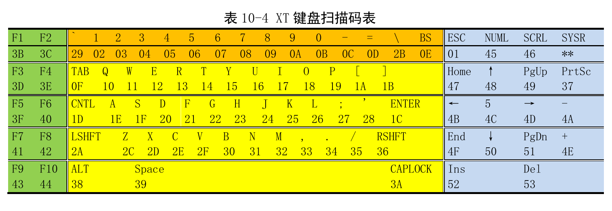

# 键盘

结构


键盘命令和键盘控制器命令


扫描码



# 显卡


# ASCII


# 数据结构

主要是两个数据结构`tty_queue`和`tty_struct`。`tty_queue`是一个队列，其中包含字符缓冲区和一个指向阻塞在该队列上的进程队列指针。

```C
struct tty_queue {
	unsigned long data;			// 可读字符的总数
	unsigned long head;			// 队列头指针
	unsigned long tail;			// 队列尾指针
	struct task_struct * proc_list;	// 阻塞在其上的进程
	char buf[TTY_BUF_SIZE];		// 字符缓冲区队列
};

```

`tty_struct`用于描述一个终端，其中包含了三个队列指针`read_q`、`write_q`和`secondary`。其中`read_q`是读队列，存放从键盘读取到的未经处理的数据;`write_q`是写队列，存放写入显示器的字符;`secondary`存放处理后的字符，供上层`read()`函数读取。

可以说，`read_q`是`secondary`队列的原料，数据在`read_q`中处理后放入`secondary`供上层函数使用，如果开启了回写，处理后的字符还会被放入`write_q`中，最终打印到显示器。

```C
struct tty_struct {
	struct termios termios;			// 控制终端属性，如是否回显字符
	int pgrp;						// 前台进程组
	int session;					// 连接到该终端的会话
	int stopped;					// 终端是否停止使用
	void (*write)(struct tty_struct * tty);	// 向终端打印字符的函数
	struct tty_queue *read_q;		// 未经处理的字符缓冲区队列
	struct tty_queue *write_q;		// 将要打印到屏幕上的字符的缓冲区队列，由进程写入
	struct tty_queue *secondary;	// 已处理的字符缓冲区队列，供进程读取
	};

```

注意到`tty_struct`中有一个`write`指针，这是因为不同的终端可能需要不同的写函数，因此使用`write`指针统一写函数的接口。通过三个指针指向三个队列，而不是直接将队列放入到`tty_struct`，所有的`tty_queue`都存放在一个数组中。

将多个相同的结构存放在数组中，再通过指针访问它们是操作系统中常用的做法。这种做法更加简单稳定，因此获得了 Linux 0.12 的青睐。不仅`tty_queue`实例存放在一个数组中，`tty_struct`实例也存放在一个数组中。

```C
// MAX_CONSOLES: 8 NR_SERIALS: 2  NR_PTY: 4 定义在linux/tty.h
// 因为每个终端有标准输入、标准输出、标准错误，因此要乘 3
#define QUEUES	(3*(MAX_CONSOLES+NR_SERIALS+2*NR_PTYS))
                                                    
static struct tty_queue tty_queues[QUEUES];
struct tty_struct tty_table[256];

#define con_queues tty_queues
#define rs_queues ((3*MAX_CONSOLES) + tty_queues)
#define mpty_queues ((3*(MAX_CONSOLES+NR_SERIALS)) + tty_queues)
#define spty_queues ((3*(MAX_CONSOLES+NR_SERIALS+NR_PTYS)) + tty_queues)

#define con_table tty_table
#define rs_table (64+tty_table)
#define mpty_table (128+tty_table)
#define spty_table (192+tty_table)

// 默认前台终端为 0
int fg_console = 0;
```

通过指针操作，“创建”了多个数组，看似简单粗暴的连续存储却使得操作更加灵活。


# 键盘驱动

## 接通码和断开码的处理

Linux 0.12 只对 Ctrl、CapsLock 之类的特殊按键的断开码做了处理，其他按键的断开码不做处理。因此，Linux 0.12 无法“感知”到用户松开了按键。

## 特殊按键的处理

Ctrl、CapsLock 等特殊按键不对应任何字符，只影响之后的按键的行为。Ctrl 后面的字符会被解释为控制字符，CapsLock 设置时字母会被解释为大写字母，Shift 可以临时切换大小写。

为了修改之后按下的按键的行为，Linux 0.12 设置了一个全局变量`mode`，Ctrl 等特殊按键对应其中的一位。根据特殊按键作用域的不同，在按下或松开时设置或清除`mode`中相应的位。比如 Ctrl 键和 Shift 键，只能在按下时影响后面的按键，所以按下时将`mode`中该按键对应的位置位，松开时将`mode`中对应的位清除;而 CapsLock 只有按下，之后所有的字母都要变成大写，所以松开时不做处理，按下时根据之前 CapsLock 是否按下来设置`mode`。CapsLock 等键还会影响键盘指示灯，在修改`mode`的同时还有打开/关闭对应的指示灯。

## 特殊字符的处理

0 ~ 32 是控制字符，分别对应 Ctrl + 0 + 32 ～64 +32。读取特殊字符时（Ctrl + 可打印字符），将可打印字符 - 64，;打印时将控制字符加 64。读取的过程在`do_self()`中，打印的过程在`copy_to_cooked()`中可以看到。

现在的 LInux 仍然采用这种处理方法。在我的 Fedora 32 中打开 sh （UNIX 标准 shell）， 输入以下命令，打印 100000 个数字，并在打印过程中按 Ctrl + C 发送 SIGINT 信号以中断打印过程。

```fish
sh-5.0$ for i in $(seq 1 100000); do echo $i; done
....
78974
78975
78976
78977
78978
78979
^C
```

可以看到 Ctrl + C 被发送后，成功终止了打印过程。查看 ASCII 表发现，`C`的 ASCII 码为 67，对应的特殊字符（减 64）是 ETX (end of text) 。

**备注**：

通过`man 2 termios`查看*Linux programmer's manual* 中对 ETX（Ctrl-C）的介绍：

> **VINTR**  (003,  ETX,  Ctrl-C,  or also 0177, DEL, rubout) Interrupt character (INTR).  Send a **SIGINT** signal.  Recognized when **ISIG** is set, and then not  passed as input.

这里讨论的是特殊字符，即我们按下的 Ctrl + C，而不是 UNIX 信号机制。默认情况下，控制字符 TEX 向终端前台进程组（控制该终端的一系列进程）发送 SIGINT 信号，该信号会杀死前台进程组。


# 键盘中断的流程

`keyboard_interrupt()`->`key_table()`->`do_tty_interrupt()`->`copy_to_cooked()`

`key_table`:`none()`、`do_self()`、`ctrl()`、`lshift()`、`rshift()`、`alt()`、`caps()`、`func()`、`cursor()`、`ctrl()`、`unctrl()`、`alt()`、`unalt()`、`shift()`、`unshift()`等

`key_map`、`alt_map`和`shift_map`

例子:`key_map`和对应的`shift_map`

`keyboard_interrupt()`读取按下码，以按下码作为索引调用`key_table`中的处理函数，以最常用的`do_self（）`为例说明键盘中断的处理过程。

`do_self()`:

1. 以扫描码`%al`为索引，根据 ALT 键和 SHIFT 键是否按下，在`alt_map`、`shift_map`或`key_map`中查找对应的 ASCII 码，并将其存入`%al`中。
2. 若 ASCII 码`%al`是小写字母，且 CapsLock 键或 Ctrl 键被按下，则将`%al`转换为大写字母
3. 若 ASCII 码`%al`在 64 ～ 64 +32 中，且 CTRL 键被按下，将其减 64
4. 若左 ALT 按下，将`%al`的第 5 位置位
5. 清空整个`%ebx`和`%eax`的高 16 位（保留`%al`），将其传入`put_queue()`
6. `put_queue()`将Shift 先按下（不松开），CapsLock 后按下。Shift 使写入当前中断的读队列`read_q`中

`ctrl()`、`unctrl()`等函数置位、清除`mode`，如[特殊按键的处理](#特殊按键的处理)所述。

另一个比较有意思的处理函数是`func()`，这个函数处理功能键，如 F1 等。PC/XT 只支持 10 个功能键，Linux 0.12 中功能键有两个用途：

- ALT + F1~10 切换终端
- 对应一串 ASCII 码，如 F1 对应 ESC [ [ A，定义在映射表`func_table`中，直接写入到`read_q`中


**疑问**：`func()`中的功能键有 12 个，F11 和 F12 的接通码和 F1 ~ F10 不相邻，但是 PC/XT 键盘中的功能键只有 10 个，可能是因为 PC/XT 是很旧的键盘扫描码集，仅支持 80 余个按键，Linux 0.12 使用较新的兼容 PC/XT 的扫描码集。


**bug**

CapsLock 键无法和 Shift 键一起工作，如果同时使用，只有 CapsLock 起作用。

- CapsLock 先按下，Shift 后按下（不松开），或次序相反。Shift 使得按下的按键转换为大写字母（步骤1），然后 CapsLock 起作用，程序发现输入的 ASCII 码是大写字母，不做修改（步骤2）

CapsLock 键只能让小写字母变为大写字母，Shift 键也只能让小写字母变成大写字母（`shift_map`)。


**问题**：

在第 2 步中，为什么 Ctrl 键被按下时字符需要转为大写？

> 提示：特殊字符的处理。控制字符对应可打印字符 ASCII 码的 64 ～ 64 + 32，因此需要转为大写。


# 字符设备相关概念

## 终端、控制台和虚拟控制台

早期的计算机体积巨大，操作繁琐复制，有大量的按钮、指示灯，计算机操作员要根据指示灯、屏幕打印的信息来对计算机进行操作，这些按钮、指示灯和屏幕就是控制台（*console*）的一部分，操作员通过控制台来控制计算机。

在计算机启动阶段，操作员只能通过控制台连接计算机，在启动完成后可以通过终端（*terminal*）连接到主机，并通过终端与主机交互。终端一般由显示器和键盘组成，通过导线连接到主机。除了这种终端，有些计算机还可以使用电传打印机（*TeleTYpe*)来代替终端。一般的终端，输入设备是键盘，输出设备是显示器，电传打印机也使用键盘输入，但是输出直接打印在纸上。虽然电传打印机没有一般的终端方便，却因价格低廉而被广泛采用，后来电传打印机的缩写 TTY 泛指电传打印机和终端。

现在的计算机都由主机、显示器和键盘组成，已经没有了远古时代硬件层面的控制台。现在终端和控制台是一个东西，都指键盘和显示器，如果要区分的话只能从功能上进行区分：启动时显示器打印日志，这时显示器和键盘是控制台;启动后，用户通过显示器和键盘与主机进行交互，这时是终端。

早期的大型机往往要连接多个终端，6、70 年代的 Multics 项目甚至希望要做到同时连接 1000 个终端。现在的计算机一般只有一个终端，但是支持多个虚拟控制台（*virtual console*），计算机用户实际使用的是虚拟控制台，比如在 GNU/Linux 中，Alt + Ctl + F1 ～ F6（不同发行版支持的虚拟控制台数量不同）可以切换虚拟控制台，就好像一台电脑有多个控制台一样。

## 伪终端

前面说的终端是在计算机本地使用的，直接通过电缆相连。计算机还可能通过网络远程登录，主机跟本地的终端通过互联网链接。

为了让软件不需修改就能在网络登录的情况下运行，UNIX 系统发明了*伪终端*（*pseudo terminal*）来消除本地终端登录和远程网络登录的差异。伪终端是一种软件，不和物理设备关联，伪终端由一对主伪终端和副伪终端组。一般远程主机使用主伪终端，本地计算机使用副伪终端，主伪终端的输出即为副伪终端的输入，反之亦然。伪终端有些类似与管道，但是提供了更复杂的功能，让远程终端之间可以互连，所有和终端相关的系统调用都可以在伪终端上使用。	

# Linux 0.12 的实现

特性：

- 实现了 PC/XT 键盘扫描码集的全部按键驱动

- 支持终端层面的作业控制，终端仅能被前台进程组读写
- 所有的读写终端的系统调用中断后默认重启
- 支持伪终端、串口设备

缺陷：

- POSIX.1 规定的字符读写行为只实现了一小部分
- `ioctl()`的实现文件 kernel/chr_dev/tty_ioctl.c 有一半都只有原型没有实现
- 伪终端只支持在本地计算机上使用

bug:

- 键盘中断中，Shift 键只能小写转大写，不能大写转小写
- `copy_to_cooked()`中错误地退出函数，没有将进程阻塞在`read_q`上


# 字符设备的初始化

在`main()`中进行初始化，其#键盘驱动中`chr_dev_init()`是一个空函数，没有实现，所有的初始化都在`tty_init()`中完成。


`con_init()`:

1. 判断显卡类型，根据显卡类型设置不同当前控制台对应的`vc_cons[]`表项（显示信息）
2. 根据显存大小和当前行列设置计算可支持的控制台数量，并设置好每个控制台可使用的显存大小。
3. 分别设置好其他控制态对应的`vc_cons[]`表项。
4. 更新当前控制台屏幕
5. 设置键盘中断


# 滚屏

Linux 0.12 中屏幕默认是 80 * 25 行，每个字符 2 字节（ASCII 码和属性）。屏幕上显示的内容存储在显存中，通过写显存的方式向屏幕打印字符。

在 Linux 0.12 中显存被均分为 8 块，给 8 个控制台使用。即使分为八块，每个控制台能够使用的显存仍大于一个屏幕占用的显存。

滚屏即将屏幕中的内容上移或下移，可以将屏幕看成一个窗口，这时滚屏有两种方法：

1. 移动窗口：向上移动窗口，相当于向下滚屏;向下移动窗口，相当于向上滚屏。
2. 不移动窗口，移动窗口中的行：上滚就将后一行复制到前一行，下滚就将前一行复制到后一行，这和数组元素插入删除后后面的元素移动的过程完全相同。

Linux 0.12 中显卡分为四种类型：`MDA`、`CGA`、`EDAM`和`EGAC` ，对滚屏有不同程度的支持。其中`MDA`和`CGA`可以归为一类，不支持窗口的移动，所以只能使用第二种方法;`EDAM`和`EGAC`支持移动窗口，滚屏可以使用两种方法实现。

第一种方法只需要设置显卡参数，移动窗口，并填充多出来的一行即可，不用进行大量的拷贝操作，性能更好。移动窗口可能会遇到窗口超出当前终端可用显存范围的情况，这时只需要将移动后窗口中的字符拷贝到可用显存起始处，并设置窗口即可。

第二种方法实现整个屏幕的滚动要进行大量的拷贝操作，性能不佳，仅用于下滚和屏幕某部分的上滚。

# 规范模式与非规范模式

规范模式（*canonical mode*）和非规范模式（noncanonical mode*）是 UNIX 系统读取终端输入的两种模式，默认是规范模式。

规范模式意味着`read()`会**按行读取**，当`read()`读取到了行分隔符（NL、EOL、EOL2、EOF）等会直接返回。如果设置了 ICRNL（将回车转换为换行），并且 IGNCR（忽略回车）未被设置，则 CR 也作为行分隔符。行分隔符只有 EOF 会被丢弃，其他会读入到缓冲区中。

非规范模式不会将字符整合为一行，并且以下字符不会被处理：ERASE、KILL、EOF、NL、EOF、EOL2、CRREPREINT、STATUS、WERASE 不会被处理。`read()`每次读取一个字符会对系统造成极大的性能损耗，因此`read()`通过 MIN 和 TIME 确定何时返回。

MIN 和 TIME 是一种抽象，UNIX 不一定在`struct termios`中实现同名结构，比如 Linux 将这两个概念实现为`sttuct termios`中的`c_cc`的索引。MIN 代表`read()`返回时读取的最少字符，TIME 代表`read()`消耗的最长时间，消耗的时间从读取到第一个字符开始计时。

MIN 和 TIME 的组合共有四种情况：

- MIN > 0 && TIME > 0：时间耗尽或读取到至少 MIN 个字符后返回
- MIN > 0 && TIME == 0：读取到至少 MIN 个字符后返回，没有时间限制
- MIN == 0 && TIME > 0：时间耗尽或读取到至少 1 个字符后返回
- MIN == 0 && TIME ==0：如果有可读的数据，最多读取传入的参数规定的个数后返回;如果没有则立刻返回

总的来说，规范模式和非规范模式的差别在于：

- `read()`返回的条件不同
- 某些控制字符（比如 ERASE）的处理不同

*Advanced programming in the UNIX Environment Third Edition* 第 18.11 给出了一个简单的 getpass(3) 程序，原程序使用无缓冲的标准 IO 函数，我改写为使用 `read()`。这个程序可以说明规范模式下

## 代码

可以发现，`read()`遇到回车就返回了，并且读入了换行符。

# 终端相关的信号处理

终端中的进程处于前台进程组或后台进程组中，只有前台进程组能读写终端设备。后台进程读终端，就会收到 SIGTTIN 信号，进程被杀死;后台进程写终端，就会收到 SIGTTOUT 信号，进程被杀死。

这两个信号存在两个特色情况，这两种情况下系统不会向进程发送 SIGTTIN 和 SIGTTOU：

- 进程忽略或阻塞该信号
- 进程处于孤儿进程组中

可以修改设置，让后台进程组也可以写终端，但是 Linux 0.12 没有实现这个功能。

SIGTTIN 和 SIGTTOU 信号由`tty_signal()`发送。


# 读

读取字符的过程主要由`copy_to_cooked()`和`tty_read()`完成。

`copy_to_cooked()`完成以下两个工作：

- 根据`struct termios`中`c_lflag`中的规定对`read_q`中的未经处理的字符进行处理
- 将以处理后的字符传送到`secondary`队列中

`ty_read()`负责取读取处理后的字符（`secondary`中的字符）写入用户缓冲区中。

`copy_to_cooked()`主要完成`struct termios`中`c_lflag`规定的字符转换行为，`tty_read()`主要实现规范模式和非规范模式下`read()`行为差异。

## `copy_to_cooked()`

1. 不断读取`read_q`中的字符并进行处理。比如，在规范模式下，ICUC 标志置位时，将小写字母转换为大写字母;当 ECHO 标志置位时，读取到的字符经处理后打印在屏幕上。
2. 读取的过程中，若`read_q`为空或`secondary`为满，则将退出函数（实际上应该当前进程阻塞在`read_q`上）。
3. 唤醒阻塞在`secondary`上的进程。

读取的过程中如果罚下能`read_q`为空或`secondary`为满，应该阻塞当前进程，直到用户按下按键，`put_queue()`唤醒该进程，或`tty_read()`读取`secondary`的字符后唤醒该进程。但 Linux 0.12 只唤醒阻塞在`read_q`上的进程，却没有将进程阻塞在`read_q`上，会出现以下 bug。

**bug**：

如果`read_q`非空而`secondary`已满，用户按下一个按键，然后进程 A 读取多于`secondary`容量的字符，此后如果用户不按下按键，即使`read_q`中有字符，该进程 A 也会永远阻塞。原因如下：

1. 按下按键，键盘中断程序调用`copy_to_cooked()`尝试将`read_q`中的字符写入到`secondary`中，因为`secondary`已满，`copy_to_cooked()`直接退出。

2. 进程 A 通过`tty_read()`读取多于`secondary`容量的字符，读取完`secondary`后，进程阻塞，等待`secondary`变为非空。
3. `read_q`中有字符，但是用户没有按下按键，`copy_to_cooked()`未被调用，`read_q`中的字符不会被写入到`secondary`中，`secondary`永远为空，进程 A 永远阻塞。

在`tty_read()`中有唤醒阻塞在`read_q`上进程的代码`wake_up(&tty->read_q->proc_list)`，`put_queue()`也会唤醒阻塞在`read_q`上的进程，但是进程却不会阻塞在`read_q`上，这应该是 Linus 当年忘记了让`copy_to_cooked()`将进程阻塞在`read_q`队列上。


**问题**：

1. `copy_to_cooked()`如果`read_q`为空或`secondary`满，则直接`wake_up(&tty->secondary->proc_list)`，这样不会使等待在上面的进程被错误唤醒吗？比如某个进程在等待`read()`，终端的`read_q`为空，然后错误地被唤醒吗？

> 该函数不会被 read() 之类的用户可调用的函数调用，而是归 do_tty_interrupt() 或 response() 之类的内核调用的函数调用。比如 do_tty_interrupt()，该函数负责将读取到的字符转换后写入到 secondary 队列中，供 read() 调用，这个函数被中断处理程序调用。
>
> read() 后要等待键盘中断发生，键盘中断发生后才有可能调用 do_tty_interrupt()。
>
> 因此只要没发生键盘中断，即使 read_q 为空，read() 也不会返回，进程继续阻塞。
>
> 键盘中断发生后，有一些按键是无意义的，对应的按键处理程序为 none()，这个函数不做任何处理，read_q 不会被写入任何字符。这时 do_tty_interrupt() 调用 `copy_to_cooked()`会出现发生键盘中断，但未读入任何字符的情况，read() 返回，进程激活。这就相当于 read() 读入了“空”。

2. 是输入按下一个按键（不算特殊按键）调用一次`copy_to_cooked()`，激活一个进程，还是可能会出现按下多个按键，获取多个字符，调用一次`copy_to_cooked()`，激活一个进程？

> 每按下一个按键（包括 Ctrl、CapsLock 等），至少会激活一次阻塞在`secondary`上的进程，甚至会出现一个按键激活几次进程的情况。
>
> 不论按下哪个键，都会产生至少一个扫描码，有些按键会产生多个扫描码，导致多次中断。每次中断`keyboard_interrupt()`都会调用`copy_to_cooked()`尝试从`read_q`读取字符到`secondary`并激活阻塞在`secondary`上的进程。Ctrl 等键不会对应 ASCII 码，按下后`read_q`仍是空的，即使如此，`copy_to_cooked()`仍会被调用并激活阻塞在`secondary`上的进程。这里 LInux 0.12 实现的不好。


## `tty_read()`


## 回写机制

终端读取到字符后，可以同时将它写到屏幕中，这就是回写（*write back*）机制。回写由`struct termios`中`c_lfalg`的`ECHO`、`ECHOE`等位控制。`ECHO`控制普通字符的回写，`ECHOE`控制 ERASE 和 WERASE 的回写，还有其他的标志控制 NL 等字符的回写，这里不详述了，可以参考《UNIX 环境高级编程》或`man 2 termios`。

在 Linux 0.12 中，当`ECHO`等位被置位时，在`copy_to_cooked()`在将处理后的字符写入给`secondary`队列前，将处理后的字符写入`write_q`队列中，并通过`write`指针指向的函数（`con_write()`）将其输出。 

# 写

`con_write()`和`tty_write()`


# `ioctl()`


# 字符设备与进程调度

`put_queue()`激活阻塞在`read_q`上的进程。

`copy_to_cooked()`激活阻塞在`secondary`上的进程，如果`read_q`空或`secondary`满都不会挂起进程。

`tty_read()`如果没有可读的字符，且没有信号要处理，则挂起进程。

`tty_write()`如果`write_q`队列满，则挂起。


# 伪终端的支持

上面提到，伪终端是成对的，分为主伪终端和从伪终端，主伪终端的输出作为从伪终端的输入，反之亦然。主从伪终端的实现相当简单，向某个伪终端写入只需要将字符传送到对应的伪终端的`read_q`队列或`secondary`队列。这样即可让所有上层函数（如`tty_read()`等）在伪终端上运行。

