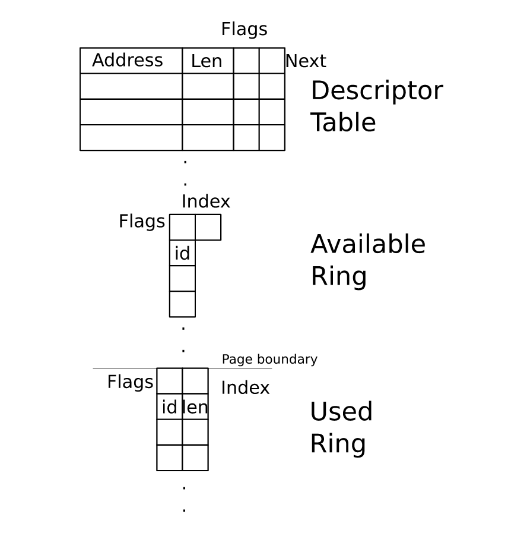

- [x] 设备 reset 有什么用
- [x] virtqueue_ops 中 disable_cb 和 enable_cb 怎样用？
- virtio-paper 中假定 virtio_ring 使用 guest 的字节序，但新的标准规定使用小尾端
- [ ] ring_used 和 ring_avail 中的 flag（used to supress notification）怎样用？里面的 R/W 是 device 的权限还是 driver 的权限？

是 device 的权限

- [ ] ring_used 和 ring_avail 中的 flag 的 nonotify 怎样用？
- [ ] block driver 写入到描述符表后要设置内存屏障，怎样设置内存屏障？
- [ ] 使用 virtio 1.1
- [ ] 2.6.5.2
- [ ] 2.6.5.3 中 indirected descriptor 怎样用？

---------------


- [ ] 什么是 PCI？VIRT_PCI 是什么?
- [ ] inter-guess communication 什么意思？
- [ ] 9.3  Tun Device Vring Support 什么意思？

# virtio 简介

解决的问题

版本问题，lagacy driver 和 transitional driver

# 配置

配置操作主要包括四部分：读写特性位、读写状态位、读写配置空间、重置设备。特性位包含设备类型特定的信息，比如 VIRTIO_NET_F_CSUM 标识网络设备是否支持 checksum。配置空间包含设备特定的信息，比如网络设备包含 VIRTIO_NET_F_MAC （支持 MAC 地址）位，那么状态空间中就会有它的 MAC 地址。8 位状态位用来标识 guess 探测硬件的状态（进度），当 VIRTIO_CONFIG_S_DRIVER_OK 被设置时，表示 guess 成功完成硬件探测，guess 和 host 知道哪些特性能被 driver 理解并使用。重置设备可以避免驱动程序关闭时从设备上删除缓冲区的问题，重置后设备就不会覆盖旧缓冲区。


设备配置空间使用小尾端。遗留设备使用 guest OS 的 endian。

驱动不能假设超过 32 比特的读操作是原子的，因此要以这种方式读取配置字段:

```c
u32 before, after;
do {
    before = get_config_generation(device);// read config entry/entries.
	after = get_config_generation(device);
} while (after != before);
```

配置空间的实际大小可能会大于规范中要求的大小（比如可能存在一些 padding），因此驱动要假设配置空间大于等于规范中的大小。

有些字段不一定存在，在访问前要通过特性位检测。

设备允许驱动在设置`FEATURE_OK`前访问配置字段，只要该字段可用。

遗留设备没有配置生成标志（*configuration generation flag*），当配置更新时可能存在竞争条件，需要反复读取直到读取结果不变

# 操作


virtio 有以下操作：

```c
struct virtqueue_ops {
  int (*add_buf)(struct virtqueue* vq, struct scatterlist sg[], unsigned int out_num, unsigned int in_num, void* data);
  void (*kick)(struct virtqueue* vq);
  void* (*get_buf)(struct virtqueue* vq, unsigned int* len);
  void (*disable_cb)(struct virtqueue* vq);
  bool (*enable_cb)(struct virtqueue* vq);
};
```

`add_buf()`将一个


`disable_cb()`禁用某个 virtqueue 的回调函数，实际上就是关闭该 virtqueue 的外中断。`enable_cb()`使能 virtqueue 的外中断，这里存在竞争条件：当回调函数被禁止时，缓冲区在`get_buf()`返回`NULL`（未探测 host 写入的 virtio 缓冲区）和`enable_cb()`之间被使用，这时可能会永久的丢失这个事件的中断。水平触发的中断不会有以上问题（不会丢中断）。


## virtqueue

使用小尾端，遗留设备使用 guest OS 的 endian。

message framing ？？？


## split virqueue

 驱动必须将设备可写的描述符元素放到只读描述符元素之后。设备仅在 VIRTIO_F_IN_ORDER 被设置时按顺序读取缓冲区。



注意，缓冲区描述符和 used_ring 及 available_ring 是分开的。这是因为待续待续待续待续待续待续续待续待续待续待续续待续待续待续待续续待续待续待续待续

为了提高缓存命中率，used_ring 被要求放在 available_ring 之后的页的边界上。
| Virtqueue Part   | Alignment | Size               |
| ---------------- | --------- | ------------------ |
| Descriptor Table | 16        | 16∗(Queue Size)    |
| Available Ring   | 2         | 6 + 2∗(Queue Size) |
| Used Ring        | 4         | 6 + 8∗(Queue Size) |

Virtqueue 的大小就是其中的缓冲区个数，它必须是 2 的整数倍，最大值为 32768（16 比特宽）。

```c
struct virtq_desc { 
        /* Address (guest-physical). */ 
        le64 addr; 
        /* Length. */ 
        le32 len; 
 
/* This marks a buffer as continuing via the next field. */ 
#define VIRTQ_DESC_F_NEXT   1 
/* This marks a buffer as device write-only (otherwise device read-only). */ 
#define VIRTQ_DESC_F_WRITE     2 
/* This means the buffer contains a list of buffer descriptors. */ 
#define VIRTQ_DESC_F_INDIRECT   4 
        /* The flags as indicated above. */ 
        le16 flags; 
        /* Next field if flags & NEXT */ 
        le16 next; 
};
```

