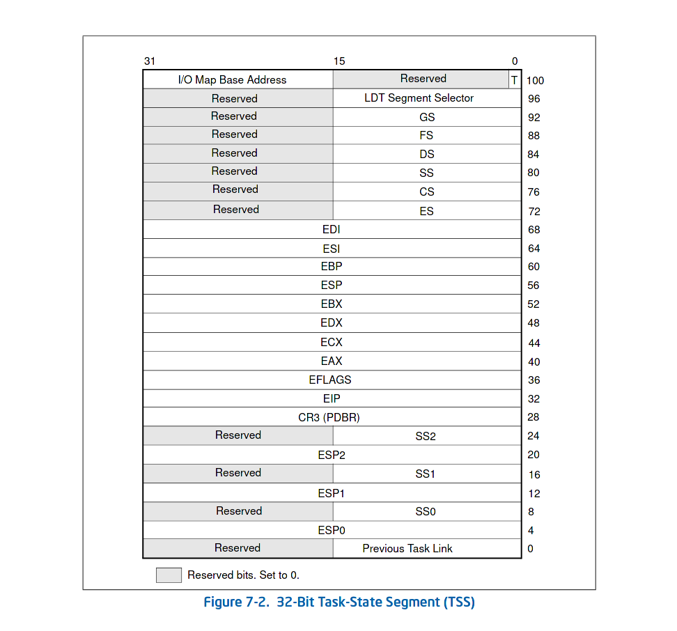
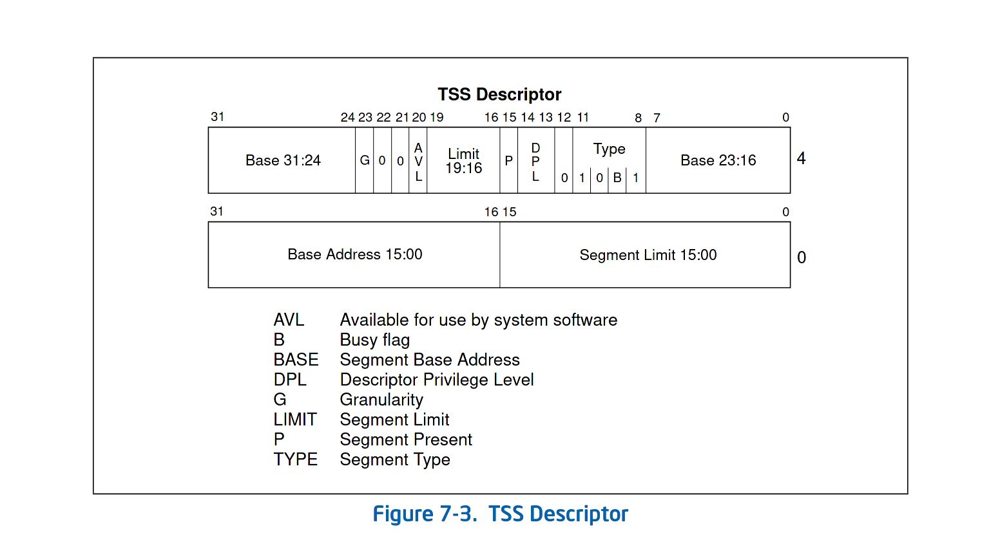
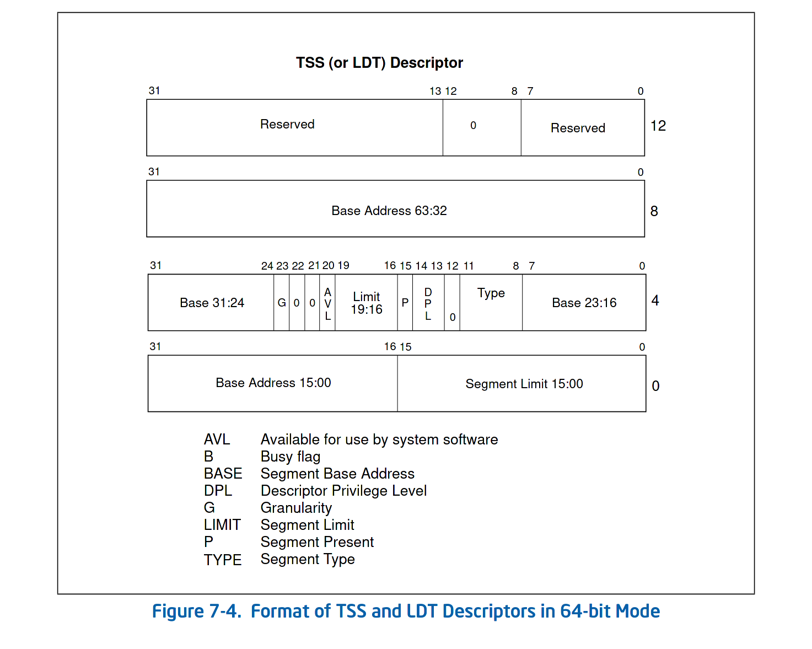
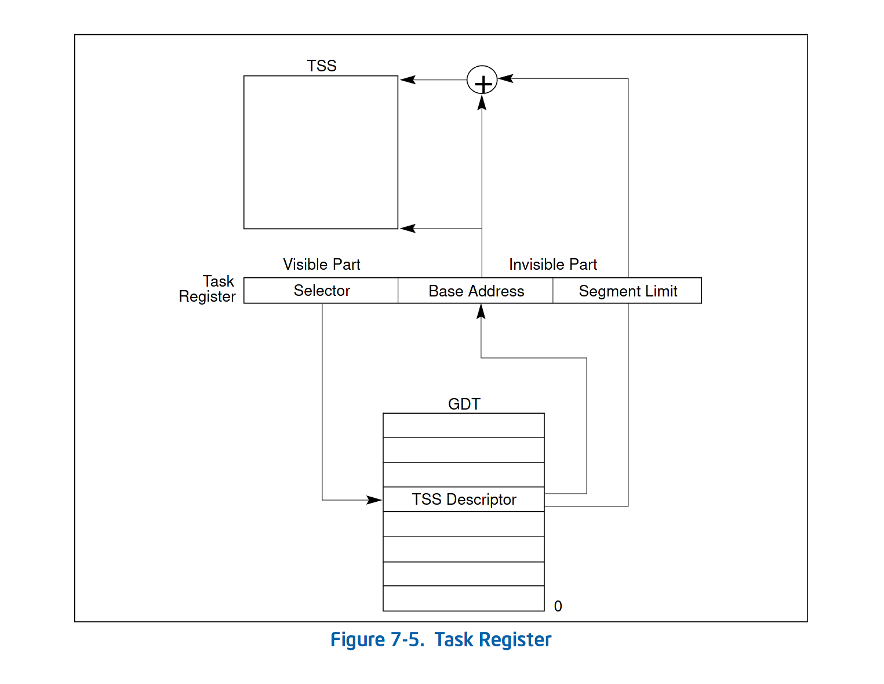
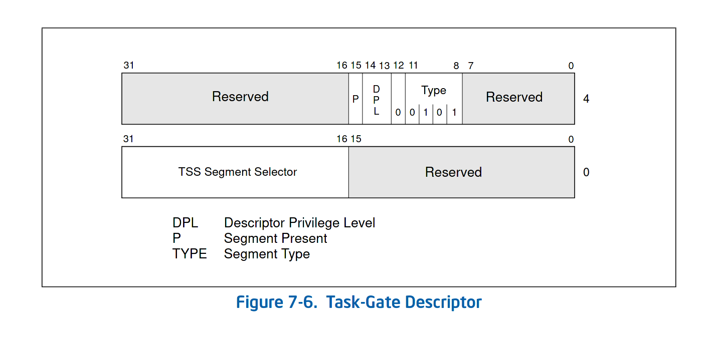
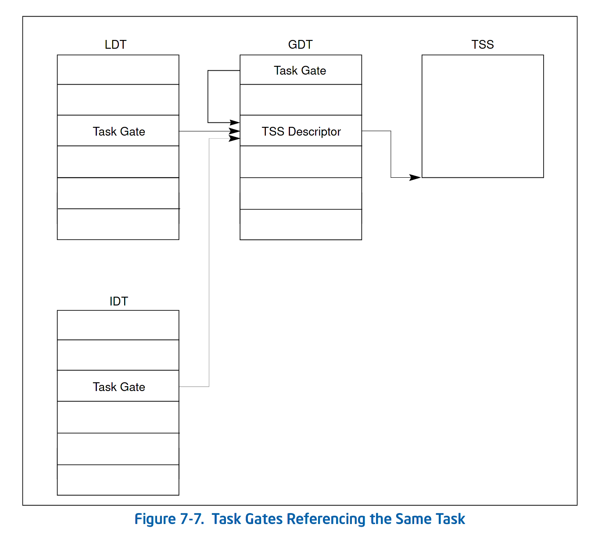
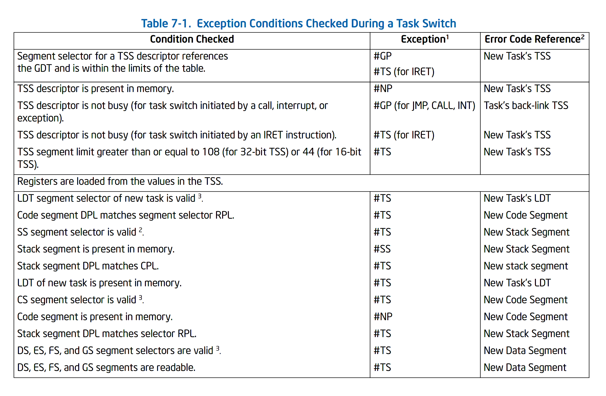
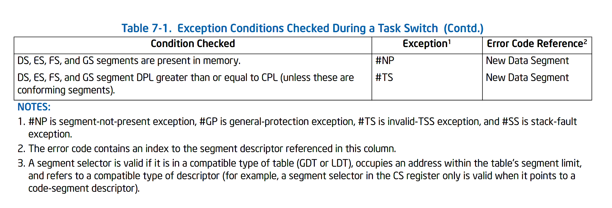
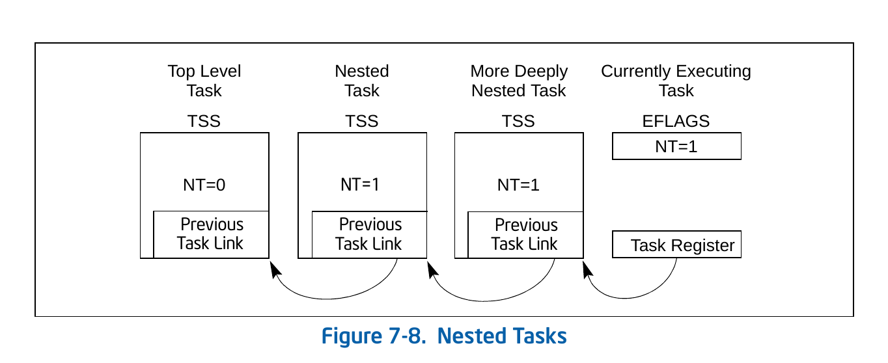
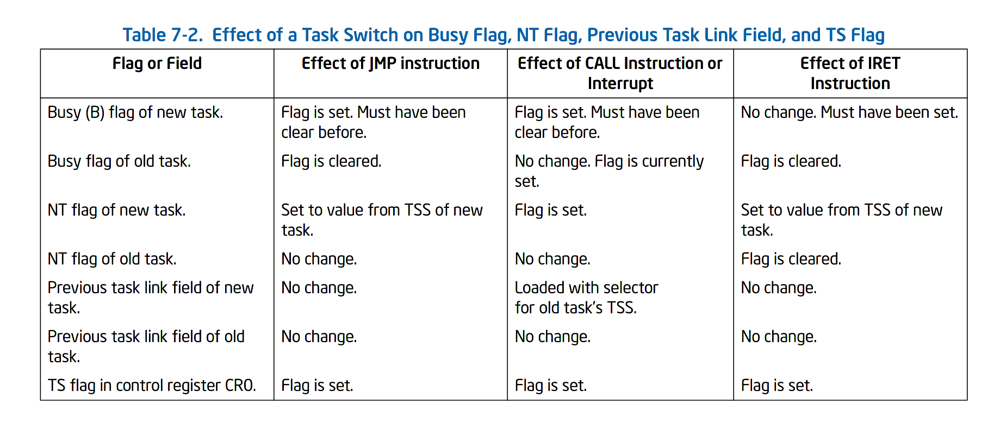

# 疑问

- [ ] I/O Map 是什么
- [ ] 64 位模式不支持任务切换，那么操作系统怎样进行线程切换
- [ ] 添加几个标志位的作用
- [ ] 展开介绍任务切换中标志位的变化和原因（现在还没弄清楚）
- [ ] 展开接受浮点寄存器的保存和 TS 标志位的作用

# 任务管理相关的数据结构

- TSS
- 任务门描述符
- TSS 描述符
- 任务寄存器
- EFLAGS 中的 NT(nested task) 标志

当运行在保护模式时，必须为每一个任务设置号 TSS 和 TSS 描述符，并且将对应的选择子加载到任务任务寄存器中。

## Task-State Segment(TSS)

32 位处理器的 TSS如图：

TSS 中的信息可以分为动态信息和静态信息，动态信息在任务被悬挂时修改，静态信息一半在初始化 TSS 后就不会被修改了。

动态信息包括：通用寄存器，段寄存器、EFLAGS、EIP、上一个任务的链接（上一个任务的 TSS 选择子）。

静态信息包括：LDT 段选择子，CR3 控制寄存器，三个特权级的堆栈指针 ESP，T flag（debug trap)， I/O 映射基地址域。

T flag 被设置时，发生任务切换会产生调试异常。

I/O 映射基地址域详见 第 18 章 *Input/Output,” in the Intel® 64 and IA-32 Architectures Software Developer’s Manual, Volume 1*。

如果开启了分页，需要注意：

- TSS 应该放置页中，而不应该横跨两个页，否则读取可能出现问题。
- TSS 和描述符表的词条所在的页权限应该设置为 R/W。
- 当 TSS 所在的页在内存中时，任务切换的性能更高。

## TSS 描述符

TSS 是一个系统段，通过段描述符（在 GDT 中）指定。如果使用一个 IDT 中的描述符 JMP 或 CALL 会产生 #GP 异常，如果使用 IRET 会产生 #TS 异常，将 TSS 描述符加载到段寄存器也会产生 #GP 异常。

可以看到，TSS 描述符中有一位是 busy flag，这个标志用来标识任务是否*繁忙*。繁忙是指一个任务正在运行或者被挂起。处理器使用 busy falg 来发现是否有程序跳转到某个被中断的任务执行。为了确保只有一个 busy flag 被关联到 TSS 上，需要保证只有一个选择子指向 TSS。

当 G flag 为 0 时，该段是 32 bit TSS。32 bit TSS 的大小要大于`0x67H`，否则会产生 #TP疑问

I/O Map 是什么


64 位模式不支持任务切换，那么操作系统怎样进行线程切换

任务管理相关的数据结构
TSS

任务门描述符

TSS 描述符

任务寄存器

EFLAGS 中的 NT 标志

当运行在保护模式时，必须为每一个任务设置号 TSS 和 TSS 描述符，并且将对应的选择子加载到任务任务寄存器中。

Task-State Segment(TSS)
32 位处理器的 TSS如图：



TSS 中的信息可以分为动态信息和静态信息，动态信息在任务被悬挂时修改，静态信息一半在初始化 TSS 后就不会被修改了。

动态信息包括：通用寄存器，段寄存器、EFLAGS、EIP、上一个任务的链接（上一个任务的 TSS 选择子）。

静态信息包括：LDT 段选择子，CR3 控制寄存器，三个特权级的堆栈指针 ESP，T flag（debug trap)， I/O 映射基地址域。

T flag 被设置时，发生任务切换会产生调试异常。

I/O 映射基地址域详见 第 18 章 Input/Output,” in the Intel® 64 and IA-32 Architectures Software Developer’s Manual, Volume 1。

如果开启了分页，需要注意：

TSS 应该放置页中，而不应该横跨两个页，否则读取可能出现问题。

TSS 和描述符表的词条所在的页权限应该设置为 R/W。

当 TSS 所在的页在内存中时，任务切换的性能更高。

TSS 描述符
TSS 是一个系统段，通过段描述符（在 GDT 中）指定。如果使用一个 IDT 中的描述符 JMP 或 CALL 会产生 #GP 异常，如果使用 IRET 会产生 #TS 异常，将 TSS 描述符加载到段寄存器也会产生 #GP 异常。



可以看到，TSS 描述符中有一位是 busy flag，这个标志用来标识任务是否繁忙。繁忙是指一个任务正在运行或者被挂起。处理器使用 busy falg 来发现是否有程序跳转到某个被中断的任务执行。为了确保只有一个 busy flag 被关联到 TSS 上，需要保证只有一个选择子指向 TSS。

当 G flag 为 0 时，该段是 32 bit TSS。32 bit TSS 的大小要大于0x67H，否则会产生 #TP 异常。这里涉及到 I/O Map Base。

大多数系统中，为了让系统软件控制任务切换，TSS 的 DPL 被设置为小于 3，但是也可以将 TSS 的 DPL 设置为应用态，以便应用态的任务切换到别的任务。

64 位模式下的 TSS 描述符
64 位模式下不支持任务切换，但是仍然保留并拓展了 TSS 描述符。



任务寄存器
TR 寄存器类似于其他段寄存器，可见部分存储选择子（指向 TSS 描述符），不可见部分缓存描述符。

加电开机后 TR 寄存器中的选择子设置为0,不可见部分的基地址设置为0，段限长设置为 0xFFFFH。

分别使用LTR和STR加载和取出 TR 寄存器。LTR是一个特权指令，用于加载 TR 寄存器，操作对象是一个选择子。STR可以将 TR 寄存器的值存放到内存或通用寄存器中，这个指令可以在任意特权级使用，使用这个指令判断当前执行的是哪个任务。STR指令有一个例外情况，当 CR4.UMIP = 1 时 STR指令只能在 CPL = 0 时执行。

 异常。**这里涉及到 I/O Map Base。**

大多数系统中，为了让系统软件控制任务切换，TSS 的 DPL 被设置为小于 3，但是也可以将 TSS 的 DPL 设置为应用态，以便应用态的任务切换到别的任务。

## 64 位模式下的 TSS 描述符

64 位模式下不支持任务切换，但是仍然保留并拓展了 TSS 描述符。

## 任务寄存器

TR 寄存器类似于其他段寄存器，可见部分存储选择子（指向 TSS 描述符），不可见部分缓存描述符。

加电开机后 TR 寄存器中的选择子设置为0,不可见部分的基地址设置为0，段限长设置为 0xFFFFH。

分别使用`LTR`和`STR`加载和取出 TR 寄存器。`LTR`是一个特权指令，用于加载 TR 寄存器，操作对象是一个选择子。`STR`可以将 TR 寄存器的值存放到内存或通用寄存器中，这个指令可以在任意特权级使用，使用这个指令判断当前执行的是哪个任务。`STR`指令有一个例外情况，当 CR4.UMIP = 1 时 `STR`指令只能在 CPL = 0 时执行。

## 任务门描述符

任务门和任务们描述符是同义词，任务们是一个描述 TSS 描述符的描述符，可以存在与 GDT、IDT 和 LDT 中，其中主要包含目标 TSS 描述符的的选择子。结构如下：

任务门和 TSS 描述符的关系如下（任务门实际上就是指针的指针）：

通过任务门在任务切换时访问 TSS 不需要考虑该 TSS 的描述符的 DPL，只要访问任务门时 CPL 和 RPL 小于 任务门的 DPL 即可成功访问 TSS。

任务门满足了一些无法用 TSS 描述符满足的需求：

- 一个任务只有一个 TSS 描述符和 busy flag，但可以通过多个任务门访问它们。
- 更少限制的对任务的访问。通过 TSS 描述符访问 TSS 有严格的特权级限制，通过设置任务门可以实现低特权级到高特权级的访问。
- 使用独立的任务处理中断和异常。

# 任务切换

任务切换有一下四种方式：

- 当前任务`JMP`或`CALL` GDT 中的 TSS
- 当前任务`JMP`或`CALL`GDT 或 IDT 中的任务门
- 中断或异常隐式地访问 IDT 中的任务门
- 当 ELFAGS 中的 NT 标准被设置且当前任务执行 IRET

当发生这四种情况时，处理器发生任务切换。不同的任务切换用于不同的场景，所以对于任务管理相关的数据结构/标志位的影响也不同。任务切换主要修改的数据结构和标志位是 ELFAGS 中的 NT 标准，TSS 描述符中的 Busy flag。

任务切换的步骤如下：

1. 获取目标任务的 TSS 段选择子。可以通过`JMP`或`CALL`的操作对象获得，也可能通过当前 TSS 中的上一个任务的链接(`IRET`使用这种方法）获取。
2. 检查当前任务是否有权限切换到目标任务。CPL 和 RPL 必须小于目标 TSS 段选择子或任务门的 DPL。
3. 检查目标 TSS 描述符的大小。
4. 检查目标任务是否可用（`call`、`jmp`、中断和异常）或 busy flag是否被设置（`iret`）。
5. 检查当前 TSS、目标 TSS 和 TSS 段描述符是否在内存中。

6. 将当前处理器状态保存到当前 TSS中
7. 加载目标 TSS 段描述符到当前段寄存器中
8. 加载目标 TSS 到当前系统寄存器中（ESP、EFLAGS、CR0等）
9. 开始执行新的任务。

加载目标 TSS 前，不同的切换方法对当前（旧的） TSS 的影响:

|  切换方式  | Busy flag in the old TSS descriptor | NT flag in the old TSS |
| :--------: | :---------------------------------: | :--------------------: |
|    IRET    |                清除                 |          清除          |
|    JMP     |                清除                 |          清除          |
|    CALL    |      不变（本来就应该被设置）       |          设置          |
| 中断和异常 |                设置                 |          设置          |

加载目标 TSS 后，不同切换方法对当前（新的）TSS 的影响。

|  切换方式  | Busy flag in the new TSS descriptor | NT flag in the new TSS |
| :--------: | :---------------------------------: | :--------------------: |
|    IRET    |                不变                 |          不变          |
|    JMP     |                设置                 |          不变          |
|    CALL    |                设置                 |          设置          |
| 中断和异常 |                不变                 |          设置          |

如果在第 7 步之前发生了错误，处理器会保证系统状态恢复到发生错误之前的状态，整个系统会保持安全状态;如果在第 7 步发生错误，仍然会进行任务切换，但是任务切换后会产生异常（取决于发生的错误），整个系统出于不安全的状态。

#TS 异常的处理参考其他笔记。

除了上面提到的两个标志，任务切换还会设置 CR0 中的 TS（task swtich）标志。和FPU、XXM、SSE 等相关的寄存器不会被自动保存在 TSS 中，相关的浮点寄存器需要手动保存，TS 标志位可以用来判断浮点寄存器是否需要保存。

# 任务链接

当使用`CALL`、中断和异常导致任务切换时，旧的任务的 TSS 选择子会被保存在新任务 TSS 的先前任务链接域（previous task link field）中，并设置 EFLAGS 中的 NT 标志位。当使用`IRET`返回时，处理器会检测 TSS 的先前任务链接和 EFLAGS 的 NT 位，如果先前任务链接有效并且 NT 位被设置，就会通过先前任务链接返回到之前的任务。

当使用`JMP`指令进行任务切换时，不会设置 NT 位和先前任务链接域。

任务链接和 NT 位实现了任务的“嵌套链”。`CALL`、中断和异常最终都会返回，因此需要保存返回信息（TSS 选择子），最终形成嵌套链。而`JMP`指令仅仅是跳转，不会返回，因此不会构成嵌套链，不需要保持返回信息（TSS 选择子）。

## 使用 busy flag 避免递归任务切换

## 修改任务链接https://gcc.gnu.org/onlinedocs/