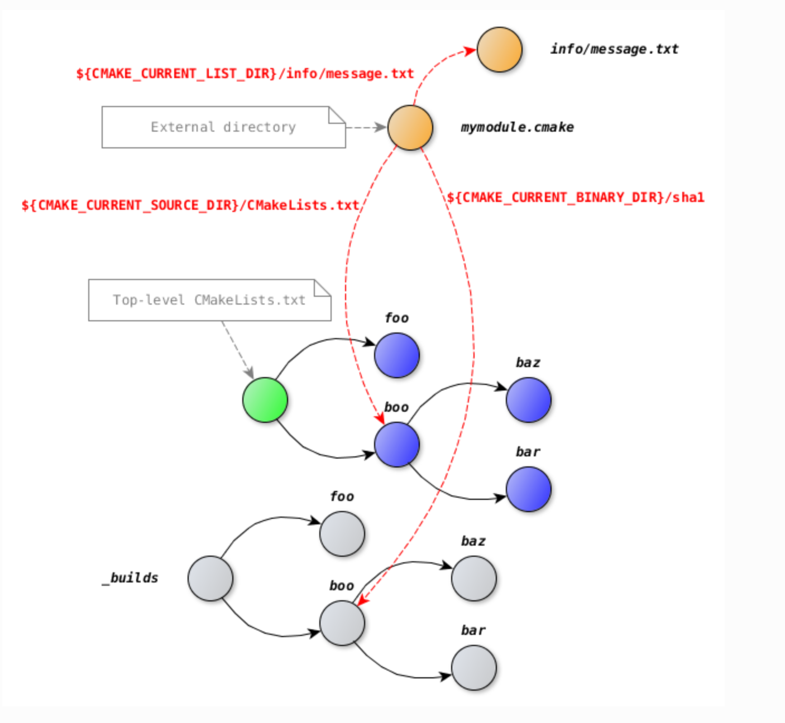

[TOC]

# 注意事项

- [x] 怎样用 CMake 运行构建出来的可执行文件
- [ ] 注意区分变量和变量引用的值
- [x] 怎样实现类似`make clean`的功能

> CMake 是一个构建系统生成器，它无法完全知道构建工具生成哪些东西，所以不会提供类似`make clean`的功能。一般使用 out-of-source 的方式进行构建，所有的生成文件都存放在专门的目录中，如果需要类似与`make clean`的功能，只需要对二进制目录（binary directory）执行`rm -rf`即可。

- [x] 函数参数是什么类型，拷贝还是引用？

  > 函数参数都是按值传递的

- [x] 为不同的目标、文件设置不同的语言特性、编译选项

- [x] 生成器表达式

> 使用场景：
>
> 1. 指定不同编译器的选项
> 2. 不同构建类型时的值

- [x] 怎样使用 GTest 运行测试？

> 1. 使用 CTest 运行 GTest，如果出错再去看 log。
> 2. 自定义目标来运行 GTest

- [x] 如何使目标依赖于生成过程中生成的源文件

> 如果该源文件是通过`configure_file()`生成的，或者是在`add_custom_command()`中使用`OUTPUT`指定了它，CMake 可以自己发现该源文件是生成的，并自动处理它。
>
> 如果 CMake 无法知道它是生成的，可以用 `set_source_file_properties(<file> PROPERTIES GENERATED 1) `显式地告诉 CMake。

- [x] 在`add_custom_command()`和`add_custom_target()` 中使用没有作用？？？哪里错了？？？

  >  似乎当`add_custom_command()`的输出被目标依赖时才会执行，如果希望`add_custom_command()`被执行可以创建一个自定义目标依赖它。

- [ ] 5.8 “需要在调用之前设置`CMAKE_REQUIRED_FLAGS`变量。否则，作为第一个参数传递的标志将只对编译器使用”没看懂

  > santizer 的标准不仅要传递给编译器还有传递给链接器。`check_c_compiler_flags()`的第一个参数默认只传递给编译器，`CMAKE_REQUIRED_FLAGS`不仅会传递给编译器还会传递给链接器，所以这里将`CMAKE_REQUIRED_FLAGS`设置为第一个参数。

- [x] 函数参数

- [x] 函数 vs 宏

- [ ] 如何通过源码获取依赖

- [ ] 如何链接系统库，即 unistd.h 等

# CMake简介

CMake是一个通过配置文件自动生成原生构建工具所用的文件（比如Makefile）的工具，可以自动生产多种格式的项目文件（例如VS、XCode的项目构建文件），实现跨平台跨构建工具。


因为 CMake 是跨操作系统、跨构建系统的，但不同的操作系统有不同的命令、库、编译器，编译器的标准和功能很可能并不一致，操作系统的命令也很可能不一致，如果需要跨操作系统、编译器，项目的组织不用改变，还是要添加不少检测操作系统、编译器的 CMake 代码。

# CMake的执行过程


1. **配置**：解析 CMakeLists.txt，生成 CMakeCache.txt
2. **生成**：生成构建系统项目文件（Makefile等）
3. **构建**：实际构建项目（`cmake --build`或原生的`make`等）

在命令行中，配置和生成连续完成，但在 GUI 中可以单独完成配置或生成。

CMakelists.txt 中的所有命令，要么在配置时完成，要么在生成时完成。详见[配置和生成时的操作](#配置和生成时的操作)。

# CMake 版本的兼容性

CMake 是一个逐步开发的项目，新版本的 CMake 需要保持对使用旧版本的 CMake 的项目的支持，但是某些情况下确实难以做到无代价地修复 bug 或者保持兼容性。比如，可能旧版本的 CMake 可能有存在某种限制，用户找到了避开该限制的方法，如果新版本这部分做了修改，可能会导致旧项目无法用新版本 CMake 构建。

CMake 使用*[Policies](https://gitlab.kitware.com/cmake/community/-/wikis/doc/cmake/Policies)*机制解决不同版本间行为的差异。CMake 的 policy 机制有以下四个设计目标：

1. **旧项目可以用新版本的 CMake 构建**

   为了实现这个目标，新版本默认使用旧版的行为，但是对于不同的行为会发出警告。

2. **不应该为了兼容性而放弃对 bug 的修复**
3. **所有可能导致需要修改项目代码的变化都会被记录下来**
4. **为了 CMake 代码的整洁，会逐步移除对老版本 CMake 的兼容性支持**

CMake 所有的 policy 的名字都使用 CMPXXXX，其中 XXXX 是代表一串数字。

CMake 通过命令`cmake_policy()`实现对 policy 行为的设置。

最粗粒度的设置是将 policy 的行为设置到某个特定版本，可以使用`cmake_policy(VERSION <version-id>)`实现。也可以通过在项目根目录设置`cmake_minimun_required(VERSION <version-id>)`实现。可以使用命令`cmake_policy(SET <policy-name> OLD|NEW)`设置某个 policy 的行为，实现细粒度的设置。

`cmake_policy()`形成了 policy stack，当通过`add_subdirectory()`进入子目录时，当前目录的 policy 压栈，离开子目录时 policy 出栈。简单地说，policy 仅作用于当前目录和子目录。`cmake_policy()`允许手动将 policy 入/出栈，从而实现不同的代码段使用不同的 policy 行为。

比如一下子目录中的代码：

```cmake
cmake_policy(PUSH)
cmake_policy(SET CMP0003 OLD) # use old-style link directories for now
add_executable(myexe ...)
cmake_policy(POP)
```

该子目录继承了上层目录的 policy 行为，但是`add_executable()`命令使用旧行为。


# CMake 语言

CMake 虽然是一个构建工具生成器，但它也是一门语言，在实际的项目构建中，要同等对待 CMake 和项目代码，应用于其他编程语言的原则（比如模块化编程)也同样要应用于 CMake。

因此，先学习 CMake 语言，再学习使用 CMake 组织项目。

## 变量

CMake 中有三种变量

- 普通变量（*regular variable*）
- 缓存变量（*cache variable*）
- 环境变量（*environment variable*)

CMake 中的变量也受作用域规则的限制。普通变量相当于许多语言中的局部变量，仅作用于当前作用域及其子作用域;缓存变量在被写入到文件 CMakeCache.txt 中，在 CMake 程序开始前、结束后仍然存在;环境变量的意义和 shell 中的环境变量相同，可以读取系统中的环境变量，也可以设置环境变量给 CMake 的子进程使用。

CMake 引用变量时，如果可以找到普通变量，就使用该变量，如果找不到普通变量就使用同名缓冲变量;如果找不到缓冲变量，就将该变量设置为空字符串。可以在`CMakeLists.txt`中定义缓冲变量，也可以在命令行中传递缓冲变量`cmake -D var=value`，如果缓冲变量`var`存在，则将`value`赋给`var`;若`var`不存在，则创建`var`，并将`value`赋给它。

CMake 中的一切变量都是字符串，不同的命令会把它解析为不同的类型。比如，变量`is_debug`的值为`ON`,它仍是一个字符串变量，但是`if() else()`命令会把它当成是布尔类型，并认为它是真的。


```cmake
普通变量： set(<variable> <value>... [PARENT_SCOPE])
缓存变量： set(<variable> <value>... CACHE <type> <docstring> [FORCE])
环境变量： set(ENV{<variable>} [<value>])
```

其中，缓存变量中的`<type>`并不是真的设置变量的类型，所有的变量都是字符串类型，不存在其他类型的变量。这里的`<type>` 是设置给 cmake-gui 看的，如果将`<type>`设置为`BOOL`，那么该变量在 cmake-gui 中就会显示成`BOOL`类型。

缓存变量可以设置为以下几种类型：

- `BOOL`：布尔类型
- `FILEPATH`：文件路径
- `PATH`：目录路径
- `STRING`：字符串
- `INTERNAL`：仅在命令行中可见，cmake-gui 不会显示它。

这些所谓的“类型”都是对于 cmake-gui 而言的，如果使用命令行就不需要理会它们。`<docstring>`是 cmake-gui 显示的变量介绍。

`set()`命令中的`FORCE`和`PARENT_SCOPE`选项会在后面逐步介绍。

使用以下命令取消变量：

```cmake
普通变量：  unset(<variable>)
缓存变量：  unset(<variable> CACHE)
环境变量：  unset(ENV{<variable})
```


### 变量的作用域

CMake 的作用域除了函数外，还有目录。子目录中的 CMakeLists.txt 的作用域嵌套在父目录的 CMakeLists.txt 中，会继承父目录中 CMakeLists.txt 的普通变量。缓存变量和环境变量本身就是全局的（被项目中的所有 CMake 程序使用），所以在子目录中也能使用。

子目录中的`CMakeList.txt`继承父目录中定义的变量是值拷贝的,在子目录中`unset`继承来的变量不会影响父目录中的变量。

使用以下项目演示变量的作用域：

```cmake
.
├── CMakeLists.txt
└── sub
    └── CMakeLists.txt
--------------------------------------------------------------------
CMakeLists.txt
--------------------------------------------------------------------
cmake_minimum_required(VERSION 3.17.4)
project(variable LANGUAGES NONE)
set(regular "regular")
set(CACHE "cache" CACHE STRING "cache variable")
set(ENV{ENV} "env")
message(STATUS "${regular}")
message(STATUS "${CACHE}")
message(STATUS "$ENV{ENV}")
add_subdirectory(sub)

--------------------------------------------------------------------
sub/CMakeLists.txt
--------------------------------------------------------------------
message(STATUS "${regular}")
message(STATUS "${CACHE}")
message(STATUS "$ENV{ENV}")

--------------------------------------------------------------------
output
--------------------------------------------------------------------
shell> cmake -S. -B_builds
-- regular
-- cache
-- env
-- regular
-- cache
-- env
-- Configuring done
-- Generating done
-- Build files have been written to: /home/cmake/variable/_builds

```

CMake 中的变量可以使用任意字符作为名字，通常仅在单一作用域中使用的变量使用小写字母命名，在多个作用域中使用的变量使用大写字母命名。

### 缓存变量

使用`set()`命令设置缓存变量不会修改已存在的缓冲变量，如果要修改缓冲变量可以通过在命令行`-D`传递参数完成。通过命令行传递的缓冲变量优先级高于文件中定义的缓存变量。

如果一定要在文件中使用`set()`覆盖缓存变量，可以在`set()`命令中加上`FORCE`选项。这种方法非常不建议，通常好的 CMake 代码不应该出现`FORCE`。

有时需要设置多个缓冲变量，这时可以将多个缓存变量定义在`xx.cmake`文件中，运行 CMake 时通过参数`-C xx.cmake`来读入变量。

缓存变量通常表示“选项”，比如当前项目的构建类型等，CMake 提供了`option(var comment ON/OFF)`命令直接设置布尔类型的缓存变量，值为`OFF`或`ON`。

**最佳实践**：因为缓存变量是全局的，所以缓存变量，尤其是`option()`命令设置的选项，应该前缀项目名，以避免其与子目录中定义的缓存变量发生命名冲突。

### 环境变量

这里说的环境变量不会影响 shell，只影响 CMake。环境变量会被 CMake 的子进程继承，并且会存在于 CMake 的整个生命期。缓存变量仅在配置阶段存在，而环境变量在生成阶段仍然存在。

CMake 提供了在 CMake 文件中设置环境变量的功能，使用`set(ENV{var})`命令设置环境变量，使用`unset(ENV{var})`变量取消环境变量，使用`$ENV{var}`访问环境变量。比如：

```cmake
cmake_minimum_required(VERSION 3.5)
project(env NONE)
message("USER: $ENV{USER}")
set(ENV{USER} "nobody")
message("USER: $ENV{USER}")
unset(ENV{USER})
message("USER: $ENV{USER}")
---------------------------------------------------
|| USER: kongjun
|| USER: nobody
|| USER: 

```

CMake 可以读取 shell 设置的环境变量，但不能改变它，设置同名环境变量仅影响 CMake。

**陷阱**：CMake 不会追踪已使用的环境变量，如果通过 shell 修改了正在使用的环境变量，CMake 不会发现它被修改了，直到下一次运行 CMake 生成 Makefile。所以如果通过 shell 修改了环境变量，应当重新运行 CMake 生成 Makefile。


### 变量引用

通过`${<variable>}`引用变量，CMake 支持嵌套的变量引用，如：

```cmake
set(var1 "hello")
set(var2 "var1")
set(var3 ${${var2}})
```

`var3`的值为`hello`。


## 列表	

某些命令可以把变量当成列表，列表实际上是一个由`;`分割的字符串。

`set()`命令可以创建列表，格式为`set(<variable> [item1] [item2] ... [tiemN])`。创建列表就像是把多个字符串（变量）连接了起来，如果创建的列表中有包含空格的元素，可以将该元素用`"`包裹起来，告知 CMake 那是一个元素。

```cmake
set(l0 a b c)
set(l1 a;b;c)
set(l2 "a b" "c")
set(l3 "a;b;c")
set(l4 a "b;c")
message("l0 = 'a' + 'b' + 'c' = '${l0}'")
message("l1 = 'a;b;c' = '${l1}'")
message("l2 = 'a b' + 'c' = '${l2}'")
message("l3 = \"'a;b;c'\" = '${l3}'")
message("l4 = 'a' + 'b;c' = '${l4}'")

message("print by message: " ${l3})
message("print by message: " "a" "b" "c")
-------------------------------------------------
output
-------------------------------------------------
l0 = 'a' + 'b' + 'c' = 'a;b;c'
l1 = 'a;b;c' = 'a;b;c'
l2 = 'a b' + 'c' = 'a b;c'
l3 = "'a;b;c'" = 'a;b;c'
l4 = 'a' + 'b;c' = 'a;b;c'
print by message: abc
print by message: abc
```

`list()`命令可以对列表进行各种处理。详情可见`cmake --help-command list`

```cmake
cmake_minimum_required(VERSION 3.17.3)
project(foo NONE)

set(l0 "a;b;c")
set(l1 "a" "b;c")
set(l2 "a" "b c")

# 获取列表长度
list(LENGTH l0 l0_len)
list(LENGTH l1 l1_len)
list(LENGTH l2 l2_len)

message("length of '${l0}' (l0) = ${l0_len}")
message("length of '${l1}' (l1) = ${l1_len}")
message("length of '${l2}' (l2) = ${l2_len}")

# 获取某个下标对应元素的值
list(GET l1 2 l1_2)
message("l1[2] = ${l1_2}")

# 移除某个元素
message("Removing first item from l1 list: '${l1}'")
list(REMOVE_AT l1 0)
message("l1 = '${l1}'")

```

列表只是一个`;`分割的字符串，**不存在包含一个空元素的列表**，空字符串是一个没有元素的列表，长度为 0，字符串`;`是一个包含两个空元素的字符串，长度为 2。

将一个空元素`""`附加到一个非空列表时，非空列表增加了一个空元素;将一个空元素附加到一个空列表时，结果还是一个空列表。

```cmake
cmake_minimum_required(VERSION 3.17.3)
project(foo NONE)

function(add_element list_name element_name)
  message("list_name: ${list_name}    list: ${${list_name}}")
  message("Add '${${element_name}}' to list '${${list_name}}'")
  list(APPEND "${list_name}" "${${element_name}}")
  list(LENGTH "${list_name}" list_len)
  message("Result: '${${list_name}}' (length = ${list_len})\n")
  set("${list_name}" "${${list_name}}" PARENT_SCOPE)
endfunction()

message("\nAdding non-empty element to non-empty list.\n")
set(mylist "a;b")
set(element "c")
foreach(i RANGE 3)
  add_element(mylist element)
endforeach()

message("\nAdding empty element to non-empty list.\n")
set(mylist "a;b")
set(element "")
foreach(i RANGE 3)
  add_element(mylist element)
endforeach()

message("\nAdding empty element to empty list.\n")
set(mylist "")
set(element "")
foreach(i RANGE 3)
  add_element(mylist element)
endforeach()

---------------------------------------------------------------------
output
---------------------------------------------------------------------

Adding non-empty element to non-empty list.

list_name: mylist    list: a;b
Add 'c' to list 'a;b'
Result: 'a;b;c' (length = 3)

list_name: mylist    list: a;b;c
Add 'c' to list 'a;b;c'
Result: 'a;b;c;c' (length = 4)

list_name: mylist    list: a;b;c;c
Add 'c' to list 'a;b;c;c'
Result: 'a;b;c;c;c' (length = 5)

list_name: mylist    list: a;b;c;c;c
Add 'c' to list 'a;b;c;c;c'
Result: 'a;b;c;c;c;c' (length = 6)


Adding empty element to non-empty list.

list_name: mylist    list: a;b
Add '' to list 'a;b'
Result: 'a;b;' (length = 3)

list_name: mylist    list: a;b;
Add '' to list 'a;b;'
Result: 'a;b;;' (length = 4)

list_name: mylist    list: a;b;;
Add '' to list 'a;b;;'
Result: 'a;b;;;' (length = 5)

list_name: mylist    list: a;b;;;
Add '' to list 'a;b;;;'
Result: 'a;b;;;;' (length = 6)


Adding empty element to empty list.

list_name: mylist    list: 
Add '' to list ''
Result: '' (length = 0)

list_name: mylist    list: 
Add '' to list ''
Result: '' (length = 0)

list_name: mylist    list: 
Add '' to list ''
Result: '' (length = 0)

list_name: mylist    list: 
Add '' to list ''
Result: '' (length = 0)

```


## CMake 代码组织与 listfile

CMake 代码可以放在不同目录中，通过`add_subdirctory()`进入该目录并执行其中的 CMakeLists.txt。这样，CMake 代码的执行和项目的构建构成了一个树状结构。

CMake 当前源代码目录设置为`CMAKE_CURRENT_SOURCE_DIR`，对应的二进制目录（使用 out-of-source 构建），被设置为`CMAKE_CURRENT_BINARY_DIR`，命令行选项`-S`指定的目录设置为`CMAKE_SOURCE_DIR`，`-B`指定的目录设置为`CMAKE_BINARY_DIR`，正在执行的文件被设置为`CMAKE_CURRENT_LIST_FILE`。注意，所有的这些内置变量都是**绝对路径**。




使用 out-of-source 方式构建时，子目录的二进制目录在项目的根二进制目录中，而不是在子源码目录中。

不要直接通过`${CMAKE_BINARY_DIR}/executable`来描述最终生成的可执行文件`executable`，因为在许多情况下可执行文件并不直接在`${CMAKE_BINARY_DIR}`中，可能在`${CMAKE_BINARY_DIR}/Debug`中。

**警告**：`add_sub_directory()`会进入到子源码目录，并执行其中的 CMakeLists.txt;除了`add_sub_directory()`，`include()`命令也可以执行子目录中的 CMakeLists.txt，但是它不进入子源码目录。因此如果要制定`include()`执行的 cmake 文件所在的目录，必须用` CMAKE_CURRENT_LIST_DIR`，而不是`CMAKE_CURRENT_SOURCE_DIR`。可以参考[模块](#模块)。


## 控制流

### 分支结构

```cmake
if(condition)
elseif(condition)
else()
endif
```

其中，`condition`是一个变量或字符串。

CMP0054 

### 循环结构

1. `foreach(var <list>)`/`foreach(var in LIST <list>)`/`foreach(var in ITEMS [item1] [tiem2] ...)`

```cmake
foreach(var list)
	# code
endforeach
```

2. `foreach(var RANGE [start] [end] [step])`

range 的范围为$[start, end]$,步长为`step`。步长可以忽略，默认为1。CMake 的 range 是闭区间，而不是左闭右开，这里要注意。

3. `while(condition)`
4. `break()`和`continue()`

## 函数

函数的定义:

```cmake
function(<function_name> <args>...)
	# body
	# return()
endfunction()

```

CMake 中的函数比较丑陋，语法上没有返回值，参数的语义也比较奇怪。参数实际上是一个变量，绑定到传入的参数的名字上。

```cmake
function(print_arg arg1 arg2)
    message("${arg1}  ${arg2}")
    message("${${arg1}}  ${${arg2}}")
endfunction()

set(msg1 "Hello")
set(msg2 "World")
print_arg(msg1 msg2)

-----------------------------------------
output
-----------------------------------------
msg1  msg2
Hello  World
```

在上面的程序中将`msg1`和`msg2`传递给了函数`print_arg()`，可以发现参数`arg1`的值是字符串`msg1`,而不是变量`msg1`的值`Hello`，这证明了 CMake 函数参数实际上传递的是实参的名字，而不是它的值。

CMake 函数参数的另一个奇怪之处是它的形参和实参个数上不需要匹配。比如上面定义的函数`print_arg()`接受两个参数，但是实际上也可以向它传递更多的参数。

CMake 内置了以下变量表示函数参数：

|          |                                   |
| :------: | :-------------------------------: |
|   ARGV   |       实际接收到的参数列表        |
|   ARGC   |       实际接收到的参数个数        |
|   ARGN   |      接收到的多余的参数列表       |
| ARGV\<N> | 接收到的第\<N>个参数（从 0 开始） |

仍以`print_arg()`说明函数的参数的表示：

```cmake
function(print_arg arg1 arg2)
    message("${ARGN}")
    message("${ARGC}")
    message("${ARGV}")
    message("${ARGV0} ${ARGV1} ${ARGV2} ${ARGV3} ${ARGV4}")
endfunction()

print_arg(msg1 msg2 msg3 msg4 msg5 msg6)
---------------------------------------------------------------
output
---------------------------------------------------------------
msg3;msg4;msg5;msg6
6
msg1;msg2;msg3;msg4;msg5;msg6
msg1 msg2 msg3 msg4 msg5

```

以上参数传递方式的缺陷在于，参数的传递没有类型和数量的限制，容易出现参数位置错误导致函数出错。如果要保证参数传递正确，就必须按次序传递，这样的话会极大的降低可读性。

现代 CMake 还提供了`cmake_parse_arguments(<prefix> <options>  <one_argument_keywords> <multiple_argument_keywords> <args>)`命令来解析复杂参数，使得参数传递更加灵活。

`cmake_parse_arguments()`定义在模块`CMakeParseArguments`中，使用时需要`include(CMakeParseArguments)`。`cmake_parse_arguments()`解析` <args>`获取参数`${option}`、`${<one_argument_keywords>}`和`${<multiple_argument_keywords>}`,并将其加上`{<prefix>}`前缀。

```cmake
function(MY_PARSE)

    set(options ADULT)
    set(oneValueArgs NAME AGE)
    set(multiValueArgs SCORE)

    cmake_parse_arguments(STUDENT "${options}" "${oneValueArgs}" "${multiValueArgs}" ${ARGV} )

    # 创建变量 prefix_参数名: 例如 STUDENT_ADULT
    message("isadult  = ${STUDENT_ADULT}")
    message("name  = ${STUDENT_NAME}")
    message("age  = ${STUDENT_AGE}")
    message("score  = ${STUDENT_SCORE}")

endfunction()

MY_PARSE(ADULT NAME zhangsan AGE 20 SCORE 100 200 300 400 500)

--------------------------------------------------------------------------------------------------
isadult  = TRUE
name  = zhangsan
age  = 20
score  = 100;200;300;400;500

```

上面的代码中，`<option>`被设置为`AUDLT`，传递的参数中含有`AUDLT`，所以`STUDENT_AUDLT`为`TRUE`;`NAME`后面的参数是`zhangsan`，所以`STUDENT_NAME`被设置为`zangsan`;`SCORE`是一个多参数的变量，`STUDENT_SCORE`被设置为`100;200;300;400;500`。

可能存在解析失败的参数，解析失败的参数会被定义在列表`<prefix>_UNPARSED_ARGUMENTS`中，可以利用这个变量判断是否解析成功。

以下代码判断上面的代码片段中的参数是否解析成功。

```cmake
 string(COMPARE NOTEQUAL "${STUDENT_UNPARSED_ARGUMENTS}" "" has_unparsed)
  if(has_unparsed)
    message(FATAL_ERROR "Unparsed arguments: ${x_UNPARSED_ARGUMENTS}")
  endif()

```

如[列表](#列表)所述，不存在包含空元素的长度为 1 的列表，空字符串被认为是不包含元素的空列表，因此如果实参是一个空字符串，函数什么都不会接收到。

CMake 中的函数可以使用`return()`命令终止函数，但是不能带出返回值。如果需要带出返回值，只能通过`set(var value PARENT_SCOPE)`命令设置父作用域的变量来模拟返回值，这个变量的名字通常由调用者传入函数中。例子如下：

```cmake
cmake_minimum_required(VERSION 3.7.13)
project(fun NONE)

function(print_if predicate msg ret)
	if (${predicate})
		message("${msg}")
		set(${ret} YES PARENT_SCOPE)
	else()
		set(${ret} NO PARENT_SCOPE)
	endif()
endfunction()

message("return value: ${ret}")
	
----------------------------------------
|| [cmake -S. -B _builds && cmake --build _builds]
|| -- Configuring done
|| -- Generating done
|| -- Build files have been written to: /home/kongjun/Documents/cpp_practice/cmake/function/_builds
|| Hello world
|| return value: YES

```

## 宏

宏的语法形式如下：

```cmake
macro(foo)
  <commands>
endmacro()
```

宏是大小字母不敏感的(*case-insensitive*)，比如定义了名为`foo()`的宏，以下调用都引用宏`foo()`。

```cmake
FOo()
foO()
Foo()
```

为了避免大小写不同带来奇怪问题，建议宏的引用和定义的大小写情况保持一致，通常情况下宏名使用小写字母。

CMake 中的宏就像是使用 CMake 函数参数引用方式的 C 宏，它相比于 CMake 函数，有以下不同：

- **宏的参数不是变量**
- **宏没有创建作用域**

考虑以下代码：

```cmake
macro(bar)
    foreach(arg IN LISTS ARGN)
        message("${arg} ${${arg}}")
    endforeach()
endmacro()

set(a "AA")
set(b "BB")
set(c "CC")
bar(a b c)
----------------------------------------------
output
----------------------------------------------
# 没有输出
```

上面提到宏中的参数`ARGN`等不是变量，所以`foreach()`没有运行。如果需要打印参数，需要将`foreach()`中的`ARGN`修改为`${ARGN}`。这里的`${ARGN}`不是解引用变量，而是进行字符串替换。

输出如下：

```cmake
AA
BB
CC
```

宏参数的一个陷阱是**宏没有创建作用域**,如果宏所在的作用域中有变量和宏参数或其调用的对象同名时，将会引用作用域中存在的变量。以下代码就是例证。

```cmake
macro(bar)
    foreach(arg IN LISTS ARGN)
        message("${arg} ${${arg}}")
    endforeach()
endmacro()

function(foo)
    bar(x y z)
endfunction()

set(a "AA")
set(b "BB")
set(c "CC")
foo(a b c)
-------------------------------------------
output
-------------------------------------------
a AA
b BB
c CC
```

当函数`foo()`调用宏`bar()`时，`bar()`在`foo()`的作用域中，存在`foo()`的变量`ARGN`（其值为`a;b;c`），所以在宏`bar()`中`ARGN`实际上是`foo()`的变量。


## 模块

CMake 也有对模块的支持，一般 CMake 模块是一个名为`<ModuleName>.cmake`的文件，其中包含定义的变量、宏、或函数。使用时通过`include()`命令引入。

C/C++ 中的`#include`预处理指令直接将头文件展开到包含它的文件中，CMake 中的`include()`的行为类似与 C 语言，`include()`会直接将模块引入到当前作用域并**执行**它。所以如果模块中只有定义，执行的结果就是当前文件可以使用其中定义;如果其中包含命令，就会在当前作用域执行它。

考虑以下项目：

```cmake
.
├── CMakeLists.txt
└── sub
    └── print_var.cmake

```

其中最上层 CMakeLists.txt 的内容如下：

```cmake
cmake_minimum_required(VERSION 3.17.4)
project(variable LANGUAGES NONE)https://knzl.at/cmake-exclude-from-all/
message("in top-level directory")
message(STATUS "${CMAKE_CURRENT_SOURCE_DIR}")
message(STATUS "${CMAKE_CURRENT_LIST_FILE}")
set(regular "regular")
set(cache "cache" CACHE STRING "cache variable")
set(ENV{env} "env")
include(sub/print_var.cmake)

```

子目录中 print_var.cmake 内容如下：

```cmake
message("in sub-directory")
message(STATUS "${CMAKE_CURRENT_LIST_FILE}")
message(STATUS "${CMAKE_CURRENT_SOURCE_DIR}")
message(STATUS "${regular}")
message(STATUS "${cache}")
message(STATUS "$ENV{env}")

```

运行结果：

```cmake
in top-level directory
-- /cmake/variable
-- /cmake/variable/CMakeLists.txt
in sub-directory
-- /cmake/variable/sub/print_var.cmake
-- /cmake/variable
-- regular
-- cache
-- env

```

可以看到，`include()`子目录中的模块后，该模块被执行了，并且该模块执行时在`include()`它的文件对应的`CMAKE_CURRENT_SOURCE_DIR`中，但在执行时`CMAKE_CURRENT_LIST_FILE`被设置为该模块的文件名。

也就是说模块没有创建作用域，执行时在包含它的文件的作用域中，但是运行时`CMAKE_CURRENT_LIST_FILE`、`CMAKE_CURRENT_LIST_DIR`被设置为模块对应的文件和所在目录。

CMake 内置了一些系统模块，比如前面用到的`CMakeParseArguments`，这些模块的所在目录被放置在模块搜索路径`CMAKE_MUDLE_PATH`中。上面的例子中使用了自定义的模块，所以使用`include()`路径时给出了模块的路径`sub/print_var.cmake`。通常，`include()`模块时只给出模块名，不写模块的路径，这时就必须将自定义模块所在的目录加入到模块搜索路径中。

添加到模块搜索路径后，顶层 CMakeLists.txt 可以改写为以下代码：

```cmake
cmake_minimum_required(VERSION 3.17.4)
project(variable LANGUAGES NONE)
list(APPEND CMAKE_MODULE_PATH "sub")		# 将子目录 sub 添加到模块搜索路径中
message("in top-level directory")
message(STATUS "${CMAKE_CURRENT_SOURCE_DIR}")
message(STATUS "${CMAKE_CURRENT_LIST_FILE}")
set(regular "regular")
set(cache "cache" CACHE STRING "cache variable")
set(ENV{env} "env")
include(print_var)		# 使用模块 print_var，对应文件 sub/print_var.cmake

```


## 调试

CMake 没有专门的调试器（也没有必要），使用命令`message()`，配合`CMAKE_CURRENT_LIST_FILE`、`CMAKE_CURRENT_FUNCTION`等内置变量调试即可。这些内置变量详见 CMake 文档[cmake_current_function](https://cmake.org/cmake/help/latest/variable/CMAKE_CURRENT_FUNCTION.html#variable:CMAKE_CURRENT_FUNCTION),[cmake_current_source_dir](https://cmake.org/cmake/help/latest/variable/CMAKE_CURRENT_SOURCE_DIR.html?highlight=cmake_current_source_dir#variable:CMAKE_CURRENT_SOURCE_DIR)。


## 跨平台的命令

CMake 是跨平台的工具，为常用的系统命令提供了跨平台的 CMake 命令，可以通过`cmake -E`查看或执行。

```bash
cmake -E
----------------------------------------------------------------------
CMake Error: cmake version 3.17.4
Usage: cmake -E <command> [arguments...]
Available commands: 
  capabilities              - Report capabilities built into cmake in JSON format
  chdir dir cmd [args...]   - run command in a given directory
  compare_files [--ignore-eol] file1 file2
                              - check if file1 is same as file2
  copy <file>... destination  - copy files to destination (either file or directory)
  copy_directory <dir>... destination   - copy content of <dir>... directories to 'destination' directory
  copy_if_different <file>... destination  - copy files if it has changed
  echo [<string>...]        - displays arguments as text
  echo_append [<string>...] - displays arguments as text but no new line
  env [--unset=NAME]... [NAME=VALUE]... COMMAND [ARG]...
                            - run command in a modified environment
  environment               - display the current environment
  make_directory <dir>...   - create parent and <dir> directories
  md5sum <file>...          - create MD5 checksum of files
  sha1sum <file>...         - create SHA1 checksum of files
  sha224sum <file>...       - create SHA224 checksum of files
  sha256sum <file>...       - create SHA256 checksum of files
  sha384sum <file>...       - create SHA384 checksum of files
  sha512sum <file>...       - create SHA512 checksum of files
  remove [-f] <file>...     - remove the file(s), use -f to force it (deprecated: use rm instead)
  remove_directory <dir>... - remove directories and their contents (deprecated: use rm instead)
  rename oldname newname    - rename a file or directory (on one volume)
  rm [-rRf] <file/dir>...    - remove files or directories, use -f to force it, r or R to remove directories and their contents recursively
  server                    - start cmake in server mode
  sleep <number>...         - sleep for given number of seconds
  tar [cxt][vf][zjJ] file.tar [file/dir1 file/dir2 ...]
                            - create or extract a tar or zip archive
  time command [args...]    - run command and display elapsed time
  touch <file>...           - touch a <file>.
  touch_nocreate <file>...  - touch a <file> but do not create it.
  create_symlink old new    - create a symbolic link new -> old
  true                      - do nothing with an exit code of 0
  false                     - do nothing with an exit code of 1


```

在 CMakeLists.cmake 中通过`add_custom_target()`、`add_custom_command()`、`execute_process()`等命令使用，例如：

```cmake
execute_process(
	COMMAND ${CMAKE_COMMAND} -E sleep 1
	OUTPUT_VARIABLE output
	RESULT_VARIABLE ret
	)
```

`cmake -P`可以执行特定的 CMake 脚本。

## 生成器表达式（待续）

生成器表达式可以获取只有在生成时才能获取到的信息，并且可以部分替代分支结构，是 CMake 中做常用、最重要的语法特性。

四种表达式：

- 布尔表达式
- 基于字符串的表达式
- 条件表达式
- 输出表达式

变量查询：

- 匹配
- 替换
- 目标相关

操作符：

- 字符串转换
- 字符串


# 使用 Modern CMake 构建项目

> ### Imagine targets as objects.
>
> Calling the member functions modifies the member variables of the object.
>
> Analogy to constructors:
>
> * `add_executable`
> * `add_library`
>
> Analogy to member variables: 
>
> * target properties (too many to list here)
>
> Analogy to member functions:
>
> * `target_compile_definitions`
>
> * `target_compile_features`
>
> * `target_compile_options`
>
> * `target_include_directories`
>
> * `target_link_libraries`
>
> * `target_sources`
>
> * `get_target_property`
>
> * `set_target_property`
>
>   ​															      ---- [Effective Modern CMake](https://www.youtube.com/watch?v=y7ndUhdQuU8)

对象、属性、依赖、作用域（变量、命令）。

## 环境检测


经常在检测完操作系统、编译器后设置编译选项，参考[控制编译选项、语言特性、传递宏](#控制编译选项、语言特性、传递宏)一节。

## 配置工具链

## 控制编译选项、语言特性、传递宏（待续）

## 控制编译器警告

## 目标（待续）

### 目标可见性

### 目标依赖


`set_target_property()`

`target_compile_options()`

`target_compile_features()`

`target_compile_definition()`

`target_link_options()`

`target_sources()`

`target_include_directories()`

`target_link_libraries()`

`target_link_directories()`

`targehttps://doc.qt.io/qt-5/cmake-manual.htmlt_depencies()`


`add_compile_options()`

`add_compile_definition()`

`include_directories()`

`link_directories()`


## 处理依赖（待续）

### `find_package()`

可以通过设置变量`CMAKE_DISABLE_FIND_PACKAGE_<PackageName>`来禁止`find_package()`搜索某个包，这样可以做到在不进行大量 CMake 代码修改的情况下禁止使用某个包。这个变量必须在初次运行 CMake 时设置，在发现了某个包后再禁止搜索就没用了。

### pkg-config

### 直接引入依赖源代码

### 使用包管理工具


## 配置和生成时的操作

Makefile 只是简单的进行我们要求的操作，尽管这样让程序员要做更多的工作，但是也给了构建系统的过程中足够的方便，程序员可以轻易控制构建的每一个步，比如在某个时刻运行某个 shell 命令，将某个可执行文件复制到某个位置。

 CMake 将项目的构建分为了配置（解析 CMakelists.txt）、生成（生成 Makefile 等配置文件）和构建（编译、链接项目）三个阶段，并提供了一些基础设施帮助程序员在这三个步骤进行操作，实现和 Makefile 一样灵活的功能。

### 配置时的操作

 `execute_process`可以在配置时执行任何命令。

```cmake
execute_process(COMMAND <cmd1> [<arguments>]
                 [COMMAND <cmd2> [<arguments>]]...
                 [WORKING_DIRECTORY <directory>]
                 [TIMEOUT <seconds>]
                 [RESULT_VARIABLE <variable>]
                 [RESULTS_VARIABLE <variable>]
                 [OUTPUT_VARIABLE <variable>]
                 [ERROR_VARIABLE <variable>]
                 [INPUT_FILE <file>]
                 [OUTPUT_FILE <file>]
                 [ERROR_FILE <file>]
                 [OUTPUT_QUIET]
                 [ERROR_QUIET]
                 [COMMAND_ECHO <where>]
                 [OUTPUT_STRIP_TRAILING_WHITESPACE]
                 [ERROR_STRIP_TRAILING_WHITESPACE]
                 [ENCODING <name>])
```

因为在配置阶段，CMake 主要是检测环境，配置编译器、编译选项等设置，所以尽管`execute_process`可以执行任何命令，但是用处也比较有限。

### 生成时的操作

`add_custom_command()`在生成时主要用来生成源文件。通常的用法是：生成特定文件，再隐式或显式地被目标依赖。

```cmake
add_custom_command(OUTPUT output1 [output2 ...]
                    COMMAND command1 [ARGS] [args1...]
                    [COMMAND command2 [ARGS] [args2...] ...]
                    [MAIN_DEPENDENCY depend]
                    [DEPENDS [depends...]]
                    [BYPRODUCTS [files...]]
                    [IMPLICIT_DEPENDS <lang1> depend1
                                     [<lang2> depend2] ...]
                    [WORKING_DIRECTORY dir]
                    [COMMENT comment]
                    [DEPFILE depfile]
                    [JOB_POOL job_pool]
                    [VERBATIM] [APPEND] [USES_TERMINAL]
                    [COMMAND_EXPAND_LISTS])
```

`add_custom_command()`添加的自定义命令必须要有输出文件，并且只有当这个文件被其他目标依赖时才会执行。

`add_custom_target()`可以添加自定义目标，这就相当于 Makefile 中的目标，因此 CMake 也可以当作 Makefile 写。

```cmake
add_custom_target(Name [ALL] [command1 [args1...]]
                   [COMMAND command2 [args2...] ...]
                   [DEPENDS depend depend depend ... ]
                   [BYPRODUCTS [files...]]
                   [WORKING_DIRECTORY dir]
                   [COMMENT comment]
                   [JOB_POOL job_pool]
                   [VERBATIM] [USES_TERMINAL]
                   [COMMAND_EXPAND_LISTS]
                   [SOURCES src1 [src2...]])
```

默认情况下，添加的自定义目标不会被执行，需要通过`--target <target>`手动制定，如果需要在任何时候都构建它时，可以在命令中添加`ALL`。

常用的一种模式是，`add_custom_target()`不执行命令，只`DEPENDS`某个文件，然后通过自定义命令生成并处理该文件。`add_custom_target()`和`add_custom_command()`中的依赖只是文件级别的依赖，不是顶层目标级别的依赖。


### 构建时的操作

`add_custom_command`还有以下原型：

```cmake
 add_custom_command(TARGET <target>
                    PRE_BUILD | PRE_LINK | POST_BUILD
                    COMMAND command1 [ARGS] [args1...]
                    [COMMAND command2 [ARGS] [args2...] ...]
                    [BYPRODUCTS [files...]]
                    [WORKING_DIRECTORY dir]
                    [COMMENT comment]
                    [VERBATIM] [USES_TERMINAL]
                    [COMMAND_EXPAND_LISTS])

```

`add_custom_command()`可以为特定的目标添加命令，这个命令将在特定是时候执行。

`add_custom_command()`提供了一下三种命令执行的时机：

- PRE_BUILD：在目标执行所有规则前执行
- POST_BUILD：在目标执行完所有规则后执行
- PRE_LINK：在目标编译后，链接前执行

比如，这里有一个项目 hello，最终生成可执行文件 hello，可执行文件默认在`${CMAKE_CURRENT_BINARY_DIR}`中，现在我们希望将可执行文件复制到`{CMAKE_CURRENT_BINARY_DIR}`。可以通过给目标 hello 添加自定义命令完成：

```cmake
cmake_minimum_required(VERSION 3.13)
project(hello LANGUAGES CXX)
set(CXX_STANDARD 17)
set(CXX_EXTENSIONS ON)
set(CXX_STANDARD_REQUIRED ON)

add_executable(hello hello.cpp)
add_custom_command(
    TARGET hello
    POST_BUILD
    COMMAND ${CMAKE_COMMAND} -E copy $<TARGET_FILE:hello> ${CMAKE_SOURCE_DIR}
    WORKING_DIRECTORY ${CMAKE_BINARY_DIR}
    COMMENT "copying executable into ${CMAKE_SOURCE_DIR}"
    VERBATIM
    )
```

当目标 hello 构建完成后就会执行自定义命令，将 hello 复制到`${CMAKE_CURRENT_SOURCE_DIR}`。

## 生成源代码

### 同一目录下生成源码

有些程序的源代码无法提前确定，只能在生成阶段生成。比如下面的源文件 print_info.c.in:

```c
#include <stdio.h>
#include <unistd.h>
void print_info(void)
{
    printf("\n");
    printf("Configuration and build information\n");
    printf("-----------------------------------\n");
    printf("\n");
    printf("Who compiled | %s\n", "@_user_name@");
    printf("Compilation hostname | %s\n", "@_host_name@");
    printf("Fully qualified domain name | %s\n", "@_fqdn@");
    printf("Operating system | %s\n",
            "@_os_name@, @_os_release@, @_os_version@");
    printf("Platform | %s\n", "@_os_platform@");
    printf("Processor info | %s\n",
            "@_processor_name@, @_processor_description@");
    printf("CMake version | %s\n", "@CMAKE_VERSION@");
    printf("CMake generator | %s\n", "@CMAKE_GENERATOR@");
    printf("Configuration time | %s\n", "@_configuration_time@");
    printf("Fortran compiler | %s\n", "@CMAKE_Fortran_COMPILER@");
    printf("\n");
    fflush(stdout);
}
```

这个函数用来输出系统信息，不同的系统有不同的信息，无法提前获得并硬编码到文件中。这些信息全部可以在 CMake 的配置阶段生成，CMake 提供了生成源代码的功能。

用一个`main()`调用这个函数，打印系统信息。

```c
void print_info();
int main()
{
    print_info();
    return 0;
}
```

最终项目的结构如下：

```shell
.
├── CMakeLists.txt
├── main.c
└── print_info.c.in
```

`configure_file()`可以根据模板文件，使用 CMake 变量替换模板文件中的同名字符串，生成目标文件，声明如下：

```cmake
Copy a file to another location and modify its contents.

 configure_file(<input> <output>
                [COPYONLY] [ESCAPE_QUOTES] [@ONLY]
                [NEWLINE_STYLE [UNIX|DOS|WIN32|LF|CRLF] ])

```

利用`cmake_host_system_infomation()`获取系统信息，并使用`configure_file()`生成目标文件。

```cmake
# host name information
cmake_host_system_information(RESULT _host_name QUERY HOSTNAME)
cmake_host_system_information(RESULT _fqdn QUERY FQDN)
# processor information
cmake_host_system_information(RESULT _processor_name QUERY PROCESSOR_NAME)
cmake_host_system_information(RESULT _processor_description QUERY PROCESSOR_DESCRIPTION)
# os information
cmake_host_system_information(RESULT _os_name QUERY OS_NAME)
cmake_host_system_information(RESULT _os_release QUERY OS_RELEASE)
cmake_host_system_information(RESULT _os_version QUERY OS_VERSION)
cmake_host_system_information(RESULT _os_platform QUERY OS_PLATFORM)
# timestamp
string(TIMESTAMP _configuration_time "%Y-%m-%d %H:%M:%S [UTC]" UTC)

configure_file(print_info.c.in print_info.c)
add_executable(print_info main.c print_info.c)
```

`configure_file()`默认生成`@VAR@`和`${VAR}`两类变量替换模板文件，`${VAR}`主要用在 shell 脚本中，这里不需要这种变量，因此指定了`@ONLY`以指示 CMake 仅生成`@VAR@`。

注意，目标文件是生成出来的，性质于可执行文件相同，位于`${CMAKE_CURRENT_BINARY_DIR}`。

尝试构建项目：

```shell
shell>cmake -S. -B_builds 
...
shell>cmake --build _builds/ -- VERBOSE=1
....
Scanning dependencies of target print_info
gmake[2]: 离开目录“/cmake/configure_file/_builds”
/usr/bin/gmake  -f CMakeFiles/print_info.dir/build.make CMakeFiles/print_info.dir/build
gmake[2]: 进入目录“/cmake/configure_file/_builds”
[ 50%] Building C object CMakeFiles/print_info.dir/main.c.o
/usr/bin/cc    -o CMakeFiles/print_info.dir/main.c.o   -c /cmake/configure_file/main.c
[100%] Linking C executable print_info
/usr/bin/cmake -E cmake_link_script CMakeFiles/print_info.dir/link.txt --verbose=1
/usr/bin/cc    CMakeFiles/print_info.dir/main.c.o  -o print_info 
/usr/bin/ld: CMakeFiles/print_info.dir/main.c.o: in function `main':
main.c:(.text+0xa): undefined reference to `print_info'
collect2: 错误：ld 返回 1
gmake[2]: *** [CMakeFiles/print_info.dir/build.make:104：print_info] 错误 1
gmake[2]: 离开目录“/cmake/configure_file/_builds”
gmake[1]: *** [CMakeFiles/Makefile2:96：CMakeFiles/print_info.dir/all] 错误 2
gmake[1]: 离开目录“/cmake/configure_file/_builds”
gmake: *** [Makefile:104：all] 错误 2

```

项目构建失败，可以发现在构建项目时没有 print_info 依赖于文件 print_info.c，因此 Makefile 尝试将 print_info.o 和 main.o 链接为 print_info。但是，Makefile 没有编译出 print_info.o，导致`main()`引用了未定义的`print_info()`。

这是因为在配置阶段我们生成的文件并不存在，因此直接让目标依赖于生成的文件，CMake 会找不到该文件，认为该文件不存在，从而导致错误。

实际上现在的 CMake 已经比较智能了，如果该源文件是通过`configure_file()`生成的，或者是在`add_custom_command()`中使用`OUTPUT`指定了它，CMake 可以自己发现该源文件是生成的，并自动处理它。

如果 CMake 无法知道它是生成的（比如这里的情况），可以用 `set_source_file_properties(<file> PROPERTIES GENERATED 1) `显式地告诉 CMake。

在 CMakeLists.txt 添加上：`set_source_files_properties(print_info.c PROPERTIES GENERATED 1)` 即可正确构建项目。

```shell
shell>cmake -S. -B_builds && cmake --build _builds
-- The C compiler identification is GNU 10.2.1
-- Check for working C compiler: /usr/bin/cc
-- Check for working C compiler: /usr/bin/cc - works
-- Detecting C compiler ABI info
-- Detecting C compiler ABI info - done
-- Detecting C compile features
-- Detecting C compile features - done
-- Configuring done
-- Generating done
-- Build files have been written to: /cmake/configure_file/_builds
Scanning dependencies of target print_info
[ 33%] Building C object CMakeFiles/print_info.dir/main.c.o
[ 66%] Building C object CMakeFiles/print_info.dir/print_info.c.o
[100%] Linking C executable print_info
[100%] Built target print_info
shell> _builds/print_info

Configuration and build information
-----------------------------------

Who compiled | 
Compilation hostname | localhost.localdomain
Fully qualified domain name | localhost.localdomain
Operating system | Linux, 5.8.9-200.fc32.x86_64, #1 SMP Mon Sep 14 18:28:45 UTC 2020
Platform | x86_64
Processor info | Unknown P6 family, 4 core Intel(R) Core(TM) i5-10210U CPU @ 1.60GHz
CMake version | 3.17.4
CMake generator | Unix Makefiles
Configuration time | 2020-09-21 14:03:16 [UTC]
Fortran compiler | 

```


### 不同目录下生成源码(待续)


## 构建可执行文件（待续）


## 构建库（待续）

四种类型


## 构建模式


# 测试


## CTest

**注册测试**


**运行测试**

## GTest(待续)

**查找/安装 GTest**

`FindGTest`

`FetchContent`


**运行 GTest**

`set_test_properties()`

`GoogleTest`


# 

# 文档

doxygen

# 安装


# 打包


# 其他

## 编译数据库

CMake 内置了对编译数据库的支持，只要设置以下变量，就可以在二进制目录中创建compile_commands.json，方便地使用各种 linter 和编辑器。

```cmake
set(CMAKE_EXPORT_COMPILE_COMMANDS ON)
```

如果使用 Vim 的话，推荐 YouCompleteMe 和 ALE，这两个插件和 CMake 配合的很好。

## 输出详细的编译步骤

构建时默认不会输出详细的编译、链接信息，可以在构建时制定`-- VERBOSE=1`输出详细信息。

如果使用 UNIX Makefile 作为原生构建系统的话，可以使用以下命令生成输出详细信息的 Makefile。

```cmake
option(CMAKE_VERBOSE_MAKEFILE ON)
```


# CMake 的缺陷

1. 存在某些接口上的不一致

`find_package(<NAME>)`生成缓存变量`<NAME>_FOUND`，但`find_command(<NAME>)`生成`<NAME>_NOTFOUND`。

2. 命令的执行存在限制

`add_custom_target()`等命令中的`COMMAND`不是直接在 shell 上执行。这其实不算是缺点，但是我需要直接在 shell 上执行命令，最终通过执行 shell 脚本完成


# 术语

## imported target

`IMPORTED`是一个目标属性，当这个属性为`TRUE`时，说明这个属性是别的项目创建并导入的当前项目的目标，比如`find_package(GTest COMPONENTS gtest REQUIRED)`命令会生成一个导入对象`GTest::gtest`，可以在当前项目中链接。

## rpath

## file-level dependencies

## top-level target delendencies


# 参考


[CMake 菜谱(陈晓伟译)](https://www.bookstack.cn/read/CMake-Cookbook/README.md):一本通过例子讲解 CMake 的好书。

[The Hitchhiker’s Guide to the CMake](https://cgold.readthedocs.io/en/latest/index.html)：一本主要讲解 CMake 语法和特性的书，对如何使用 CMake 构建项目介绍得相对比较少。

[CMake FAQ](https://gitlab.kitware.com/cmake/community/-/wikis/FAQ#cmake-does-not-generate-a-make-distclean-target-why)：CMake 官方的问答。

[Effective Modern CMake](https://gist.github.com/mbinna/c61dbb39bca0e4fb7d1f73b0d66a4fd1/):一篇 github 上千 star 的文章，介绍了 Modern CMake 的准则。原文需要翻墙才能阅读，我这里备份了一份,详见[effective_modern_cmake.md](./effective_modern_cmake.md)。

[Tutorial: Easy dependency management for C++ with CMake and Git](https://foonathan.net/2016/07/cmake-dependency-handling/)

[【CMake 系列】（九）实战之如何下载依赖](https://github.com/xizhibei/blog/issues/142)

[知乎专栏：CMake 实用指南](https://zhuanlan.zhihu.com/c_200294809)

[CMake最佳实践](https://www.jianshu.com/p/3711361d10a5)：介绍 Modern CMake 的短文

[Tutorial: Easy dependency management for C++ with CMake and Git by Jonathan](https://foonathan.net/2016/07/cmake-dependency-handling/): 使用 CMake 和 Git 处理 C++ 依赖。

[Tutorial: Easily supporting CMake install and find_package() by Jonathan](https://foonathan.net/2016/03/cmake-install/)使用 CMake 进行安装并为库提供 find_package() 接口。

[Tutorial: Managing Compiler Warnings with CMake by Jonathan](https://foonathan.net/2018/10/cmake-warnings/):介绍了如何使用 CMake 控制 C++ 编译器的警告。

[CMake: EXCLUDE_FROM_ALL vs. EXCLUDE_FROM_DEFAULT_BUILD](https://knzl.at/cmake-exclude-from-all/): 比较了 EXCLUDE_FROM_ALl 和 EXCLUDE_FROM_DEFAULT_BUILD。