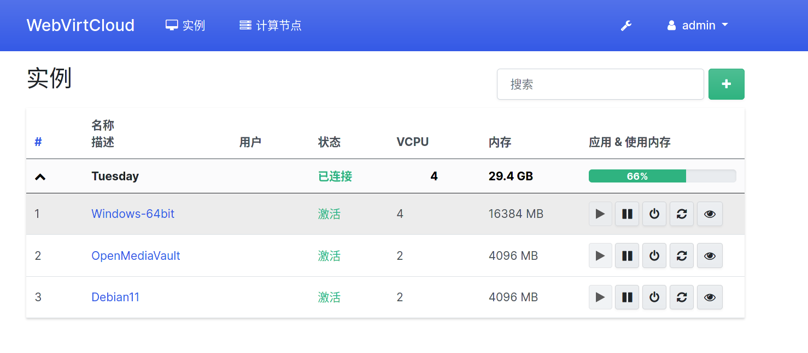

最近阅读了韦易笑（[Github](https://github.com/skywind3000)/[知乎](https://www.zhihu.com/people/skywind3000))专栏[我爱命令行](https://www.zhihu.com/column/commandline)中的三篇文章：

- [KVM 虚拟化环境搭建 - WebVirtMgr](https://zhuanlan.zhihu.com/p/49120559)
- [KVM 虚拟化环境搭建 - ProxmoxVE](https://zhuanlan.zhihu.com/p/49118355)
- [OpenMediaVault：你的开源 NAS 系统](https://zhuanlan.zhihu.com/p/138254689)

这三篇文章介绍了 KVM 虚拟化的搭建和家庭 NAS 方案，看得我心痒痒的。恰好自己在学校有动态公网 IP，就从咸鱼买了两条 16G 内存，加上一块 2T 监控硬盘，把台式机虚拟化作服务器。

我在 Debian10 上搭建 KVM 虚拟化环境，在虚拟机中创建 OpenMediaVault（NAS）和 Windows10 。这里主要有三个问题：

- 如何管理虚拟机？使用 [WebVirtCloud](https://github.com/retspen/webvirtcloud) 图形化地管理虚拟机。
- 如何管理存储？使用 mapped 模式让虚拟机共享物理机硬盘。
- 如何管理网络？使用桥接模式实现虚拟机联网。

物理机仅用于虚拟化和为虚拟机提供硬盘，不做多余的事情。

# 机器配置

- CPU: AMD Ryzen 3 3200GE
- GPU: 核显
- 硬盘：512G SSD 和 2T HDD
- 主板：迫击炮 PRO A MAX

# 安装 Debian10

因为 WebVirtCloud 支持在 Debian10 上自动安装，并且 Debian 是最重要的开源项目之一，所以这里选择 Debian10。

安装无 GUI 版本即可，这样可以节约系统资源。使用 GUI 安装器安装，在设置磁盘分区时，选择“仅使用一个分区”，使用 [btrfs](https://wiki.archlinux.org/title/Btrfs) 文件系统。事实上，btrfs 支持在不分区上的硬盘上安装，但是 Debian10 没有提供这个安装选项。安装完成后，如果确实想要类似于分区的效果，可以再为 home 等目录创建 btrfs 子卷。

以下是我的 OS 信息。

```shell
       _,met$$$$$gg.
    ,g$$$$$$$$$$$$$$$P.
  ,g$$P"     """Y$$.".
 ,$$P'              `$$$.
',$$P       ,ggs.     `$$b:
`d$$'     ,$P"'   .    $$$
 $$P      d$'     ,    $$P    root@Thursday 
 $$:      $$.   -    ,d$$'    ------------- 
 $$;      Y$b._   _,d$P'      OS: Debian GNU/Linux 10 (buster) x86_64 
 Y$$.    `.`"Y$$$$P"'         Host: MS-7C52 1.0 
 `$$b      "-.__              Kernel: 4.19.0-18-amd64 
  `Y$$                        Uptime: 5 hours, 50 mins 
   `Y$$.                      Packages: 1000 (dpkg) 
     `$$b.                    Shell: bash 5.0.3 
       `Y$$b.                 Terminal: /dev/pts/3 
          `"Y$b._             CPU: AMD Ryzen 3 3200GE (4) @ 2.770GHz 
              `"""            GPU: AMD ATI Picasso 
                              Memory: 19689MiB / 30097MiB 
```


# 配置 ssh

安装完成后首先要配置 ssh 服务器，以便远程登录操作。默认情况下，Debian 已经启用了 ssh 服务器，如果没有，请用以下命令安装：

```shell
apt install -y openssh-server
```

然后启用 ssh 服务器：

```shell
systemctl restart ssh # 重启 ssh 服务
systemctl enable ssh # 开机自动启动 ssh 服务
ssytemctl status ssh # 查看 ssh 服务状态
```

安装 Debian 时，自动创建了普通用户账户，但物理机仅用于虚拟化，不做多余事情，不使用这个账户。所以直接使用 ssh 登录 root 账户进行系统管理。如果 ssh 不允许登录 root 账户，请取消 /etc/ssh/sshd_config 中以下代码的注释：

```
# PermitRootLogin yes
```

ssh 默认允许通过密码验证登录，这会给系统带来安全风险，配置好密码登录的 ssh 后，配置密钥验证，然后禁止密码验证。

在本地计算机（你的笔记本或台式机）执行以下命令：

```shell
ssh-keygen # 如果有密钥就不用再生成了
ssh-copy-id root@服务器ip地址
```

输入 root 账户的密码验证成功后，就可以通过密钥验证登录了。取消 /etc/ssh/sshd_config 中这样注释，禁止密码验证登录。

```
# PasswordAuthentication no
```

只允许密钥验证登录就意味着假如密钥丢失，将永远不可能通过 ssh 登录服务器，所以要妥善保管密钥。如果还需要更强的 ssh 安全性，可以参考[如何配置安全的 SSH 服务？（OpenSSH 安全必知必会）](https://learnku.com/server/t/36120)。

最后，完成 ssh 安全性最重要的一步配置——神兽护体。在 /etc/issue.net 添加以下字符画，下次登录就会有神兽护体，永不宕机。

```
         ┌─┐       ┌─┐
      ┌──┘ ┴───────┘ ┴──┐
      │                 │
      │       ───       │
      │  ─┬┘       └┬─  │
      │                 │
      │       ─┴─       │
      │                 │
      └───┐         ┌───┘
          │         │
          │         │
          │         │
          │         └──────────────┐
          │                        │
          │                        ├─┐
          │                        ┌─┘
          │                        │
          └─┐  ┐  ┌───────┬──┐  ┌──┘
            │ ─┤ ─┤       │ ─┤ ─┤
            └──┴──┘       └──┴──┘
                  神兽保佑
                  永不宕机

```


# 安装 KVM

执行以下命令安装 KVM 所需的包。

```shell
apt-get install --no-install-recommends qemu-system libvirt-clients libvirt-daemon-system dnsmasq
```

> KVM 整套解决方案一般分三层：
>
> - KVM：内核级别的虚拟化功能，主要模拟指令执行和 I/O
> - QEMU：提供用户操作界面，VNC/SPICE 等远程终端服务
> - Libvirtd：虚拟化服务，运行在 Hypervisor 上提供 TCP 接口用于操作虚拟机的创建和启停

安装完 KVM 后，需要配置 libvirtd 和 qemu。

首先配置 libvirtd，使用 UNIX socket 连接 libvirtd，禁止安全验证（本地连接没有安全问题），禁止监听 TLS，并将 socket 所有组设置为 libvirt。在 /etc/libvirt/libvirtd.conf 中找到并修改以下配置：

```
-p /home/data/kvm/imagei
mkdir -p /home/data/kvm/isounix_sock_group = "libvirt"
unix_sock_ro_perms = "0777"
unix_sock_rw_perms = "0770"
unix_sock_admin_perms = "0700"
unix_sock_dir = "/var/run/libvirt"
auth_unix_ro = "none"
auth_unix_rw = "none"
listen_tls = 0
```

然后将 www-data 用户添加到 libvirt 组。

```shell
usermod www-data -G libvirt
```

最后让 qemu 由用户 libvirt-qemu（所属用户组为 libvirt-qemu）启动。在 /etc/libvirt/qemu.conf 中找到并修改以下配置。

```
user = "libvirt-qemu"
group = "libvirt-qemu"
```

由于使用 WebVirtCloud 在浏览器中管理虚拟机，必须要让用户 www-data 可以连接 libvirt 的三个 socket，还要将这三个 socket 的所有者修改为 www-data。

```shell
chown www-data:libvirt /var/run/libvirt/libvirt* 
```


# 设置桥接模式

KVM 有好几种网络模式，比如 NAT 模式、桥接模式等。

NAT 模式中，物理机相当于一个具有 NAT 功能的路由器，虚拟机处于这个子网中，拥有子网内的私有地址，虚拟机通过物理机向外连接互联网，所有虚拟机在外界看来都使用物理机的 IP 地址。这种网络模式可能导致端口冲突，只有私网 IP 的话可以使用这种模式。

桥接模式中，物理机相当于一个网桥（一种数据链路层设备），将物理机和虚拟机桥接起来，虚拟机有自己独立的 IP 地址，在外界看来每个虚拟机都是独立的网络设备。这种网络模式比较适合有多个公网 IP 的情况，每个虚拟机都有公网 IP，不会导致端口冲突。桥接模式仅适用于以太网。

参考 Debian 手册 [BridgeNetworkConnections](https://wiki.debian.org/BridgeNetworkConnections) 一节配置网桥。先安装网桥管理的包：

```shell
 apt install -y bridge-utils
```

再创建虚拟网桥 br0 并将物理网卡桥接上去。网卡名字通过`ip a`查看。

```shell
brctl addbr br0
brctl addif br0 网卡名字
```

完成之后可以通过`ip a`看到系统中多了一个网络接口`br0`。修改网络接口配置文件 /etc/network/interfaces.d。

```conf
source /etc/network/interfaces.d/* # 

auto lo                            # 启动时激活
iface lo inet loopback             # 本地回环

auto enp37s0                       # 启动时激活以太网接口
iface enp37s0 inet manual          # Debian 手册推荐使用 maunal

auto br0                           # 启动时激活网桥
iface br0 inet dhcp                # 通过 DHCP 获取 IP 地址
	bridge_ports enp37s0           # 将以太网接口桥接到网桥
	bridge_stp off                 # Debian 手册推荐的调优配置
	bridge_waitport 0
	bridge_fd 0
```

/etc/network/interface.d/ 中有一个配置文件 setup，其中激活了网卡 eth0，电脑上没有这个网卡的话删除这个文件。

修改内核参数，将以下配置写入　/etc/sysctl.d/99-netfilter-bridge.conf。

```shell
net.bridge.bridge-nf-call-ip6tables = 0
net.bridge.bridge-nf-call-iptables = 0
net.bridge.bridge-nf-call-arptables = 0
```

加载 br_netfilter 内核模块并重启 network 服务。

```shell
modprobe br_netfilter
systemctl restart network
```


# 创建 KVM 目录

```bash
mkdir -p /home/data/kvm
mkdir -p /home/data/kvm/image
mkdir -p /home/data/kvm/iso
chown www-data:www-data /home/data/kvm/iso
```


# 挂载机械硬盘

```shell
mkdir -p /home/data/kvm/hdd
mkfs.btrfs -l hdd /dev/sdx # 硬盘号使用 lsblk 查看
mount -t btrfs -o subvol='/' LABEL=hdd /home/data/kvm/hdd/ 
```

创建 /home/data/kvm/hdd，将机械硬盘挂载上去。尝试挂载：

```shell
mount -t btrfs -o subvol='/' /home/data/kvm/hdd
```

在 /etc/fstab 中添加以下设置，实现自动挂载：

```
LABEL=hdd /home/data/kvm/hdd btrfs subvol=/ 0 0
```


# 安装 WebVirtCloud

使用官方安装脚本自动安装配置。如果不能翻墙就从 [hub.fastgit.org](https://hub.fastgit.org/) 中下载安装脚本，并将将脚本中的 github.com 改为 hub.fastgit.org。

进入 WebVirtCloud（端口 8080），初始用户名 admin，初始密码 admin。在“计算节点”-->“存储”中配置 ISO 池（/home/data/kvm/iso）和 image 池（/home/data/kvm/image）。



# 共享目录

通过设置共享目录让宿主机和虚拟机共享机械硬盘。编辑 KVM 虚拟机配置文件（也可以在 WebVirtCloud 中编辑 XML 配置）：

```shell
virsh edit --domain 虚拟机名字
```

在`<device>...</device>`中添加以下代码：

```xml
<filesystem type='mount' accessmode='mapped'>
      <source dir='/home/data/kvm/hdd/omv'/> # 分配给该虚拟机的目录在物理机中的路径
      <target dir='omv'/> # 虚拟机中设备的名字，当成硬盘挂载
</filesystem>
```

上面的代码片段中，宿主机创建了 /home/data/kvm/hdd/omv 并将这个目录映射到虚拟机的硬盘 omv，在虚拟机中当成一般的硬盘挂载即可。在虚拟机中设置 /etc/fstab 实现开机自动挂载。

```
omv       /mnt/omv     9p    trans=virtio   0    0
```

重启后发现系统无法挂载，这是因为 systemd unit 之间的依赖有问题。mnt-omv.mount 依赖于 9pnet_virtio 模块，这个模块在 kmod 之后才会加载。所以修改 mnt-omv.mount 文件，在`Unit`中添加`Requires=kmod.service`强制在 kmod 加载后才挂载 mnt-omv。


# 安装配置 Windows10

Windows10 默认不支持 virtio，所以在 WebVirtCloud 中创建实例时，不要勾选任何和 virtio 有关的东西。创建完成后，在实例的“设置”-->“磁盘”-->“实例卷”-->“编辑卷”（一个图标）-->“高级”-->“总线”中将 virtio 修改为 SATA。

Debian10 默认没有安装 acpi，导致 Windows10 无法相应 libvirt 的关机指令。关机时会出现libvirt-guests.sh: Waiting for guest OMV to shut down 的报错，安装 acpi 就可以解决。

```shell
apt install -y acpi acpid
```

Windows10 虚拟机在我的电脑上只有两个核心，性能非常差。通过 host-passthrough 解决这个问题，详细信息参考 [Domain XML format](https://libvirt.org/formatdomain.html)，使用这个模式后虚拟机可以直接使用物理机 CPU，但丧失了在不同平台迁移的能力。

```xml
<cpu mode='host-passthrough' check='none'>
    <topology sockets='1' cores='4' threads='1'/>
</cpu>
```

sockets 是 CPU 数量，cores 是核心数，threads 是每个核的线程数。

# 安装配置 OpenMediaVault

[OpenMediaVault](https://www.bing.com/search?form=MOZLBR&pc=MOZI&q=OpenMediaVault)（简称 OMV） 是基于 Debian 的 NAS 系统，详细信息可以参考韦易笑的知乎专栏文章[OpenMediaVault：你的开源 NAS 系统](https://zhuanlan.zhihu.com/p/138254689)。

参考本文上面介绍的挂载机械硬盘和共享目录，在机械硬盘上创建一个目录给 OMV。安装好 OMV 后，服务的主要服务都跑在 OMV 中。

安装 OMV-Extras（OMV 插件管理器）：

```shell
apt update -y && apt --no-install-recommends -y install dirmngr gnupg && wget http://omv-extras.org/openmediavault-omvextrasorg_latest_all5.deb && dpkg -i openmediavault-omvextrasorg_latest_all5.deb
```

安装完毕后，进入 OMV 的 Web 管理界面，在 OMV-Extras 中安装 docker。


# 搭建应用服务

到这里，我们就有了自己的 NAS 和私有云，可以方便的创建销毁虚拟机，还可以利用服务器（虚拟机）搭建各种应用。Github 上有一个项目 [awesome-selfhosted](https://github.com/awesome-selfhosted/awesome-selfhosted) 收集了各种可以在服务器上搭建的项目，知乎上也有不少回答很有价值。

我介绍搭建 calibre-web 个人图书馆。直接通过 pip3 安装 calibre-web。

```shell
apt install -y python3-setuptools xz-utils python3-pip imagemagick
pip3 install wheel 
pip3 install "Jinja2>3"
pip3 install calibreweb[
pip3 install calibreweb[{oauth,metadata,comics}]

```

安装 calibre 来获取电子书转换功能。

```shell
wget -nv -O- https://download.calibre-ebook.com/linux-installer.sh | sudo sh /dev/stdin
```

电子书转换器位置在 /opt/calibre/calibre-convert，在 web 中设置转换器位置。

通过[calibre-web-double](https://github.com/fugary/calibre-web-douban-api)实现从豆瓣下载元数据。将这个项目中的 NewDouban.py 拷贝到 /usr/local/lib/python3.7/dist-packages/calibreweb/cps/metadata_provider 并重启 calibre-web 即可。

编写 systemd 服务开启自动启动。

```shell
# /etc/systemd/system/calibre.service
[Unit]
Description=Calibre web service

[Service]
ExecStart=/usr/local/bin/cps
```

```shell
# /etc/systemd/system/calibre.timer
[Unit]
Description=Run calibre-web everyday

[Timer]
OnBootSec=1m

[Install]
WantedBy=multi-user.target
```


# 硬件问题

## sp5100-tco watchdog hardware is disabled

这是因为主板不支持这个功能，/etc/modprobe.d/sp5100_tco.conf 添加以下配置，将 sp5100-tco 假如黑名单。

```
blacklist sp5100_tco
```

## AMD Vi error: unable to write to iommu perf counter

 在 /etc/default/grub 中修改`GRUB_CMDLINE_LINIX`为`iommu=soft`，然后执行`update-grub`更新 grub。


